<center><h1>第2章 进程的描述与控制</h1></center>

### 2.1 前驱图和程序执行

- **前趋图**：前趋图(Precedence Graph)是一个**有向**无循环图，记为DAG(Directed Acyclic Graph)，用 于描述进程之间执行的前后关系。

  ⚠️**前趋图中必须不存在循环**。

- 程序**顺序执行**时的特征：

  - **顺序性**：按照程序结构所指定的次序。
  - **封闭性**：**独占资源**，计算机的状态只由于该程序的控制逻辑所决定， 执行过程中不受外界影响。
  - **可再现性**：程序运行结果与程序执行速度无关，只要初始状态相同， 结果应相同。

- 程序**并发执行**时的特征：①间断性 ；②失去封闭性；③不可再现性；④异步；⑤资源共享；⑥相互制约

### 2.2 进程的描述

- **进程的定义**：进程是进程实体的$\underbrace{运行过程}_{本质}$，是系统进行$\underbrace{资源分配和调度}_{目的}$的一个独立单位。

- **进程与程序的关联**

  - 进程是操作系统为了管理控制程序的运行而加设的一个概念和实体
  - 程序不运行，就没有进程，一个进程是一个程序的一次执行过程
  - 一个程序可能对应多个进程

- **进程实体组成**：**程序段、数据段、PCB**三部分组成了**进程实体（进程映像)**，进程实体也称为进程。

  - **PCB（Process Control Block 进程控制块）**信息：
    - **进程标识符**：外部与内部标识符
    - **处理机状态（进程上下文）**：由处理机的各种寄存器中的内容组成，主要包括①通用寄存器；②指令计数器；③程序状态字PSW；④用户栈指针

    - **进程调度信息**：①进程状态；②进程优先级；③事件
    - **进程控制信息**：①程序和数据的地址；②进程同步和通信机制；③资源清单；④链接指针；⑤家族信息（记录父、子进程的关系）

  - **程序段**: 存放需要执行的代码

  - **数据段**: 存放程序运行过程中处理的各种数据

  - **注意事项**：**PCB 是系统感知进程存在的唯一标志**，当进程被创建时，操作系统为其创建 PCB，当进程结束时，会回收其 PCB；**进程与PCB一一对应**。

- **进程的特征**：

  - **动态性**: 进程是程序的一次执行过程，是动态地产生、变化和消亡的
  - **并发性**: 内存中有多个进程实体，各进程可井发执行
  - **独立性**: 独立占有资源、独立参与CPU调度

  - **异步性**: 推进速度不可预知
  - **结构性**:【**进程＝程序+数据+PCB**】
  - **交互性**：进程之间的关系（直接、间接）

- **进程的状态**

  - **创建态** (New)：进程正在被创建，操作系统为进程分配资源、初始化PCB

  - **运行态** (Running),：占有CPU并在CPU上执行

  - **就绪态** (Ready)：已经具备运行条件, 没有空闲CPU因此还没有运行

  - **阻塞态** (Wating/Blocking), 因等待某一时间暂时不能运行

  - **终止态** (Terminated), 进程正在从系统中撤销，操作系统会回收进程拥有的资源、撒销PCB

    注意：某一时刻，进程只能处于一种状态。

  - ⭐**状态转换**：

    - **运行态$\to$就绪态**：①时间片轮转调度机制下，时间片用完；②优先级进程调度机制下，就绪态队列出现了优先级比当前运行的进程优先级高的进程。
    - **阻塞态$\to$就绪态**：不是进程自身能控制的，是一种**被动行为**
    - **运行态$\to$阻塞态**：是一种进程自身做出的**主动行为**


- **进程控制块PCB的组织方式**：
  
  - **线性方式**：实现简单、开销小，但每次查 找时都需要扫描整张表，因此适合进 程数目不多的系统。
  
  - **链接方式**
  
    - 按照进程状态将 PCB 分成多个队列（每个队列具有优先级）
    - 操作系统有指向各队列的指针
  
    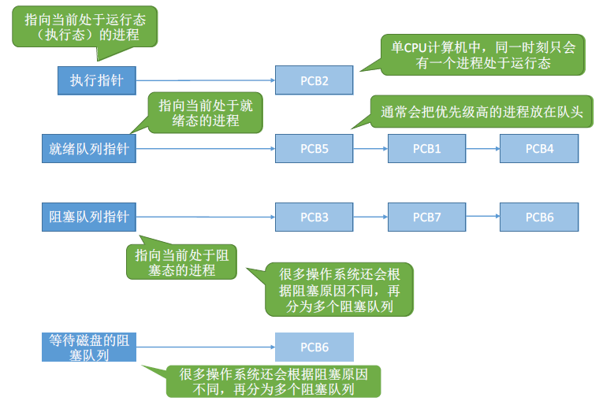
  
  - **索引方式**
  
    - 根据进程状态的不同, 建立几张索引表
    - 操作系统持有指向各个索引表的指针
  
    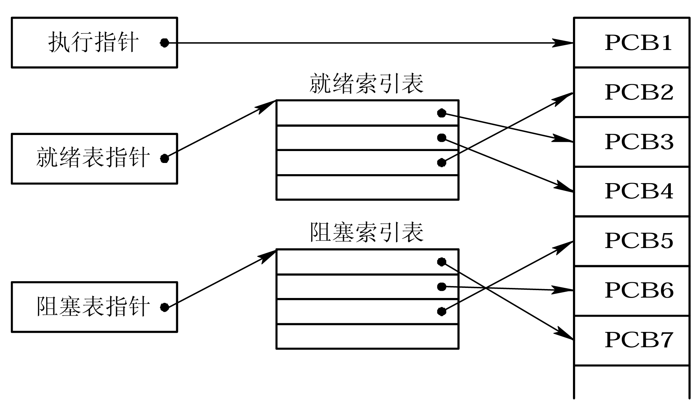

### 2.3 进程控制

#### 2.3.1 OS内核的功能

- **处理机的执行状态**：**系统态**（管态，内核态）、**用户态**（目态）。
- **OS内核的支撑功能**：中断处理、时钟管理、原语操作
  - **原语操作**：它是一个不可分割的基本单位，因此，在执行过 程中不允许被中断。原子操作在**管态**下执行，常驻内存。
  - **时钟管理**：时间片轮转调度、实时系统 的截止时间控制、批处理系 统中的最长运行时间控制
  - **中断处理**：内核最基本的功能，是整个 OS赖以活动的基础
- **OS内核的资源管理功能**：进程管理、存储器管理、设备管理。
  - **进程管理**：进程调度与分派、进程创建与撤 销、进程同步、进程通信等
  - **存储器管理**：地址转换机构、内存分配与回收、 内存保护和对换等
  - **设备管理**：设备驱动程序、缓冲管理、设备分配、设备独立性等


####  2.3.2 进程的创建

- **进程的层次结构**

  - 子进程可以继承父进程所拥有的资源
  - 子进程被撤消时，从父进程那里获得的资源归还给父进程；撤消父进程时，也必须同时撤消其所有的子进程。
  - 进程不能拒绝其子进程的继承权

- **引起创建进程的事件**
  $$
  \begin{aligned}
  系统创建的用户进程&\begin{cases}批作业调度\\交互作业提交\\系统提供服务\end{cases}\\
  用户创建的用户进程&:应用请求
  \end{aligned}
  $$

- **进程的创建原语**

  - **申请空白 PCB**：为新进程申请获得惟一的**数字**标识符，并从PCB集合中索取一个 空白PCB。 
  - **为新进程分配资源**：内存、文件、I/O设备、CPU时间等
  - **初始化PCB**：标识符信息、处理机状态信息、处理机控制信息
  - **将新进程插入就绪队列**（如果进程就绪队列能够接纳新进程）

- **创建原语流程图**

  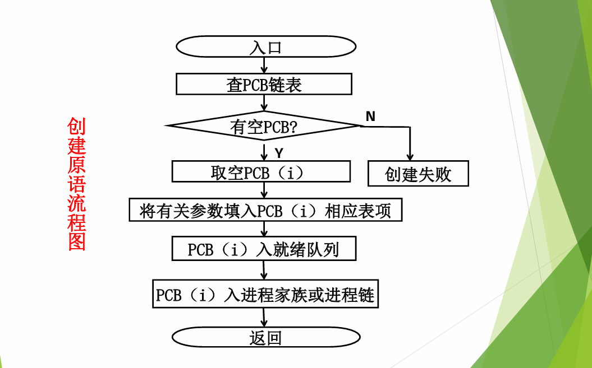

#### 2.3.3 进程的终止

- **引起进程终止（Termination of Process）的事件**

  - **正常结束**（批处理系统中的Holt指令、分时系统中的Logs off指令）
  - **异常结束**（越界错、保护错、非法指令、特权指令错、运行超时、等 待超时、算术运算错、I/O故障）
  - **外界干预**（操作员或操作系统干预、父进程请求、因父进程终止）

- **进程的终止原语**
  - 从PCB标识符集合中找到要终止进程的PCB
  - 若进程正在运行，立即剥夺CPU，将CPU分配给其他进程
  - 终止其所有子进程
  - 将该进程拥有的所有资源归还给父进程或操作系统
  - 将被终止进程(PCB)从所在队列(或链表)中移出，等待其他程序搜集信息

- **撤销原语流程图**

  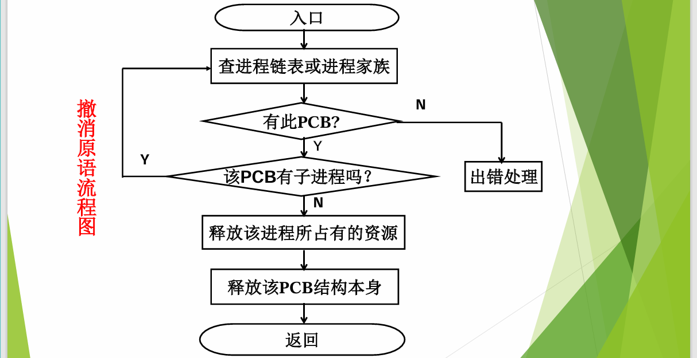

#### 2.3.4 进程的阻塞

- **引起进程阻塞的事件**

  - 向系统请求共享资源失败

  - 等待某种操作的完成

  - 进程同步约束

  - 等待新任务的到达（如：服务进程无事可做）

- **阻塞原语**
  - 找到要阻塞的进程对应的PCB
  - 保护进程运行现场，将PCB状态信息设置为“**阻塞态**"，暂时停止进程运行
  - 将PCB插入相应事件的阻塞队列
  - 调度程序重新调度，将处理机分配给其他进程

- **阻塞原语流程图**

  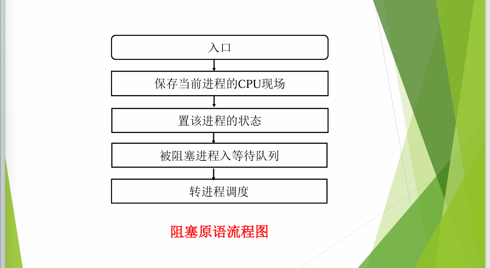

#### 2.3.5 进程的唤醒

- **进程唤醒过程**：当被阻塞进程所期待的事件发生，则调用唤醒原语wakeup将 等待该事件的进程唤醒。

- **唤醒原语**
  - 将被阻塞的进程从等待该事件的阻塞队列中移出
  - 将 PCB 中的现行状态由**阻塞态**改为**就绪态**
  - 将该PCB插入到就绪队列中，等待被调度

#### 2.3.6 进程的挂起与激活

- **挂起原语**
  - 检查被挂起进程的状态，若处于活动就绪状态，便将其改为静止就绪
  - 对于活动阻塞状态的进程，则将之改为静止阻塞。
  - 注意：若被挂起的进程被挂起前正在执行，则挂起后内核要转向调度程序重新调度其他进程来运行。
- **激活原语**
  - 检查该进程的现行状态，若是静止就绪，便将之改为活动就绪
  - 若为静止阻塞，便将之改为活动阻塞。

### 2.4 进程同步 

#### 2.4.1 进程同步的基本概念

- **两种形式的制约关系**
  - **间接相互制约关系**：源于资源共享
  - **直接相互制约关系**：源于进程间的合作（即执行的先后顺序）
- **临界资源 (Critical Resouce)**：诸进程间应采取**互斥**方式实现对这种资源的共享
- **临界区** 
  - 每个进程中**访问临界资源的那段代码**称为**临界区(critical section)**
  - **检查是否可进入临界区的代码**，把这段代码称为**进入区(entry section)**
  - 将临界区正被访问的标志**恢复为未被访问的标志**，这段代码段称为**退出区(exit section)**
- **同步机制应遵循的规则**
  - **空闲让进**：临界资源空闲时应允许自己立即进入临界区
  - **忙则等待**：若临界资源正在被访问，则必须等待
  - **有限等待**：等待必须是有限时间的，以免陷入”死等待“
  - **让权等待**：当进程不能进入自己的临界区时，应立即释放处理机，以免进程陷入“忙等”状态。

#### 2.4.2 硬件同步机制

- **关中断**：进入锁测试之前关闭CPU中断机制，实现互斥

  - **优点**：简单
  - **缺点**
    - **不适用于多处理机,** **只适用于操作系统内核进程**，不适用于用户进程（因为开/关中断指令只能运行在内核态，这组指令如果能让用户随意使用会很危险）
    - **关中断时间过长**，**会影响系统效率**，限制了处理器交叉执行程序的能力

- **利用Test-and-Set指令实现互斥**

  该指令简称 TS 指令，也有地方称为 TestAndSetLock 指令，或 TSL 指令；TSL 指令是用硬件实现的，执行过程中**不允许被中断**，只能一气呵成，示例如下：

  ```c
  // 布尔型共享变量 lock 表示当前临界区是否被加锁
  // true 表示加锁，false 表示未加锁
  bool TestAndSet(bool *lock) {
      bool old;
      old = *lock;
      *lock = true;
      return old;
  }
  
  // 以下是使用 TSL 指令实现互斥的算法逻辑
  while (TestAndSet(&lock));   // 检查 并 上锁
  // 临界区代码段...
  lock = false;                // 解锁
  // 剩余区代码段...
  ```

  **优点：**实现简单，无需像软件实现那样严格检查是否会有逻辑漏洞；适用于多处理机环境

  **缺点：** **不满足让权等待** , lock = true, 另一个进程会忙等

- **利用Swap指令实现进程互斥**

  也有叫 Exchange 指令，简称 XCHG 指令，同TS指令，执行的过程不允许被中断，只能一气呵成，示例如下：

  ```c
  // Swap 指令的作用是交换两个变量的值
  Swap (bool *a, bool *b) {
      bool temp;
      temp = *a;
      *a = *b;
      *b = temp;
  }
  
  // 以下是使用 TSL 指令实现互斥的算法逻辑
  // lock 表示当前临界区是否被加锁
  bool old = true；
  while (old == true)
      Swap(&lock, &old);
  // 临界区代码段...
  lock = false;                // 解锁
  // 剩余区代码段...
  ```

  **优点：**实现简单，无需像软件实现那样严格检查是否会有逻辑漏洞；适用于多处理机环境

  **缺点：**不满足让权等待 , lock = true, 另一个进程会忙等

#### 2.4.3 信号量（Semaphores）机制

信号量表示系统中某种资源的数量，该机制包含一对原语: **wait(S) 和 signal(S)**, 叫做 **P(S), V(S)** 操作；**wait(S)和signal(S)是两个原子操作**，因此，它们在执行时是不可中断的。

- **整型信号量**：整数型变量, 表示某种资源的数量

  ```c
  int S = 1;
  void wait(int S) {
      while (S <= 0);
      S --;
  }
  
  void signal(int S) {
      S ++;
  }
  // P0
  {
      wait(S);
      使用资源...
      signal(S);
  }
  ```

  缺点: 会发生忙等, 不满足让权等待 互斥原则

- **记录型信号量**

  ```c
  typedef struct {
      int value;          // 剩余资源数
      struct process_control_block_list *L;  // 阻塞队列
  } semaphore;
  
  void wait (semaphore S) {       // 原语操作
      S.value --;
      if (S.value < 0) 
          block (S.L);        // 资源数不够, 把进程挂到S的等待队列中, 进入阻塞态
  }
  
  void signal(semaphore S) {      // 原语操作
      S.value ++;
      if (S.value <= 0) {
          wakeup(S.L);        // 释放资源后, 可用资源还是小于等于0，则表示释放之前肯定有进程阻塞了
      }						//此时将阻塞的进程唤起,由阻塞态变为就绪态
  }
  ```

  优点: 没有申请到资源的进程会被挂起进入**阻塞态**, 所以**不会发生忙等(让权等待满足)**, 满足所有的互斥原则

- **AND型信号量**：

  对若干个临界资源的分配，采取原子操作方 式：要么把它所请求的资源全部分配到进程，要么一个也不分配。

  ```c
  Swait(S1, S2, ..., Sn)
  {
  	while (TRUE)
  	{
  		if (Si >= 1 && ... && Sn >= 1) {
  			for (i = 1; i <= n; i++)Si--;
  			break;
  		}
  		else{
              //将第一个发现资源分配不足的进程进行阻塞，然后PC计数置0，PC指向要分配的资源的起始地址，相当于一切从新来过
  			place the process in the waiting queue associated with the first Si found with Si < 1, and set the program count of this process to the beginning of Swait operation
  		}
  	}
  }	
  Ssignal(S1, S2, ..., Sn) {
  	while (TRUE) {
  		for (i = 1; i <= n; i++) {
  			Si++;
  			Remove all the process waiting in the queue associated with Si into the ready queue
  		}
  	}
  }
  ```

- **信号量集**

  以对AND信号量机制加以扩充，对进程所申请的所有资源以及每类资源不同的资源需求量，在一次P、V原语操作中完成申请或释放。

  进程对信号量$S_i$的测试值不再是1，而是该资源的分配下限值$t_i$，对应Swait和Ssignal的格式为：
  $$
  \begin{array}{l}\mathrm{Swait(S_1,t_1,d_1;\ldots;S_n,t_n,d_n)};\\\mathrm{Ssignal(S_1,d_1;\ldots;S_n,d_n)};\end{array}
  $$
  其中$Si,t_i,d_i$分别表示拥有的资源量，最小分配量，申请分配的量。

  下面是几种特殊的形式：

  - **Swait(S,d,d)**，此时在信号量集中只有一个信号量S，但允许它每次申请d个资源，当现有资源数少于d时，不予分配。
  - **Swait(S,1,1)**，此时的信号量集已蜕化为一般的记录型信号量(S>1时)或互斥信号量(S=1时)。
  - **Swait(S,1,0)**。这是一种很特殊且很有用的信号量操作。当S>1时，允许多个进程进入某特定区:当S变为0后，将阻止任何进程进入特定区。换言之，它相当于一个可控开关。

#### 2.4.4 信号量的应用

- **进程互斥**

  > ⚠️⚠️⚠️需要为不同的临界资源设置不同的互斥信号量；P、V操作必须成对出现。

  ```c
  /* 信号量机制实现互斥 */
  semaphore mutex = 1;  // 初始化信号量，其值可理解为此信号量表示进入临界区的名额，并且只有一个。
  
  P1() {
      // ...
      P(mutex);  // 使用临界资源前需要加锁
      // 临界区代码段...
      V(mutex);  // 使用临界资源后需要解锁
      // ...
  }
  
  P2() {
      // ...
      P(mutex);  // 使用临界资源前需要加锁
      // 临界区代码段...
      V(mutex);  // 使用临界资源后需要解锁
      // ...
  }
  ```

- **进程同步（合作/前驱关系）**

  > ❗让各并发进程按照一定顺序进行，必须有先后顺序

  ```c
  /**
   * 要求：代码4需要在代码1和代码2执行后才可以执行
   */
  P1() {
      // 代码1
      // 代码2
      signal(S);
      // 代码3
  }
  P2() {
      wait(S);  //如果代码1和代码2没有执行完，就会主动请求阻塞
      // 代码4
      // 代码5
      // 代码6
  }
  ```

  上述代码描述仅两个进程间，我们现在描述一下多个进程，现在假设有如下进程前驱图

  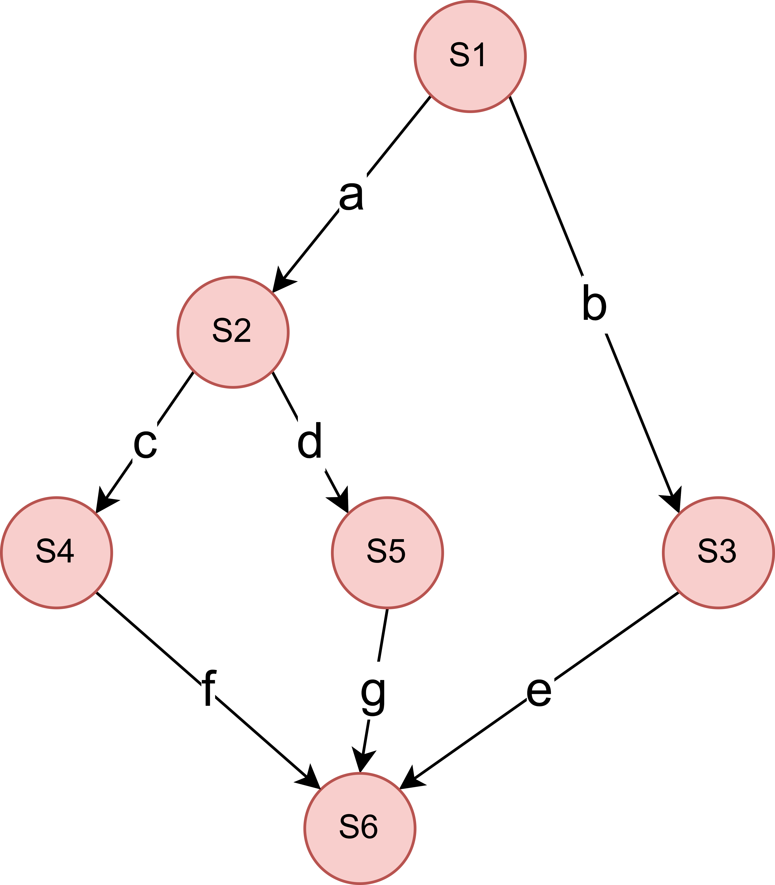

  则我们有如下同步代码：

  ```c
  p1(){ S; signal(a); signal(b);}
  p2(){ wait(a); S2; signal(c); signal(d);}
  p3(){ wait(b); S3; signal(e);}
  p4(){ wait(c); S4; signal(f);}
  p5(){ wait(d); Ss; signal(g);}
  p6(){ wait(e); wait(f); wait(g); S6;}
  main(){
  	semaphore a, b, c, d, e, f, g;
  	a.value=b.value=c.value=0;
  	d.value=e.value=0;
  	f.value=g.value=0;
  	cobegin
  		p10;p20; p30); p40(); p50; p60;
  	coend
  }
  ```

#### 2.4.5 管程

- **定义**：管程是由局部数据结构、多个处理过程和一套初始化代码组成 的模块。

- **管程与进程的区别**

  |                | 进程               | 管程                       |
  | -------------- | ------------------ | -------------------------- |
  | 定义的数据结构 | 私有               | 公共                       |
  | 所执行的操作   | 顺序程序           | 同步操作和初始化操作       |
  | 设置目的       | 实现系统并发       | 解决共享资源的互斥使用问题 |
  | 工作方式       | 主动工作方式       | 被动工作方式（被调用）     |
  | 并发           | 进程之间能并发执行 | 不能与其调用者并发         |
  | 动态性         | 有诞生有消亡       | OS中的一个资源管理模块     |

- **条件变量**

  - **x.wait**:当遇到同步约束，将执行x.wait操作的进程阻塞在条件变 量x关联的阻塞队列上。
  - **x.signal**：从条件变量x关联的阻塞队列上唤醒一个进程，让它恢 复运行。若队列上没有进程在等待，就什么也不做。

#### 2.4.6 总结

- **信号量机制解决互斥问题**

  - 一种临界资源设一个信号量。

  - 信号量=系统初始状态临界资源的可用量。

  - wait和signal操作必须**成对匹配**，**wait**操作用于**临界区前**，**signal**操作用于**临界区后**。

  - **互斥信号量的定义**

    ```c++
    semaphore  mutex;//信号量mutex用于互斥问题
    ```

    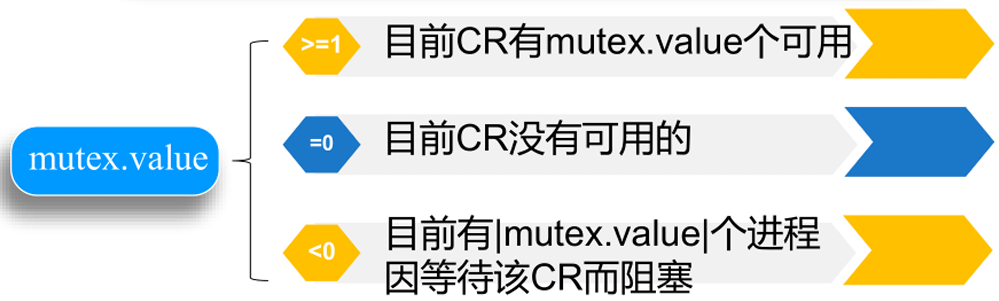

- **信号量机制解决同步问题**

  - 一种同步信号设一个信号量。

  - 信号量的初值设置为系统初始状态下信号的有无。

  - wait和signal操作不成对匹配，一般使用其进行同步的两个进程具有前驱关系。

  - **同步信号量的定义**

    ```C++
    semaphore  s;//这样声明的信号量s用于同步问题
    ```

    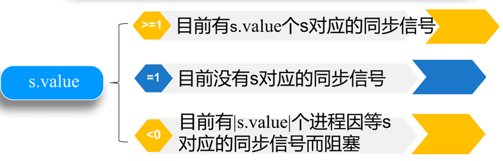

- **记录型信号量机制解决问题的步骤**

  - 分析问题中的进程、资源
  - 分析进程间的关系
  - 分别设置互斥、同步信号量
  - 写出并发进程体，找出相关的临界区
  -  分别加wait、signal操作并分析结果

### 2.5 经典进程的同步问题

### 2.6 进程通信

- 进程通信就是进程之间的信息交换
- 进程是分配系统资源的单位（包括内存地址空间），因此**各进程**拥有的**内存地址空间相互独立**

#### 2.6.1 进程通信的类型

- **共享存储器系统（Shared-Memory System）**

  不需要频繁地进行内核态和用户态的切换，**速度最快**，但共享内存是**临界资源**，两个进程对共享空间的**访问**必须是**互斥**的（互斥访问通过操作系统提供的工具实现）

  - 基于**数据结构**的共享

    使用有界缓冲区，这种共享方式仅适用于传递少量的数据，其通信效率低下，是一种**低级通信**方式

  - 基于**存储区**的共享

    在内存中画出一块共享存储区，数据的形式、存放位置都是由进程控制，而不是操作系统。相比之下，这种共享方式速度更快，是一种**高级通信**方式

- **管道（Pipe）通信系统**

  > “管道”是指用于连接读写进程的一个共享文件，又名pipe文件。其实就是在内存中开辟个大小固定的缓冲区

  - 管道**只能采用半双工通信**，某一时间段内只能实现单向的传输。如果要**实现双向同时通信，则需要设置两个管道**。
  - 各进程要**互斥地访问管道**
  - 数据以宇符流的形式与入管道
    - 当**管道写满**时，写进程的**write()系统调用将被阻塞**，等待读进程将数据取走。
    - 当读进程将数据全部取走后，**管道变空**，此时读进程的**read()系统调用将被阻塞**。
  - 数据读出后，管道立即丢弃，这就意味着**读进程最多只能有一个**，否则可能会有读错数据的情况。
  - ⚠️管道机制必须提供以下三方面的 协调能力：**互斥**；**同步**；**确定对方是否存在**。

- **消息传递系统（Message passing system）**

  > 进程间的数据交换以**格式化**的消息(Message）为单位。进程通过操作系统**提供的“发送消息/接收消息”两个原语进行数据交换**。

  - **消息结构**
    - 消息头, 包括：发送进程ID、接受进程ID、消息类型、消息长度等格式化信息
    - 消息体
  - **传递方式**
    - 直接传递：消息直接挂到接收进程的消息缓冲队列上
    - 间接传递：消息要先发送到中间实体（信箱）中，因此也称“信箱通信方式”。

-  **客户机-服务器系统（Client-Server system）**

  - 套接字

    - 基于文件型：通信双方通过对特殊文件的读写实现通信，其原理与管道相似。
    - 基于网络型：采用的是非对称方式通信，发送者需要知道接收者“地址”。

    其好处在于①具有逻辑链路的唯一性（有“地址”）；②隐藏实现细节

  - 远程过程调用和远程方法调用

    > 远程过程(函数)调用RPC(Remote Procedure Cal)，是一个通信协议，用于通过网络连接的系统。

#### 2.6.2 消息传递通信的实现方式

- **直接消息传递**

  - **直接通信原语**

    - **对称寻址**方式

      ```cpp
      send(receiver,message);		//发送一个消息给接收进程
      receive(sender, message);	//接收 Sender 发来的消息
      ```

    - **非对称寻址**方式

      > 有时接收进程可能需要与多个发送进程通信，无法事先指定发送进程，例如打印进程，可接收多个进程的打印任务

      ```cpp
      send(P，message);		//发送一个消息给进程P（例如，发给打印进程）
      receive(id，message);	//接收来自任何进程的消息，id变量可设置为进行通信的发送方进程 id 或名字。
      ```

  - **消息格式**

    > 消息传递系统中所传递的消息，必须具有一定的消息格式，只有这样才能规范传输，减少工作量。

  - **进程同步方式**

    - 发送进程阻塞，接收进程阻塞：主要用于进程之间紧密同步，发送进程和接收进程之间无缓冲时。
    - **发送进程不阻塞、接收进程阻塞**：应用最广，节省资源
    - 发送进程和接收进程均不阻塞：仅当发生某事件使它无法继续运行时，才把自己阻塞起来等待。这种方式可以最大化地利用系统资源，但是需要进行额外的同步措施来防止数据的丢失或读写冲突。

  - **通信链路**

    - **连接请求方式**
      1. 使用原语显示请求建立通信链路
      2. 利用系统发送原语，自动建立链路
    - **依通信方式划分**
      1. 单向通信链路
      2. 双向通信链路

- **信箱通信**

  > 1.信箱通信属于**间接**通信方式，即进程之间的通信，需要通过某种**中间实体**(如共享数据结构等)来完成。
  >
  > 2.邮箱通信方式既可实现实时通信，又可实现非实时通信。

  - **信箱结构**

    - **信箱头**：存放有关信箱的描述信息

    - **信箱体**：由若干个可以存放消息(或消息头)的信箱格组成，个数在创建信箱时已确定

  - **信箱通信原语**

    - 邮箱的创建和撤消

    - 消息的发送和接收

      ```cpp
      Send(mailbox，message)		//将一个消息发送到指定邮箱
      Receive(mailbox，message)	//从指定邮箱中接收一个消息
      ```

  - **信箱的类型**
    
    - **私用邮箱**：由用户进程创建，并作为该进程的一部分，创建者只能读，其他用户只能写，属于单向通信
    - **公用邮箱**：由操作系统创建，并提供给系统中的所有核准进程使用，因此，其具有全局性，区别于共享邮箱
    - **共享邮箱**：由某进程创建，在创建时或创建后指明它是可共享的，同时须指出共享进程(用户)的名字。
  - 发送进程和接收进程之间的关系
    - 一对一关系：专用通信
    - 多对一关系：服务进程与其他很多进程进行交互
    - 一对多关系：一发多收，属于广播式通信.
    - 多对多关系：一般使用公用邮箱进行通信

### 2.7 线程（Threads）的基本概念

> 线程是一个**基本的CPU执行单元，也是程序执行流的最小单位**。

- **引入线程的原因**
  - 提示系统并发度：引入线程后，不仅是进程之间可以并发，进程内的**各线程之间**也可以**并发**，使得一个进程内也可以并发处理各种任务
  
- 线程和进程的区别

  - 资源分配、调度
    - 传统进程机制中，进程是资源分配、调度的基本单位
    - 引入线程后，进程是资源分配的基本单位，线程是调度的基本单位

  - 并发性
    - 传统进程机制中，只能进程间并发
    - 引入线程后，各线程之间也能并发，提升了并发度

  - 系统开销
    - 传统的进程间并发，需要切换进程的运行环境，系统开销很大
    - 线程间并发，如果是同一个进程内的线程切换，则不需要切换进程环境，系统开销小
    - 引入线程后，并发所带来的系统开销减小

### 2.8 线程的实现

#### 2.8.1 用户级线程（User-Level Thread，ULT）


- 用户级线程由应用程序通过线程库实现，所有的**线程管理工作**都由**应用程序负责**（包括线程切换）

- 用户级线程中，**线程切换**可以在**用户态下完成**，无需操作系统的干涉

- 在用户看来，是有多个线程，但是操作系统内核看来，是意识不到线程的存在。“**用户级线程**”就是“**从用户视角能看到的线程**”

  **优点：**用户级线程的切换在用户空间即可完成，不需要切换到核心态，线程管理的系统开销小，效率高

  **缺点：**当一个用户级线程被阻塞后，整个进程都会被阻塞，并发度不高。多个线程不可在多核处理机上**并行**运行

#### 2.8.2 内核级线程（Kernel-Level Thread，KLT）

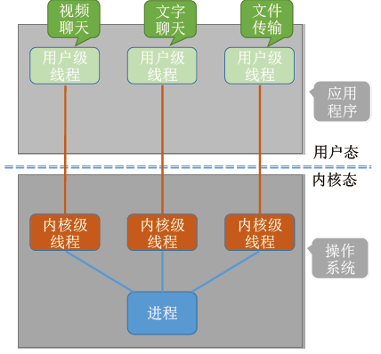

- 内核级线程的管理工作由操作系统内核完成

- 线程调度、切换等工作都是由内核负责，因此**内核级线程的切换**必然需要在**核心态**下才能完成

- 操作系统会为每个内核级线程建立相应的 TCB（Thread Control Block，线程控制块），通过 TCB 对线程进行管理。“**内核级线程**”就是“**从操作系统内核视角能看到的线程**”

  **优点：**当一个用户级线程被阻塞后，其他线程还可以继续执行，并发度高。多个线程可在多核处理机上**并行**运行

  **缺点：**一个用户进程会占用多个内核级线程，线程切换由操作系统内核完成，需要切换到核心态，因此线程管理的成本高，开销大

#### 2.8.3 多线程模型

- **一对一模型**

  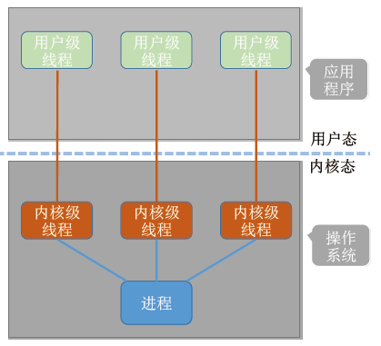

  - **一对一模型：**一个用户级线程映射到一个内核级线程。每个用户进程有与用户级线程同数量的内核级线程
  - **优点**：当一个用户级线程被阻塞后，其他线程还可以继续执行，并发度高。多个线程可在多核处理机上**并行**运行
  - **缺点：**一个用户进程会占用多个内核级线程，线程切换由操作系统内核完成，需要切换到核心态，因此线程管理的成本高，开销大

- **多对一模型**

  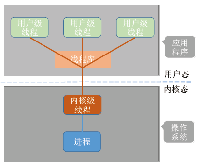

  - **多对一模型：**多个用户级线程映射到一个内核级线程。且一个进程只被分配一个内核级线程
  - **优点：**用户级线程的切换在用户空间即可完成，不需要切换到核心态，线程管理的系统开销小，效率高
  - **缺点：**当一个用户级线程被阻塞后，整个进程都会被阻塞，并发度不高。多个线程不可在多核处理机上**并行**运行
  - **重点：**操作系统只看得见内核级线程，因此只有**内核级线程才是处理机分配的单位**

- **多对多模型**

  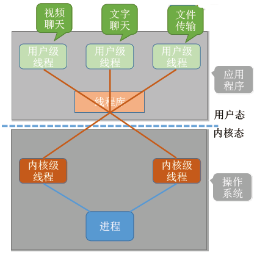

  - **多对多模型：**n 用户级线程映射到 m 个内核级线程（**n >= m**）。每个用户进程对应 m 个内核级线程

  - **优点**：克服了多对一模型并发度不高的缺点（一个阻塞全体阻塞），又克服了一对一模型中一个用户进程占用太多内核级线程，开销太大的缺点

  - 内核级线程中可以运行任意一个有映射关系的用户级线程，**只有所有内核级线程中正在运行的代码逻辑都阻塞时，这个进程才会阻塞**

    理解：

    - 用户级线程是“**代码逻辑**”的载体
    - 内核级线程是“**运行机会**”的载体（**内核级线程才是处理机分配的单位**）

    一段“逻辑代码”只有获得了“运行机会”才能被 CPU 执行

    