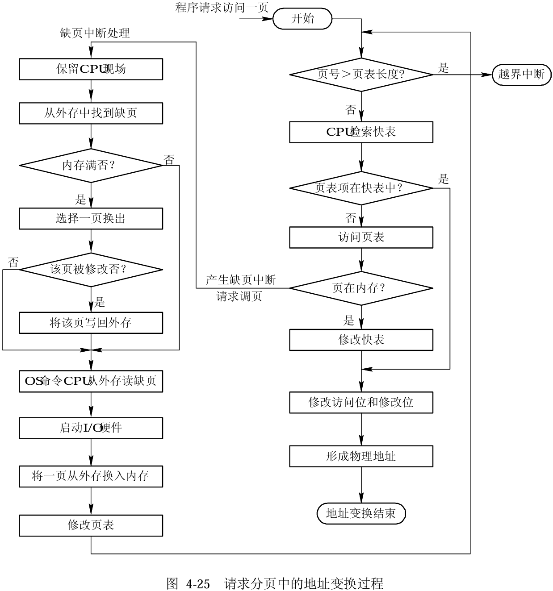
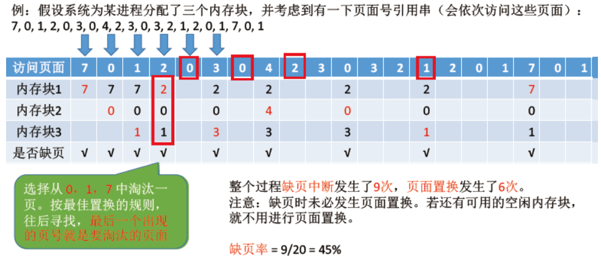
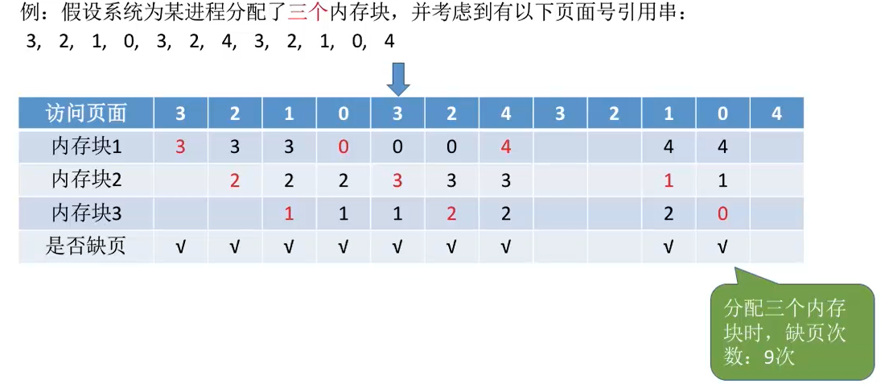
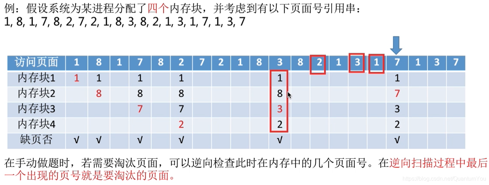
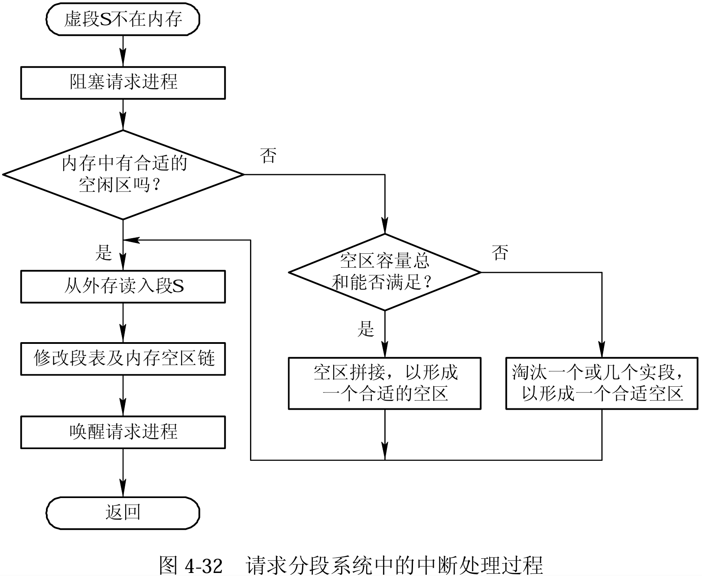
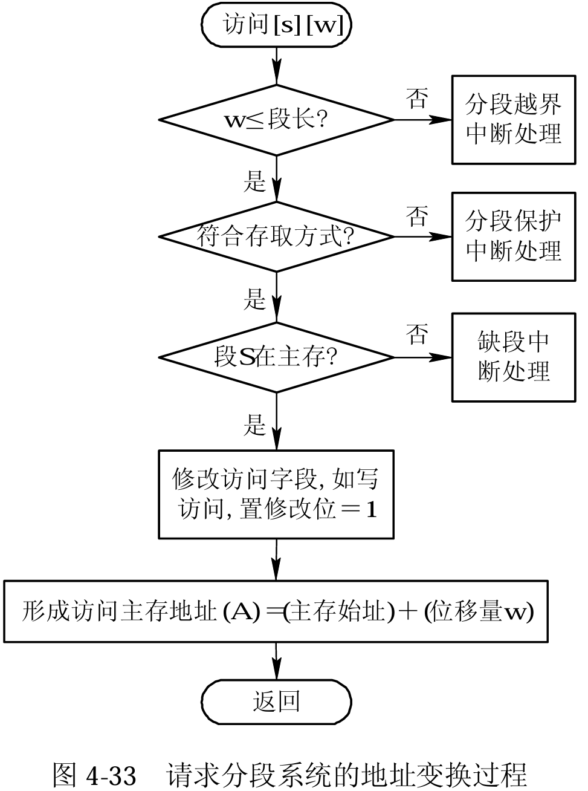
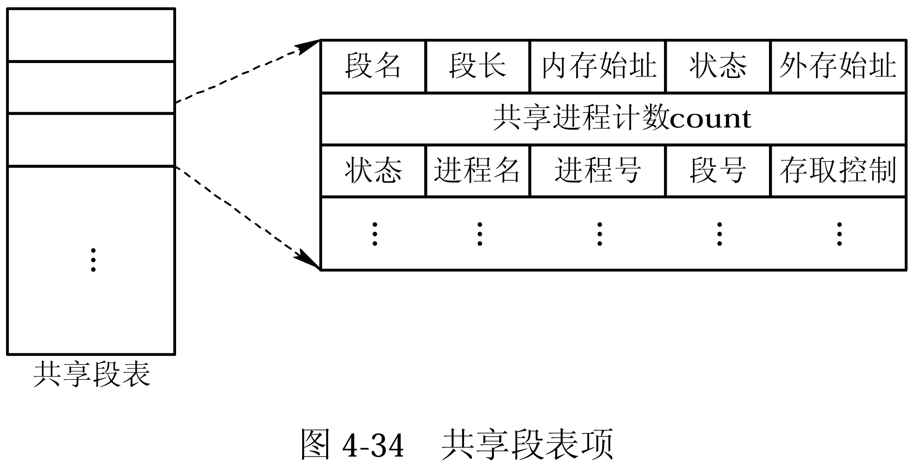

<h1>第5章 虚拟存储器</h1>

### 5.1 虚拟存储器概述

#### 5.1.1 常规存储管理方式的特征和局部性原理

1. **常规存储器管理方式的特征**
   1. **一次性**：作业必须一次性全部装入内存才能开始运行
      - 作业很大时，内存无法完全装入，导致作业无法运行
      - 大量作业运行时，内存无法容纳所有作业，导致多道程序并发性下降
   2. **驻留性**：作业一旦进入内存，就会一直驻留在内存中，直到作业运行结束
      - 会导致暂时无用的大量数据驻留在内存中，导致内存的浪费
2. **局部性原理**
   - **时间局部性**：最近访问过的程序代码和数据很快又被访问（如循环语句）
   - **空间局部性**：某存储单元被使用之后，其相邻的存储单元也很快被使用
#### 5.1.2 虚拟存储器的定义和特征

1. **虚拟内存的基本原理**

   > 虚拟内存基于**局部性原理**，有如下性质：
   >
   > - 在程序装入时，可以将程序中很快会用到的部分装入内存，暂时用不到的部分留在外存， 就可以让程序开始执行。
   > - 在程序执行过程中，当所访问的信息不在内存时，由操作系统负责将所需信息从外存**调入**内存，然后继续执行程序。
   > - 若内存空间不够，由操作系统负责将内存中暂时用不到的信息**换出**到外存。
   >
   > 在操作系统的管理下，在用户看来似乎有一个比实际内存大得多的内存，这就是**虚拟内存**。

2. **虚拟内存的特征**

   - **离散性**：程序在内存中离散（不连续）存放
   - **多次性**：无需在作业运行时一次性全部装入内存，而是允许被分成多次调入内存
   - **对换性**：在作业运行时无需一直常驻内存，而是允许在作业运行过程中，将作业换入、换出
   - **虚拟性**：从逻辑上扩充了内存的容量，使用户看到的内存容量，远大于实际的容量

3. **主存扩充的实质**

   - 将小的实存储器(实存)扩充为大的虚存储器(虚存)
   - 将磁盘空间虚拟成内存使用
   - 将进程的一部分装入内存，即可运行

#### 5.1.3 虚拟存储器的实现方法

> 虚拟内存技术，允许一个作业分多次调入内存。如果采用连续分配方式，会不方便实现。因此，虚拟内存的实现需要建立在**离散分配的内存管理方式**基础上。

1. **实现方法**
   - **分页请求系统**：页式虚拟存储系统、请求分页存储管理方式 分页系统+请求调页功能+页面置换功能
   
   - **请求分段系统**：段式虚拟存储系统、请求分段存储管理方式 分段系统+请求调段功能+分段置换功能
   
   -  **段页式虚拟存储系统**： 请求段页式存储管理方式 段页式系统+请求调页功能+页面置换功能
   
2. **硬件支持**
   - 请求分页/分段的页表机制
   - 缺页/段中断机构
   - 地址变换机构

---

### 5.2 请求分页存储管理方式

#### 5.2.1 请求分页中的硬件支持

1. ##### 请求页表机制

   - **页表项字段**

   | 页号 | 物理块号 | 状态位P | 访问字段A | 修改位M | 外存地址 |
   | ---- | -------- | ------- | --------- | ------- | -------- |

   - **状态位P**：用于指示该页是否在内存中
   - **访问字段A**：记录页面在一段时间内被访问的次数
   - **修改位 M**：表示该页在调入内存后是否被修改过
     - 内存的每一页在外存均有副本，若未修改，则置换页面时就无需写回外存，可减少系统开销和延长磁盘寿命。
     - 若已被修改，则必须将修改页写回磁盘，以保证磁盘所保留的始终是最新副本。
   - **外存地址**：用于指出该页在外存上的地址，通常是**物理块号**，供调入该页时参考。

2. ##### 缺页中断机构

   > 在请求分页系统中，每当要访问的页面不在内存时，便产生一个**缺页中断**，然后由操作系统的**缺页中断处理程序**处理中断。
   >
   > 缺页中断属于内中断，属于故障中断（可以被故障处理程序修复）

   1. **基本原理**
      1. 缺页时，**缺页的进程阻塞**，放入阻塞队列，调页完成后再将其唤醒，放回就绪队列。
      2. 如果内存中**有空闲块**，则为进程分配一个空闲块，将所缺页面装入该块，并修改页表中相应的页表项。
      3. 如果内存中**没有空闲块**，则由页面置换算法选择一个页面淘汰，若该页面在内存期间**被修改过，则要将其写回外存**。未修改过的页面不用写回外存。
   2. **缺页中断机构与一般中断的主要区别**
      1. **缺页中断**机构在**指令执行期间**产生和处理中断信号；**普通中断**是在一个**任务执行周期结束**，另一个任务执行周期尚未到来的间隙时间内执行中断信号处理。
      2. 缺页中断机制下，一条指令在执行期间可能产生多次缺页中断。

3. ##### 地址变换机构

   

   - 只有**写指令**才需要修改**修改位**。并且，一般来说只需修改快表中的数据，只有要将快表项删除时才需要写回内存中的慢表。这样可以减少访存次数。
   - 和普通的中断处理一样，缺页中断处理依然需要**保留CPU现场**。
   - 需要用某种页面置换算法来决定一个换出页面
   - 换入/换出页面都需要启动慢速的I/0操作，如果换入/ 换出太频繁，会有很大的开销。
   - 页面调入内存后，需要修改慢表，同时也需要将表项复制到快表中。

#### 5.2.2 请求分页的内存分配

1. **内存分配策略**

   1. **固定分配局部置换**(Fixed Allocation，Local Replacement) 

      > 进程的内存空间在编译时被划分为若干个**固定大小**的块。
      >
      > 置换发生时,只**在同一进程的块之间进行置换,**不涉及其他进程。
      >
      > 优点是简单高效,缺点是内存利用率低,可能出现内存浪费或内存不足的情况。

   2. **可变分配全局置换**(Variable Allocation，Global Replacement)

      > 进程的**内存空间可以动态增长或缩小**。
      >
      > 置换时可以在**不同进程的内存块之间进行置换**。
      >
      > 利用了**全局内存资源,内存利用率较高**。
      >
      > 但管理复杂,需要考虑内存碎片和外存传输开销等问题。

   3. **可变分配局部置换**(Variable Allocation，Local Replacement)

      > 进程的内存空间可以动态增长或缩小。
      >
      > 置换时只在**同一进程的块之间进行置换**,不涉及其他进程。
      >
      > 较为简单,避免了全局置换的复杂性。
      >
      > 内存利用率介于前两者之间,比固定分配高,比全局置换低。

2. **物理块分配算法**

   1. 平均分配法
   2. 按比例分配（加权）算法
   3. 考虑优先权的分配算法

3. **页面调入策略——缺页率**

   如果在进程运行过程中，**访问页面成功的次数为S**，**访问页面失败的次数为F**，则该进程**总的页面访问次数为A=S+F**，则其缺页率为：
   $$
   \mathrm {f=\frac FA}
   $$

### 5.3 页面置换算法

#### 5.3.1 最佳(Optimal)置换算法 

- **基本原理**：每次选择**淘汰的页面**将是**以后永不使用**，或者**在最长时间内不再被使用访问的页面**

- 总结

  > 最佳置换算法可以保证最低的缺页率，但实际上，只有在进程执行的过程中才能知道接下来会访问到的是哪个页面。操作系统无法提前预判页面访问序列。因此，**最佳置换算法是无法实现的**

#### 5.3.2 先进先出(FIFO)页面置换算法

- **基本原理**：每次选择**淘汰的页面**是**最早进入内存的页面**

- **实现方法**：把调入内存的页面根据调入的先后顺序排成一个队列（已经在队列中的不重复入队），需要换出页面时选择队头页面即可。 队列的最大长度取决于系统为进程分配了多少个内存块

- **Belady异常：**当为进程分配的内存块增大时，出现缺页次数不减反增的异常现象

- **总结**

  > **只有FIFO算法会产生Belady异常**。
  >
  > FIFO算法虽然**实现简单**，但是该算法与进程实际运行时的 规律不适应，因为先进入的页面也有可能最经常被访问。因此，**算法性能差**

#### 5.3.3 LRU(Least Recently Used)置换算法的描述

- **基本原理**：每次**淘汰的页面**是**最近最久未使用的页面**

- **实现方法**：赋予每个页面对应的页表项中，用**访问字段记录该页面上次被访问以来所经历的时间 t**。当需要淘汰一个页面时，选择现有页面中 t 值最大的，即最近最久未使用的页面

  

- 总结：该算法的实现需要专门的硬件支持，虽然算法**性能好**，但是**现实困难**，**开销大**

#### 5.3.4 Clock置换算法

- **实现方法：**为每个页面设置一个访问位，将内存中页面都通过指针链接形成一个循环队列

  - 当某页面被访问时，将其**访问位**置为 1
  - 当需要淘汰一个页面时，只需检查页面的访问位
    - 如果访问位是 0，则选择换出
    - 如果访问位是 1，则将它置为 0，暂不换出，继续检查下一个页面

  - 如果第一轮扫描没有符合条件的页面，则继续扫描第二轮（第二轮一定有访问位为 0 的页面）所以该算法最多扫描两轮

#### 5.3.5 改进型时钟置换算法

- **基本原理**：
  - 简单的时钟置换算法仅仅考虑了是否被访问过，如果一个页面访问过但是未被修改，淘汰时就不需要写回内存，应该优先淘汰此类的页面，可以减少 I/O 操作写回内存
  - 用两个标志位（访问位，修改位）来记录一个页面是否被访问过，是否被修改过。在其它条件都相同的时候，应该优先淘汰没有修改过的页面，避免 I/O 操作

- **算法规则：**将所有可能被置换的页面排成一个循环队列

  - 第一轮：从当前位置开始扫描到第一个（0，0）的页面用于替换。本轮扫描不修改任何标志位**（第一优先级：最近没访问，且没修改的页面）**

  - 第二轮：若第一轮扫描失败，则重新扫描，查找第一个（0，1）的页面用于替换。本轮所有扫描过的页面访问位设置为 0**（第二优先级：最近没访问，但修改过的页面）**

  - 第三轮：若第二轮扫描失败，则重新扫描，查找第一个（0，0）的页面用于替换。本轮扫描比修改任何标志位**（第三优先级：最近访问过，但没修改的页面）**

  - 第四轮：若第三轮扫描失败，则重新扫描，查找第一个（0，1）的页面用于替换**（第四优先级：最近访问过，且修改过的页面）**

#### 5.3.6 最少使用(Least Frequently Used, LFU)置换算法

- **基本原理**

  内存中每个页面设置一个移位寄存器，用来记录该页面被访问的频率；算法选择在最近时期使用最少的页面作为淘汰页；其定时右移整个移位寄存器的值，这样既可实现LRU又可以实现LFU算法

####  5.3.6 算法对比

<table>
  <tr align="center">
    <th>
     置换算法
    </th>
    <th>
     算法规则
    </th>
    <th>
     优缺点
    </th>
  </tr>
  <tr align="center">
    <td>
     OPT
    </td>
    <td>
     优先淘汰最长时间内不会被访问的页面
    </td>
    <td>
     缺页率最小，性能最好；但无法实现
    </td>
  </tr>
  <tr align="center">
    <td>
     FIFO
    </td>
    <td>
     优先淘汰最先进入内存的页面
    </td>
    <td>
     实现简单，但性能差；可能出现Belady异常
    </td>
  </tr>
  <tr align="center">
    <td>
     LRU
    </td>
    <td>
     优先淘汰最近最久未访问的页面
    </td>
    <td>
     性能很好；但需要硬件支持，算法开销大
    </td>
  </tr>
  <tr align="center">
    <td>
     CLOCK (NRU)
    </td>
    <td>
     优先淘汰最近未访问的页面
    </td>
    <td>
     实现简单，算法开销小；但未考虑页面是否被修改过
    </td>
  </tr>
  <tr align="center">
    <td>
     改进型CLOCK(改进型NRN)
    </td>
    <td>
     优先淘汰最近未访问且未修改的页面
    </td>
    <td>
     算法开销较小，性能也不错
    </td>
  </tr>
</table>

### 5.4 页面分配策略

#### 5.4.1 驻留集

- **驻留集**：指请求分页存储管理中给进程分配的**物理块的集合**；在采用了虚拟存储技术的系统中，驻留集大小一般小于进程的总大小。

  - 若驻留集太小，会导致缺页频繁，系统要花大量的时间来处理缺页，实际用于进程推进的时间很少

  - 驻留集太大，又会导致多道程序并发度下降，资源利用率降低

- ##### 分配策略的分类：

  - 驻留集数量
    - **固定分配**：操作系统为每个进程分配一组固定数目的物理块，在进程运行期间**驻留集数量不再改变**。
    - **可变分配**：先为每个进程分配一定数目的物理块，在进程运行期间，可根据情况做适当的增加或减少。

  - 置换策略
    - **局部置换**：发生缺页时只能选进程自己的物理块进行置换
    - **全局置换**：可以将操作系统保留的空闲物理块分配给缺页进程，也可以将别的进程持有的物理块置换到外存，再分配给缺页进程

#### 5.4.2 分配策略

1. ##### 固定分配局部置换

   系统为每个进程分配一定数量的物理块，在整个运行期间都不改变。

   若进程在运行中发生缺页，则只能从该进程在内存中的页面中选出一页换出，然后再调入需要的页面。

   - **缺点**：很难在刚开始就确定应为每个进程分配多少个物理块才算合理。

2. ##### 可变分配全局置换

   刚开始会为每个进程分配一定数量的物理块，操作系统会保持一个**空闲物理块队列**。

   当某进程发生缺页时，从空闲物理块中取出一块分配给该进程；若已无空闲物理块，则可选择一个**未锁定**的页面换出外存，再将该物理块分配给缺页的进程。

   > ⚠️操作系统会将一些重要的页面锁定，不允许其被换出内存

   采用这种策略时，只要某进程发生缺页， 都将获得新的物理块，仅当空闲物理块用完时，系统才选择一个未锁定的页面调出。被选择调出的页可能是系统中任何一个进程中的页，因此这个**被选中的进程拥有的物理块会减少，缺页率会增加**。

3. ##### 可变分配局部置换

   刚开始会为每个进程分配一定数量的物理块。当某进程发生缺页时，只允许从**该进程自己**的物理块中选出一个进行换出外存。

   - 如果进程在运行中**频繁地缺页**，系统会为该进程**多分配**几个物理块，直至该进程缺页率趋势适当程度；

   - 反之，如果进程在运行中**缺页率特别低**，则可适当**减少**分配给该进程的物理块。

#### 5.4.3 调入页面的时机

1. ##### 预调页策略

   - 一次调入若干个相邻的页面可能比一次调入一个页面更高效

   - 但**如果提前调入的页面中大多数都没被访问过，则又是低效的**

   - 因此可以预测不久之后可能访问到的页面，将它们预先调入内存，但目前预测成功率只有50%左右

   - 故这种策略**主要用于进程的首次调入**， 由程序员指出应该先调入哪些部分

2. ##### 请求调页策略

   - 进程在运行期间发现缺页时才将所缺页面调入内存。

   - 由这种策略调入的页面一定会被访问到，不存在低效

   - 但由于每次只能调入一页，而每次调页都要磁盘I/O操作，因此I/O开销较大

   - 这种策略主要在进程运行中使用

3. ##### 从何处调入页面

   - 系统拥有足够的对换区空间
     - 页面的调入、调出都是在内存与对换区之间进行，这样可以保证页面的调入、调出速度很快。
     - 在进程运行前，需将进程相关的数据从文件区复制到对换区
   - 系统缺少足够的对换区空间
     - 凡是不会被修改的数据都直接从文件区调入，由于这些页面不会被修改，因此换出时不必写回磁盘，下次需要时再从文件区调入即可。
     - 对于可能被修改的部分，换出时需写回磁盘对换区，下次需要时再从对换区调入。

   - UNIX方式
     - 运行之前进程有关的数据全部放在文件区，故未使用过的页面，都可从文件区调入。
     - 若被使用过的页面需要换出，则写回对换区，下次需要时从对换区调入。

### 5.5 抖动与工作集

#### 5.5.1 抖动

> 刚刚换出的页面马上又要换入内存，刚刚换入的页面马上又要换出外存，这种频繁的页面调度行为称为**抖动**（颠簸）。

产生抖动的主要原因是进程频繁访问的页面数目高于可用的物理块数（**分配给进程的物理块不够**）。

#### 5.5.2 工作集

> 工作集指的是在某段时间间隔里，进程**实际访问页面**的集合。
>
> 这段时间被称为**窗口尺寸**。工作集的大小若**大于**驻留集，则会发生**抖动**现象。

### 5.6 请求分段存储管理方式

#### 5.6.1 请求分段中的硬件支持

1. ##### 请求段表机制

   | 段名 | 段长 | 段的基址 | 存取方式 | 访问字段A | 修改位M | 存在位P | 增补位 | 外存始址 |
   | ---- | ---- | -------- | -------- | --------- | ------- | ------- | ------ | -------- |

   - **存取方式**：用于标识本分段的存取属性是只执行、只读，还是允许读/写。
   - **访问字段 A**：其含义与请求分页的相应字段相同，用于记录该段被访问的频繁程度。
   - **修改位 M**：用于表示该页在进入内存后是否已被修改过，供置换页面时参考。
   - **存在位 P**：指示本段是否已调入内存，供程序访问时参考。
   - **增补位**：这是请求分段式管理中所特有的字段，用于表示本段在运行过程中是否做过动态增长。
   - **外存始址**：指示本段在外存中的起始地址，即起始盘块号。

2. ##### 缺段中断机构

   

3. ##### 地址变换机构

   

#### 5.6.2 分段的共享与保护

1. ##### 共享段表

   

2. ##### 分段保护

   - 越界检查

   - 存取控制检查

     - 只读
     - 只执行
     - 读/写

   - 环保护机构

     事先约定，低编号的环具有高优先权，那么程序的访问和调用遵循以下原则：

     - 一个程序可以访问驻留在相同环或较低特权环中的数据。 
     - 一个程序可以调用驻留在相同环或较高特权环中的服务。
