<center><h1>第6章 输入输出系统</h1></center>

### 6.1 I/O系统的功能、模型和接口

#### 6.1.1 I/O系统的基本功能

- ##### 方便用户使用IO设备

  - 隐藏物理设备的细节

  - 与设备的无关性

- ##### 提高CPU和IO设备的利用率

  - 提高处理机和I/O设备的利用率

  - 对I/O设备进行控制
     1. 采用轮询的的可编程I/O方式
     2. 采用中断的可编程I/O方式
     3. 直接存储器访问方式
     4. I/O通道方式

- ##### 方便用户共享设备、及时修正错误

  - 确保对设备的正确共享
  - 错误处理


#### 6.1.2 I/O系统的层次结构和模型

- 越上面的层次越接近用户；越下面的层次越接近硬件

- 每一层利用其下层提供的服务，实现某些功能，封装后再向上一级提供服务

  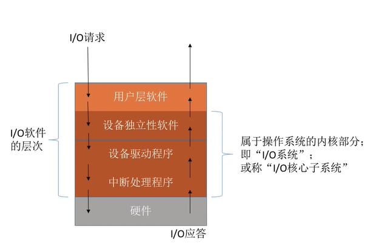

- ##### 用户层软件

  - 提供了与用户交互的接口，用户可以直接使用该层提供的**库函数**对I/O设备进行操作
  - 将用户的请求进行翻译，通过**系统调用**请求操作系统内核的服务

- ##### 设备独立性软件（设备无关软件）

  - 向上层提供调用接口
  - 对设备的保护，与对文件的保护类似
  - 差错处理
  - 设备的分配与回收
  - 数据缓冲区管理
  - 建立逻辑设备名与物理设备名之间的映射关系，并选择调用相应的驱动程序
    - 通过**逻辑设备表（LUT）**实现
    - 可以整个系统一张LUT，也可以每个用户一张LUT（类似两级目录）

- ##### 设备驱动程序

  - 将抽象要求转化为具体要求
  - 检查I/O请求的合法性
  - 了解I/O设备状态、传递相关参数、设置设备工作方式
  - 发出I/O操作命令，启动I/O设备
  - 响应通道的中断请求
  - 构造通道程序

- ##### 中断处理程序

  - 当I/O任务完成时，I/O控制器会发出**中断信号**，系统会根据此信号找到相应的**中断处理程序**并执行

#### 6.1.3 I/O 系统接口

1. ##### 块设备接口

   块设备，是指数据的存取和传输都是**以数据块为单位**的设备，其基本特征是**传输速率较高**，另一特征是**可寻址**，可随机地读/写磁盘中任一块。

   块设备接口磁盘上的所有扇区都依次编号；编号后，磁盘的二维结构改变为一种线性序列，这样块设备接口就隐藏了磁盘的二维结构。

   除了以上优点，它还可以将将抽象命令映射为低层操作。

2. ##### 流设备接口

   流设备也称字符设备，是指数据的存取和传输是**以字符为单位**的设备，如键盘、打印机等。其基本特征是**传输速率较低**，且另一特征是**不可寻址**；基于以上考虑，字符设备在输入/输出时，常采用**中断驱动**方式。

   字符设备不可寻址，因而对它只能采取**顺序存取**方式。我们通常是为字符设备建立一个**字符缓冲区(队列)**。

   因字符设备的类型非常多，且差异甚大，为了以统一的方式来处理它们，通常在流设备接口中提供了一种通用的**in-control**指令，在该指令中包含了许多参数，每个参数表示一个与具体设备相关的特定功能。

   多数流设备都属于**独占设备**，所以我们必须采取**互斥**方式实现共享，为此，流设备接口提供了打开和关闭操作。在使用这类设备时，必须先用打开操作来打开设备。如果设备已被打开，则表示它正被其它进程使用。


### 6.2 I/O设备和设备控制器

#### 6.2.1 设备控制器

1. ##### 设备控制器的基本功能

   - **接受和识别命令**：附有寄存器和**命令译码器**
   - **数据交换**：**CPU与控制器**之间通过**数据总线**进行双向**并行**数据交换；**控制器与设备**之间的数据交换，是设备将数据输入到控制器，或从控制器传送给设备。在控制器中须设置**数据寄存器**。
   - **标识和报告设备的状态**：控制器中设置有**状态寄存器**，其每一位反应设备的某一种状态。
   - **地址识别**：控制器中配置有**地址译码器**，完成地址识别。
   - **数据缓冲区**：数据缓冲区可以用来进行速度匹配和临时存储。
   - **差错控制**：

2. ##### 设备控制器的组成

   1. ##### 设备控制器与主机的接口

      该接口中有3类信号线：**数据线**、**地址线**和**控制线**；数据线常与若干个**数据寄存器**和**控制/状态寄存器**相连。CPU通过控制线发出命令；通过地址线指明要操作的设备；通过数据线存/取数据。

   2. ##### 设备控制器与设备的接口 

      设备控制器拥有一个或多个设备接口，每个接口都存在**数据**、**控制**和**状态**三种类型的信号；I/O逻辑根据处理机信号选择设备接口。接口数据线传输数据，状态线向控制器反馈当前设备状态，控制器通过控制线向相应的设备发送控制信号。

   3. ##### I/O逻辑

      I/O逻辑接收和识别CPU发来的各种指令，通过一组**控制线**与处理机交互，可完成CPU指令的**译码**任务，对设备发出指令。

   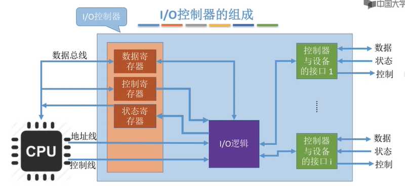

#### 6.2.1 内存映像I/O

1. 由于一个I/O控制器可能连接多个I/O设备，因此数据寄存器、状态寄存器、控制寄存器的数量也可能会有多个（一个设备对应一个）

- 有的计算机会让这些寄存器占用内存地址的一部分，称为**内存映像I/O**
  - 控制器中断寄存器与内存地址统一管理
  - 简化了指令，可以采用操作内存的指令来操作控制器 
- 另一些计算机则采用I/O专用地址，即**寄存器独立编址**
  - 控制器中的寄存器使用单独的地址
  - 需要设置专门的指令来操作控制器 
  - 不仅需要指明寄存器地址，还要指明控制器编号 

### 6.3 中断机构和中断处理程序

#### 6.3.1 基本概念

- **中断**：中断是指CPU对IO设备发来的中断信号的一种响应。
- **中断源**：引起中断发生的事件称为中断源。
- **中断请求**：中断源向CPU发出的请求中断处理信号称为中断请求。
- **中断响应**：CPU收到中断请求后转相应的事件处理程序称为中断响应。
- **陷入**：由CPU内部事件所引起的中断，称为内中断或陷入(trap)。中断和陷入的主要区别是信号的来源，即是来自CPU外部，还是CPU 内部。
- **中断向量表**：每一个设备的中断请求规定一个中断号，它直接对应于中断向量表的一个表项中。
- **中断优先级**：经常会有多个中断信号源，每个中断源对服务要求的紧急程度并不相同，系统就需要为它们分别规定不同的优先级。
- **屏蔽（禁止）中断**：当处理机正在处理一个中断时，将屏蔽掉所有的中断，对任何新到的中断请求，都暂时不予理睬，而让它们等待。
- **嵌套中断**
  - 当同时有多个不同优先级的中断请求时，CPU 优先**响应最高优先级**的中断请求:
  - 高优先级的中断请求可以**抢占**正在运行的低优先级中断的处理机

#### 6.3.2 中断处理程序的处理过程

1. **测定是否有未响应的中断信号**
2. **保护被中断进程的CPU环境**
   1. 由**硬件**将**PSW**和**PC中下一条指令地址**保存在**中断保留区（栈）**中。
   2. 将中段进程的CPU现场信息（所有**寄存器内容**）都压入**中断栈**中。
3. **转入相应的设备处理程序**：将设备中断处理程序入口地址装载到**PC**中。
4. **中断处理**
5. **恢复CPU的现场并退出中断**
   - 本中断是否采用了**屏蔽(禁止)中断**方式，若是，就会返回被中断的进程。
   - 采用的是**嵌套中断**方式，若无更高优先级的中断请求，完成当前中断后，返回被中断的进程;反之，处理优先级更高的中断请求。

### 6.4 设备驱动程序

#### 6.4.1 设备驱动程序概述

1. **设备驱动程序的功能**
   - 将通用软件指令转换为具体硬件操作指令。
   - 验证和处理输入/输出请求，管理设备状态和参数配置。
   - 控制设备执行I/O任务，管理设备队列以处理并发请求。
   - 处理设备中断，确保及时响应并执行相应的中断服务程序。
2. **设备驱动程序的特点**
   - 驱动程序作为中间件，负责将高级软件的通用I/O请求转换为特定硬件操作，并监控设备状态。
   - 针对不同的硬件设备，需要专门编写对应的驱动程序，但相似设备可能共用一个驱动程序。
   - 驱动程序的设计与设备的I/O控制方式（如中断驱动、DMA）密切相关。
   - 驱动程序的某些部分可能使用**汇编语言**编写，并且可能嵌入到硬件的ROM中。
   - 驱动程序需要**支持重入**，以便能够处理并发调用。
3. **设备处理方式**
   1. 为每种设备类型创建一个**专用**的进程来处理I/O操作。
   2. 设置一个**全局**的I/O进程来处理系统内所有设备的I/O操作。
   3. 不创建专用进程，而是为每种设备编写驱动程序，由用户进程或系统进程直接调用：该方式应用最多。

#### 6.4.2 设备驱动程序的处理过程

1. **将抽象要求转换为具体要求**：用户和上层软件发出的抽象命令需要通过设备驱动程序转换为具体操作指令，以与设备控制器通信。
2. **对服务请求进行校验**：启动IO设备之前，必须先检查该用户的I/O请求是不是合法。
3. **检查设备的状态**：设备正处于**就绪**状态才能启动进行IO操作。
4. **传送必要的参数**：在设备准备好接收或发送数据后，将数据和控制参数传送到设备控制器的相关寄存器。这些参数包括命令类型和传输方式，如通信速率、校验方式等，对于复杂设备还需设置更多参数。
5. **启动I/O设备**：驱动程序向设备控制器的命令寄存器发送控制命令，对于字符设备，写命令时发送数据，读命令时等待并检查状态以接收数据。

#### 6.4.3 对I/O设备的控制方式

1. ##### 采用轮询的可编程I/O方式

   使用轮询的可编程I/O方式时，CPU发出I/O指令并设置**忙/闲**标志后，**不断检查**该标志直到设备输入完成。

   这种方式**效率低**下，因为CPU在等待I/O完成期间大部分时间处于空闲状态，且由于缺乏中断机制，设备无法主动通知CPU操作完成。

   **优点：**控制简单；不需太多硬件支持。

   **缺点：**

   - CPU和外围设备只能串行工作；
   - 设备之间不能并行工作；
   - 无法发现和处理由于设备或其它硬件所产生的错误。

2. ##### 使用中断的可编程I/O方式

   中断驱动的可编程I/O方式允许CPU在发出I/O命令后**继续执行其他任务**，设备完成操作后通过中断信号通知CPU。

   这种方式显著提高了CPU的利用率，因为它减少了CPU等待I/O操作完成的时间，使得CPU和I/O设备可以**并行**工作。

   **优点**：与程序I/O控制方式相比，CPU的利用率大大提高，并且能 支持多道程序和设备的并行操作。

   **缺点**：

   - 在一次数据传送过程中，发生中断次数较多；
   - 多个外围设备通过中断方式进行并行操作时，由于中断次数的急剧 增加而造成CPU无法响应中断和出现数据丢失现象；
   - 如果外围设备的速度非常高，则可能造成数据缓冲寄存器的数据由 于CPU来不及取走而丢失。

3. ##### 直接存储器访问方式

   1. ##### 特点:

      - 数据传输的基本单位是**数据块**
      - 所传送的数据是从设备直接送入内存的，或者相反
      - 除传送的开始和结束外，整块数据的传送是在控制器的控制下完成的，无需CPU干预。

   2. ##### DMA控制器的组成

      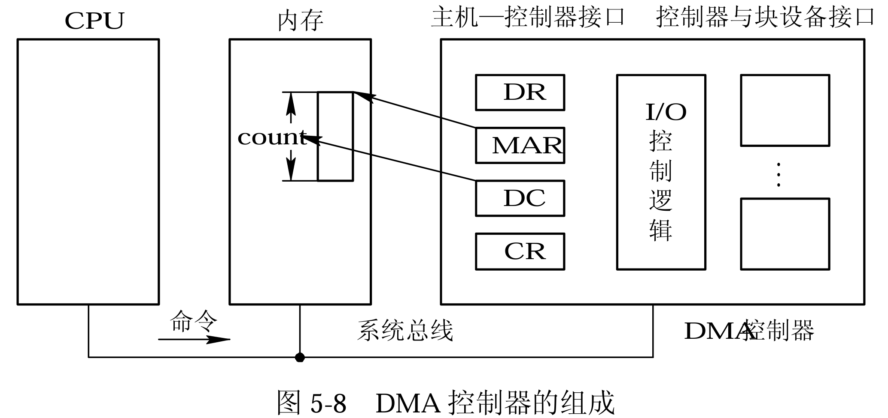

      - **命令/状态寄存器(CR)**：用于接收从CPU发来的I/O命令，或有关控制信息，或设 备的状态。 
      - **内存地址寄存器(MAR)**：在输入时，它存放把数据从设备传送到内存的起始目标地 址；在输出时，它存放由内存到设备的内存源地址。
      - **数据寄存器(DR)**：用于暂存从设备到内存，或从内存到设备的数据。
      - **数据计数器(DC)**：存放本次CPU要读或写的字(节)数。

   3. ##### DMA工作过程

      当CPU需要从磁盘读取数据时，它向磁盘控制器发送读命令和内存地址，并设置数据计数器。

      然后，CPU启动DMA控制器，后者独立负责数据传输。DMA控制器从磁盘读取数据到数据寄存器，然后从数据寄存器传输到内存，更新地址和计数。当数据传输完成后，DMA控制器发出中断请求。

      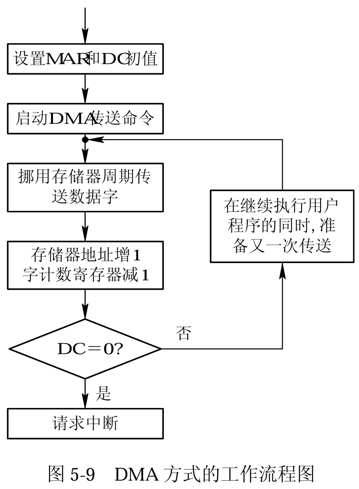

   4. **DMA 方式与中断驱动控制方式的区别**：

      - 中断方式是在DR满之后发中断请求CPU进行中断处理，而DMA方式则是在 所要求传送的数据块**全部传送完毕**时才要求CPU进行中断处理，这就大大 减少了CPU进行中断处理的次数。

      - 中断方式的数据传送是在中断处理时由CPU控制完成的，而DMA方式则是在DMA控制器的控制下不经过CPU控制完成的。

   5. **DMA方式的局限性**

      - 对外围设备的管理和某些操作仍由CPU控制。
      - 多个DMA控制器的同时使用会引起内存地址的冲突，并使得控制过程进一 步复杂化。
      - 多个DMA控制器的同时使用不经济。

4. ##### I/O通道控制方式

   1. **通道指令包含的信息**
   
      - 操作码
      - 内存地址
      - 计数
      - 通道程序结束位P，用于标识通道程序是否结束，P = 1表示本条指令程序是通道程序的最后一条指令
      - 记录结束标志R，R=0表示本通道指令与下一条指令所处理的数据同属一个记录；R=1表示这是处理某记录的最后一条指令
   
   2. ##### 通道方式与DMA方式的区别
   
      - DMA方式中，数据的传送方向、存放数据的内存地址以及传送的数据块长度等都由CPU控制，而在通道方式中，这些都由通道来进行控制。
      - DMA方式时每台设备至少一个DMA控制器，而通道控制方式可以做到**一个通道控制多台设备**与内存进行数据交换。

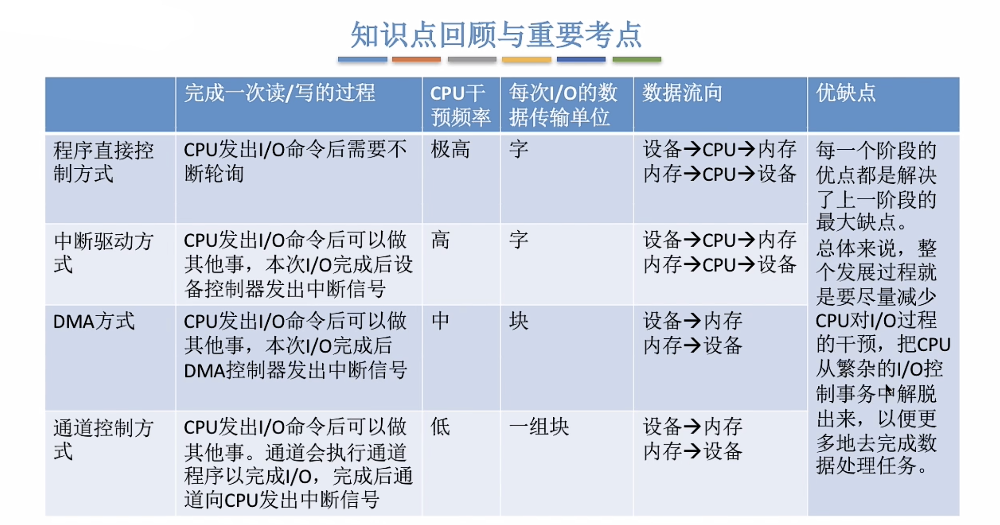

### 6.5 与设备无关的I/O软件

#### 6.5.1 基本概念

- **物理设备**：物理设备是计算机系统中实际存在的硬件组件，如硬盘、显卡和键盘，它们通过硬件接口与计算机连接并执行特定的功能。
- **逻辑设备**：逻辑设备是软件层面上的概念，它代表了一个或多个物理设备的抽象，提供了一个**统一的接口**，使得应用程序可以不考虑底层硬件的具体细节而与之交互。

- **I/O重定向**：与设备无关的软件可实现I/O重定向，I/O重定向指用于I/O操作的设备可以更换而不必更改应用程序。

#### 6.5.2 与设备无关的软件的功能层次

1. **设备驱动程序的统一接口**
2. **缓冲管理**
3. **差错控制**
   - **暂时性错误**：这类错误通常是临时的，可能是由于设备临时故障、传输干扰或其他可恢复的原因造成的。在一定的条件下，这类错误可以通过重试操作来解决。
   - **持久性错误**：这类错误通常是永久性的，无法通过简单的重试操作来恢复。例如，硬件损坏或固件缺陷可能导致持久性错误，这类错误通常需要人工干预或更换设备来解决。
4. **对独立设备的分配与回收**
5. **独立于设备的逻辑数据块**

#### 6.5.3 设备分配

1. **设备分配中的数据结构**

   1. **设备控制表 DCT**

      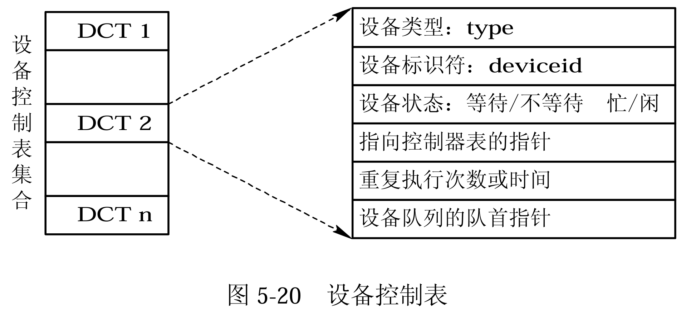

   2. **控制器控制表、通道控制表和系统设备表**

      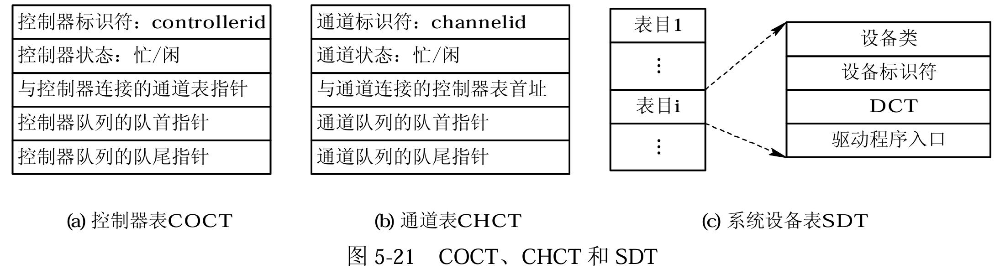

2. **设备分配时应考虑的因素**

   1. **设备的固有属性**

      - **独占设备**：一次只分配给一个进程，直到该进程结束或释放。
      2. **共享设备**：可同时分配给多个进程，需合理调度访问顺序。
      3. **虚拟设备**：作为共享设备，可同时分配给多个进程使用。

   2. **设备分配算法**

      - **先来先服务算法**
      - **高优先级算法**

   3. **设备分配中的安全性**

      - **安全分配方式**：进程在发出I/O请求后阻塞，直到操作完成。这种方式避免了“请求和保持”条件，从而防止死锁。缺点是CPU和I/O设备顺序工作，不能并行。
      - **不安全分配方式**：进程发出I/O请求后继续运行，可同时请求多个设备，提高进程推进速度。但可能导致“请求和保持”条件，增加死锁风险。需要进行安全性检查，确保分配不会导致死锁才进行。

   4. **独占设备的分配程序**

      1. **设备分配**：
         1. 进程请求I/O操作，指定需要的物理设备。
         2. 系统通过查找系统设备表(SDT)获取设备的设备控制表(DCT)。
         3. 检查DCT中的设备状态，确定设备是否可用。
         4. 如果设备忙碌，进程的PCB（进程控制块）被加入设备等待队列。
         5. 如果设备空闲，系统检查分配是否安全（如系统资源是否充足）。
         6. 安全则分配设备，否则进程等待。
      2. **控制器分配**：
         1. 在设备分配成功后，系统查找与设备相连的控制器控制表(COCT)。
         2. 检查COCT中的控制器状态。
         3. 如果控制器忙碌，进程的PCB加入控制器等待队列。
         4. 如果控制器空闲，则分配给进程。
      3. **通道分配**：
         1. 系统接着查找与控制器相连的通道控制表(CHCT)。
         2. 检查CHCT中的通道状态。
         3. 如果通道忙碌，进程的PCB加入通道等待队列。
         4. 如果通道空闲，则分配给进程。

      只有当**设备、控制器和通道都成功分配后，设备分配才算完成**，随后可以启动I/O设备进行数据传输。

      为了提升设备分配的灵活性和效率，可以采用**逻辑设备名**进行I/O请求。这样，系统首先尝试分配同类设备中的第一个可用设备，如果忙碌则尝试下一个，直到找到一个可用的设备。


#### 6.5.4 逻辑设备名到物理设备名的映射

1. **逻辑设备表LUT（Logical Unit Table）**

   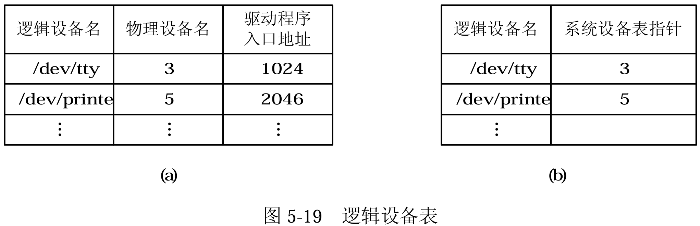

2. **逻辑设备表的设置问题**

   - **单一逻辑设备表**：整个系统只使用一张LUT，记录所有进程的设备分配情况。这种方式要求每个用户使用不同的逻辑设备名，适合单用户系统，但在多用户系统中难以实施。该设置方法对应于上图a。
   - **用户专属逻辑设备表**：每个用户登录时，系统为其创建一张LUT，并将其放入用户进程的PCB中。这种方式适合多用户系统，并且可以与系统设备表结合使用。该设置方法对应于上图b。

### 6.6 缓冲区管理

#### 6.6.1 为什么要搞缓冲区？

1. 缓和CPU与I/O设备间速度不匹配的矛盾
2. 减少对CPU的中断频率，放款对CPU中断响应时间的限制
3. 解决数据粒度不匹配的问题
4. 提高CPU和I/O设备之间的并行性

#### 6.6.2 单缓冲区（Single Buffer）

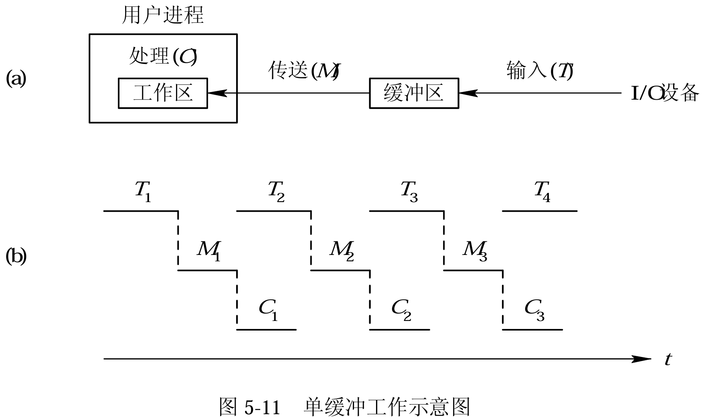

由于 T 和 C 是可以并行的（见上图），当 T>C 时，系统对每一块  数据的处理时间为 M+T，反之则为 M+C，故可把系统对每一块数据的处理时间表示为 ：
$$
Max(C,T)+M
$$

#### 6.6.3 双缓冲区（Double Buffer）

双缓冲区是一种用于提高数据输入/输出效率的机制，通过使用两个缓冲区来尽可能解决输入等待问题：当第一个缓冲区装满数据后，生产者会转向使用第二个缓冲区，同时消费者可以处理第一个缓冲区中的数据。

这种方法可以减少等待时间，提高设备利用率和系统处理速度。在块设备输入时，双缓冲可以使得设备连续输入或减少CPU等待时间；对于字符设备，双缓冲通常能消除用户在输入时的等待时间。

系统对每一块数据的处理时间为：
$$
\mathrm{Max(C,T)}
$$
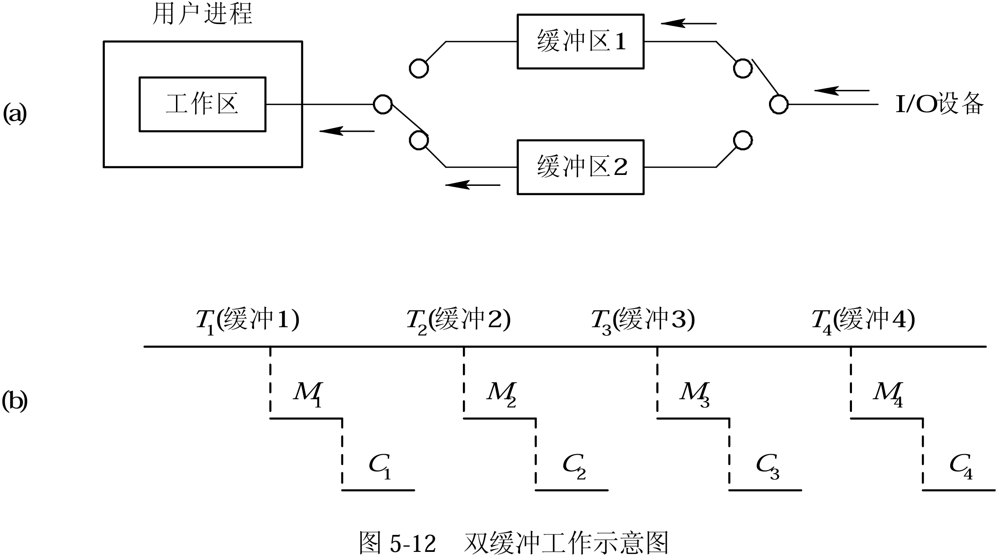

任一时刻以上双缓冲只能实现**单向数据传输**，为了实现两台机器之间的双向通信，需要配置双缓冲区，即**每个机器一个发送缓冲区和一个接收缓冲区**。这样，两台机器可以同时发送和接收数据，实现双向数据传输。

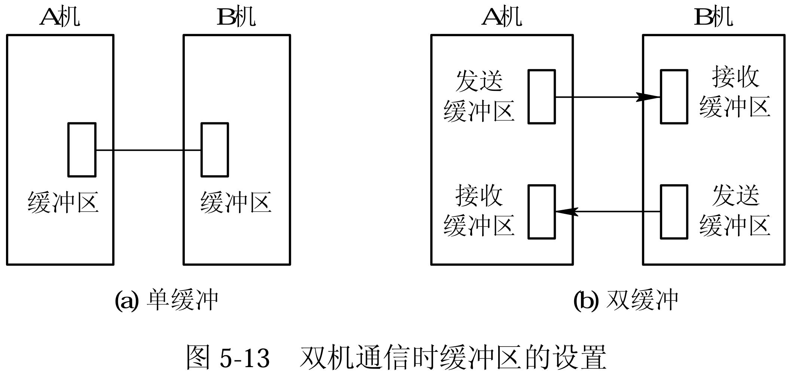

#### 6.6.4 环形缓冲区

1. **环形缓冲区的形成**

   -  **多个缓冲区**：在循环缓冲中包括多个缓冲区，其每个缓冲区的大小相同
     - 用于装输入数据的空缓冲区R
     - 已装满数据的缓冲区G
     - 计算进程正在使用的现行工作缓冲区C

   - **多个指针**
     - 用于指示计算进程下一个可用缓冲区G的指针Nextg
     - 指示输入进程下次可用的空缓冲区R的指针Nexti
     - 以及用于指示计算进程正在使用的缓冲区C的指针Current。 

   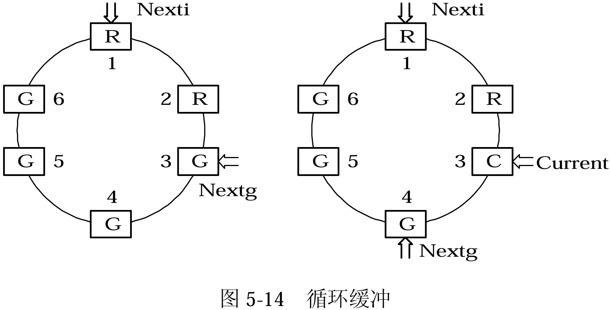

2. **环形缓冲区的使用**

   - **Getbuf 过程**：用于获取缓冲区数据，它提供Nextg指针指向的缓冲区给进程使用，并更新Current指针和Nextg指针。输入进程也使用Getbuf过程来获取Nexti指针指向的缓冲区，并更新Nexti指针。
   - **Releasebuf 过程**：用于释放已使用完毕的缓冲区。计算进程在提取完C缓冲区数据后调用Releasebuf，将缓冲区从工作状态C转为空状态R。输入进程在装满缓冲区后也调用Releasebuf，将缓冲区从R转为G状态。

3. **进程之间的同步问题**

   - **Nexti追上Nextg指针**：表示输入进程速度快于计算进程，**所有空缓冲区已满**，输入进程需要阻塞等待计算进程释放缓冲区，称为**系统受计算限制**。
   - **Nextg追上Nexti指针**：表示计算进程速度快于输入进程，**所有数据缓冲区已空**，计算进程需要阻塞等待输入进程装满缓冲区，称为**系统受I/O限制**。

#### 6.6.5 缓冲池（Buffer Pool）

1. **缓冲池的组成**

   - **空缓冲队列 emq**：这是由空缓冲区所链成的队列。其队首指针 F(emq)和队尾指针 L(emq)分别指向该队列的首缓冲区和尾缓冲区。
   - **输入队列 inq**：这是由装满输入数据的缓冲区所链成的队列。其队首指针 F(inq)和 队尾指针L(inq)分别指向该队列的首缓冲区和尾缓冲区。 
   - **输出队列 outq**：这是由装满输出数据的缓冲区所链成的队列。其队首指针 F(outq)和队尾指针L(outq)分别指向该队列的首缓冲区和尾缓冲区。 

   除了上述三个队列外，还应具有四种工作缓冲区：① 用于收容输入数据的工作缓冲区； ② 用于提取输入数据的工作缓冲区；③ 用于收容输出数据的工作缓冲区；④ 用于提取输 出数据的工作缓冲区。

2. **Getbuf 过程和 Putbuf 过程**

   ```c
   void Getbuf(unsigned type) {
       Wait(RS(type)); 			// 等待空缓冲区资源
       Wait(MS(type)); 			// 等待互斥访问缓冲区的权限
       B(number) = Takebuf(type); 	// 从缓冲区获取数据，假设Takebuf是一个获取数据的函数
       Signal(MS(type)); 			// 释放互斥锁，允许其他进程访问缓冲区
   }
   
   void Putbuf(unsigned type, unsigned number) {
       Wait(MS(type)); 			// 等待互斥访问缓冲区的权限
       Addbuf(type, number); 		// 将数据添加到缓冲区，假设Addbuf是一个添加数据的函数
       Signal(MS(type)); 			// 释放互斥锁，允许其他进程访问缓冲区
       Signal(RS(type)); 			// 增加空缓冲区的资源，通知可能有等待的进程
   }
   ```

3. **缓冲区的工作方式**

   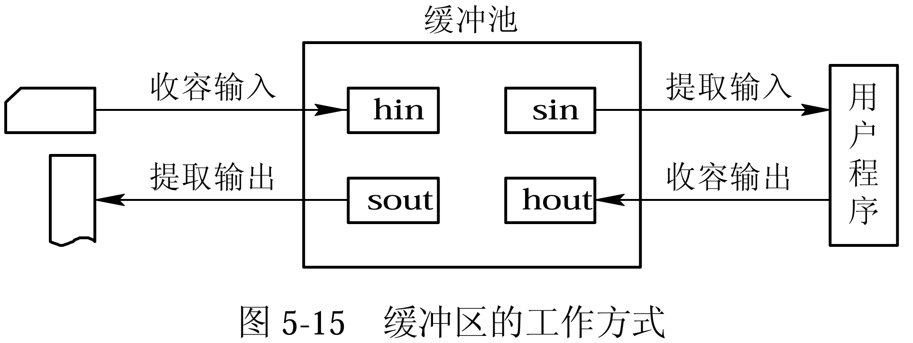

   1. **收容输入**：
      - 在输入进程需要输入数据时，便调用 **Getbuf(emq)**过程，从空缓冲队列 emq 的队首摘下一空缓冲区，把它作为**收容输入工作缓冲区hin**。
      - 然后，把数据输入其中， 装满后再调用**Putbuf(inq，hin)**过程，将该缓冲区挂在输入队列inq上。 
   2. **提取输入**：
      - 当计算进程需要输入数据时，调用**Getbuf(inq)**过程，从输入队列inq的 队首取得一个缓冲区，作为**提取输入工作缓冲区(sin)**，计算进程从中提取数据。
      - 计算进程用 完该数据后，再调用**Putbuf(emq，sin)**过程，将该缓冲区挂到**空缓冲队列emq**上。 
   3. **收容输出**：
      - 当计算进程需要输出时，调用**Getbuf(emq)**过程从空缓冲队列emq 的队 首取得一个空缓冲区，作为**收容输出工作缓冲区 hout**。
      - 当其中装满输出数据后，又调用 **Putbuf(outq，hout)**过程，将该缓冲区挂在outq 末尾。  
   4. **提取输出**：由输出进程调用 **Getbuf(outq)**过程，从输出队列的队首取得一装满输出 数据的缓冲区，作为**提取输出工作缓冲区sout**。在数据提取完后，再调用Putbuf(emq，sout) 过程，将该缓冲区挂在空缓冲队列末尾。

### 6.7 假脱机（Spooling）系统

1. ##### 假脱机系统的组成

   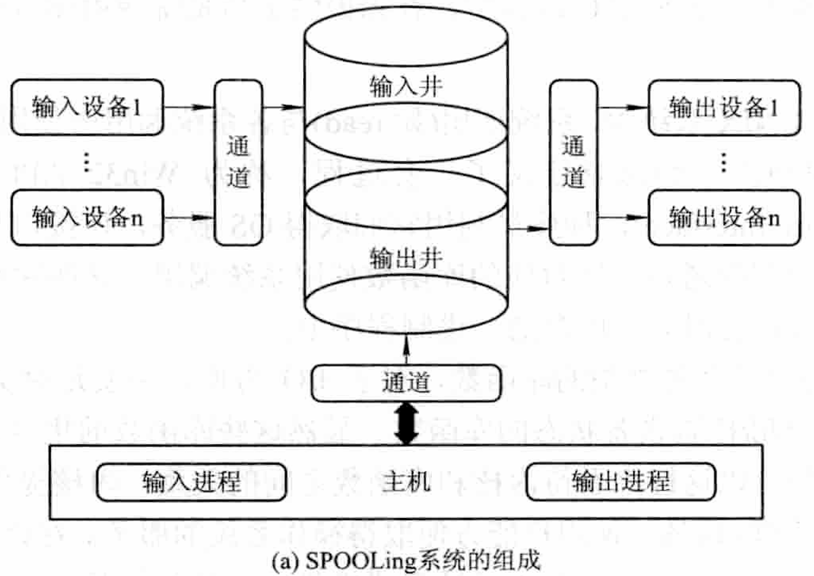

   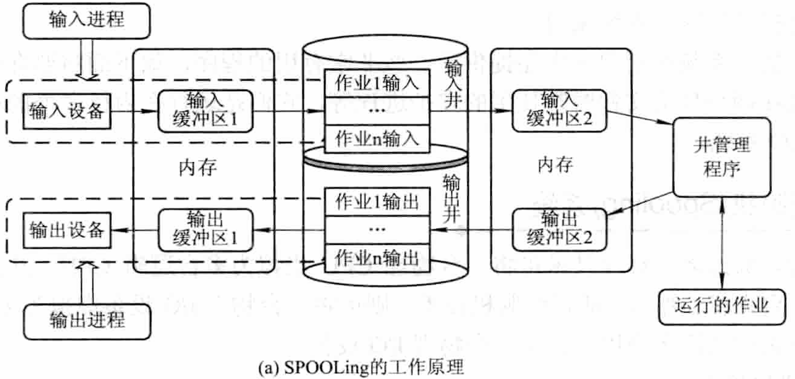

   - **输入井和输出井**：
     - **输入井**：用来暂存从输入设备（如磁盘、键盘等）读取的数据，模拟脱机输入的磁盘设备。数据先被读入输入井，然后再由CPU处理。
     - **输出井**：用来暂存用户程序的输出数据，模拟脱机输出的磁盘设备。数据先被写入输出井，然后再输出到相应的输出设备（如打印机、显示器等）。
   - **输入缓冲区和输出缓冲区**：
     - **输入缓冲区**：内存中的一块区域，用于暂时存储从输入设备读取的数据，以缓解CPU和磁盘设备之间的速度不匹配问题。数据从输入设备进入输入缓冲区，然后传送到输入井。
     - **输出缓冲区**：内存中的一块区域，用于暂时存储将要输出到输出设备的数据。数据从输出井进入输出缓冲区，然后传送到输出设备。
   - **输入进程和输出进程**：
     - **输入进程（预输入进程）**：模拟脱机输入时的外围控制机，将数据从输入设备传送到输入缓冲区，再传送到输入井。当CPU需要读取数据时，直接从输入井中读取。
     - **输出进程（缓输出进程）**：模拟脱机输出时的外围控制机，将数据从内存传送到输出井，再传送到输出缓冲区，最终输出到输出设备。
   - **井管理程序**：
     - **井管理程序**：操作系统的一部分，用于控制作业和磁盘井之间的信息交换。当作业请求进行I/O操作时，操作系统调用井管理程序，井管理程序负责从输入井读取数据或将数据写入输出井。

2. **假脱机系统的特点**

   1. 通过使用磁盘缓冲区，将I/O操作转换为对高速磁盘的数据存取，从而**提高I/O速度**并解决CPU与低速I/O设备速度不匹配的问题。
   2. 假脱机技术允许**将独占设备转变为共享设备**，通过在磁盘缓冲区中为进程分配空间和建立I/O请求表，而不是直接分配物理设备。
   3. **实现了虚拟设备功能**，让多个进程可以同时使用一台独占设备，每个进程都认为自己独占了设备，实际上它们使用的是逻辑上的设备。


