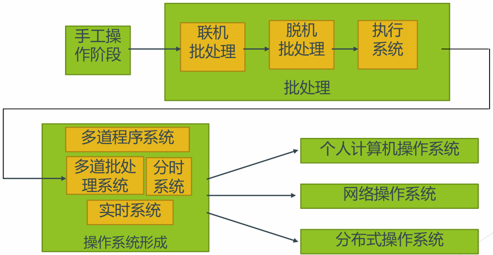
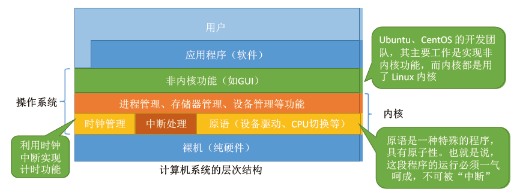
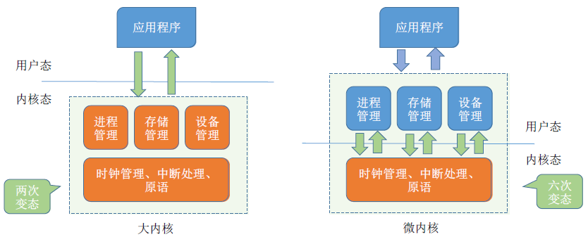

<h1>第一章 操作系统概述<h1>

### 1.1 操作系统概念，功能，目标

操作系统是一组能有效组织和管理计算机硬件和软件资源，合理地对各类作业进行调度，以及方便用户使用的程序的集合。 

### 1.2 操作系统发展历程

#### 1.2.1 未配置操作系统的计算机系统

- **人工阶段**
  - 用户既是程序员，又是操作员；用户是计算机专业人员
  - 人机矛盾， 用户独占全机，CPU等待人工操作

-  **脱机输入/输出（Off-Line I/O）阶段**
  - 程序和数据的输入和输出都在脱离主机的外围机的控制下完成。
  - 减少了CPU的空闲时间，提高了I/O速度

#### 1.2.2 单道批处理系统

- **主要特征**
  - **自动性**：磁带上的一批作业能自动地逐个地依次运行，无需人工干预。
  - **顺序性**：先调入内存的作业先完成。
  - **单道性**⭐：$\underbrace{\text{内存中仅有一道程序运行}}_\text{资源利用率不高}$。

#### 1.2.3 多道批处理系统

- #####  基本概念

  - **多道**：内存中同时存放几个作业
  - **宏并微串**：都处于运行状态，但都未运行完，是各作业交替使用CPU。

- ##### 优点

  - **资源利用率高**
  - **系统吞吐量大**

- ##### 缺点

  - **平均周转时间长**
  - **无交互能力**

#### 1.2.4 分时系统

- #####  分时系统的特征

  - **多路性**——多个用户同时使用
  - **独立性**——对每个用户而言好象独占全机
  - **及时性**——及时响应用户请求
  - **交互性**——人机对话

#### 1.2.5 实时系统

- #####  实时任务的分类

  - **周期性实时任务**、**非周期性实时任务**
  - **硬实时任务**、**软实时任务**

- **特点**：多路性、及时性、独立性、交互性、**可靠性**

#### 1.2.6 微机操作系统的发展

- 单用户单任务操作系统：CP/M、MS-DOS
- 单用户多任务操作系统：Windows
- 多用户多任务操作系统：UNIX、Solaris OS、Linux

### 1.2 操作系统的四个特征

- **并发性**: 指计算机系统中同时存在着多个运行着的程序，该特征是操作系统最基本的特征

  - **并发**: 指两个或多个事件在**同一时间间隔内**发生。这些事件宏观上是同时发生的，但微观上是交替发生的；程序是并行实体不能并发执行。

  - **并行**: 指两个或多个事件在**同一时刻**同时发生

    > 单核 CPU 同一时刻只能执行一个程序，各个程序只能**并发**地执行
    >
    > 多核 CPU 同一时刻可以同时执行多个程序，多个程序可以**并行**地执行

  - **进程**：在OS中能**独立运行**并作为**资源分配**的基本单位

  - **线程**：作为**独立运行**和**独立调度**的基本单位

- **共享性**: 指系统中的资源可供内存中**多个并发执行的进程**共同使用

  - **临界资源（或独占资源）**：一段时间内只允许一个进程访问的资源

  - **互斥共享**：在一段时间内只运行一个进程访问资源（如CPU、I/O设备），这些资源也称为**临界资源**
  - **同时访问**：在一段时间内运行多个进程“同时”访问（如内存、磁盘）

- **虚拟性**:

  - 空分复用(虚拟存储器)

    > 例如：电脑仅拥有4G内存,同时运行超过4G运行空间的程序，如LOL或穿越火线

  - 时分复用(虚拟处理器)

    > CPU时间片轮转，单核CPU却可以同时运行多个程序

- **异步性:** 

  异步性也称不确定性，指进程的执行顺序和执行时间的不确定性。

- **四大特征之间的关系**

  > 如果失去并发性，则系统中只有一个程序正在运行，则共享性失去了存在的意义
  >
  > 如果失去共享性，则多个程序不能同时访问硬件资源，就无法实现同时发送文件等功能，也就无法并发
  >
  > 如果失去了并发性，则一个时间段内系统只需要运行一道程序，那么就失去了实现虚拟性的意义。因此，**没有并发性，就谈不上虚拟性**。
  >
  > 如果失去了并发性，即系统只能串行地运行各个程序，那么每个程序的执行会一贯到底。**只有系统拥有并发性，才有可能导致异步性**。
  >
  > **并发性 & 共享性 => 互为存在条件**
  >
  > **没有并发性和共享性，就谈不上虚拟和异步，因此并发和异步是操作系统最基本的两个特征**

### 1.3 操作系统的主要功能

操作系统有四大功能：<u>**文件管理**</u>、<u>**存储器管理**</u>、<u>**处理机管理**</u>、**<u>设备管理</u>**。我们用一个打开QQ和朋友打视频的例子来说明：

> 找到 QQ 的安装位置 —— 逐层打开文件夹，找到 QQ.exe 这个程序的存放位置**（文件管理）**
>
> 双击打开 QQ.exe —— 需要把该程序相关数据放入内存**（存储器管理）**
>
> QQ 程序正常运行 —— 对应的进程被处理机 CPU 处理**（处理机管理）**
>
> 开始和朋友视频聊天 —— 需要将摄像头设备分配给进程**（设备管理）**

- **处理机管理：**进程控制、进程同步、进程通信、调度
  - **进程控制**：创建、撤销、控制进程在运行过程中的状态转换
  - **进程同步**：进程同步机制（进程互斥方式、进程同步方式）
  - **进程通信**：相互合作进程间的信息交换
  - **调度**：作业调度、进程调度

- **存储器管理：**内存分配（静态 and 动态）、内存保护、地址映射、内存扩充
  -  **内存分配**
    - **内存分配方式**：静态、动态
    - **内存分配机制**：内存分配数据结构、内存分配算法、内存回收

  - **内存保护**：内存保护机制
  - **地址映射**：将地址空间中的逻辑地址转换为内存空间中与之对应的物理地址
  - **内存扩充**：虚拟存储技术
    - 请求调入功能、置换功能

- **设备管理：**缓冲管理、设备分配、设备处理
  - **缓冲管理**：单缓冲、双缓冲、公用缓冲池
  - **设备分配**：分配I/O设备、控制器和通道；设备分配方式；回收
  - **设备处理**：设备驱动程序；中断

- **文件管理：**
  - **文件存储空间的管理**：外存空间的分配与回收、管理机制
  - **目录管理**：文件的按名存取、文件共
  - **文件的读/写管理和保护**：文件读/写过程、文件的存取控制
- **操作系统与用户之间的接口**
  - **用户接口**
    - **联机用户接口**：联机命令、命令解释程序
    - **脱机用户接口**：作业控制语言JCL
    - **图形用户接口**：图形化的操作界面

  - **程序接口**：系统调用、库函数

### 1.4 操作系统的体系结构

#### 1.4.1 操作系统内核

#### 1.4.2 操作系统体系结构

