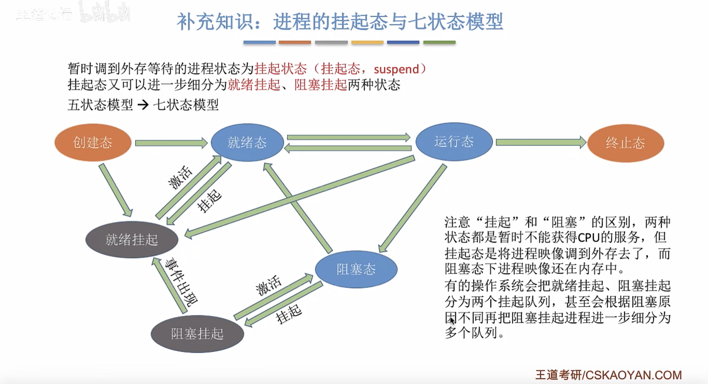
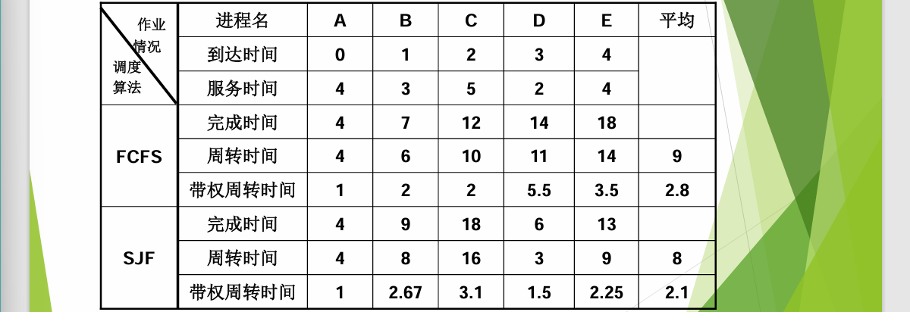
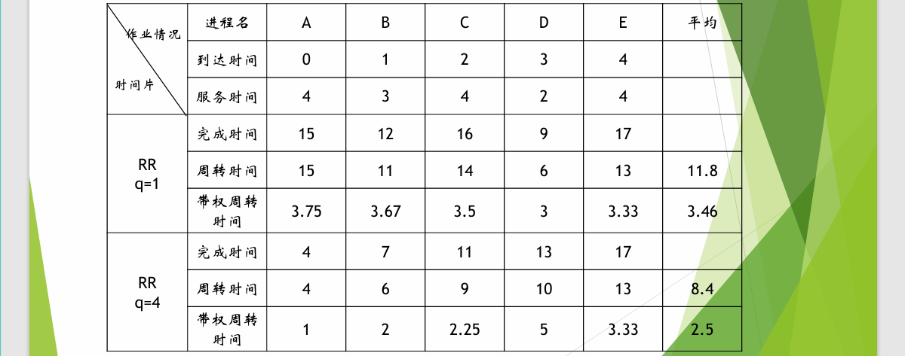
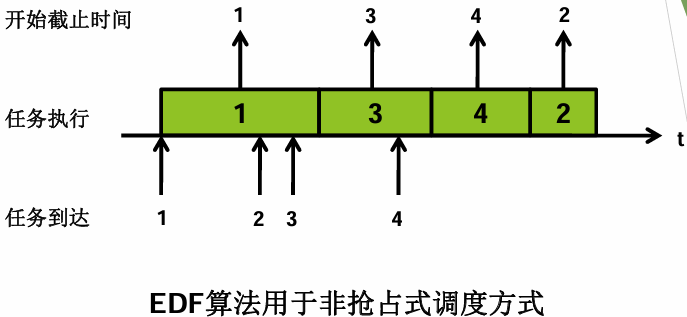
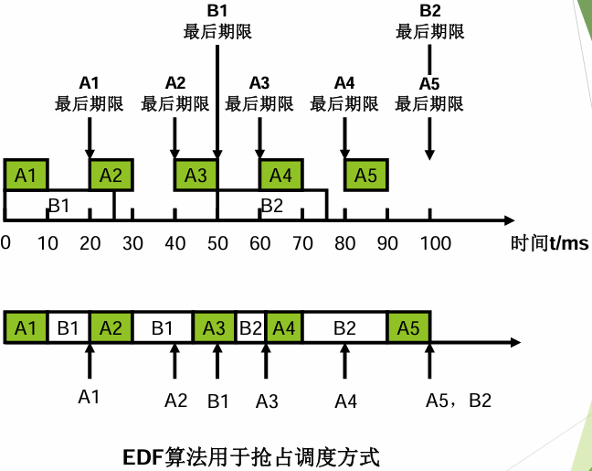
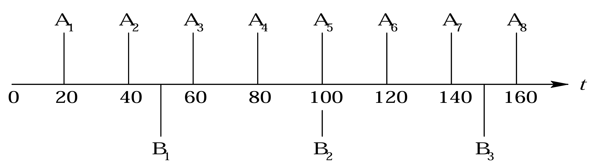
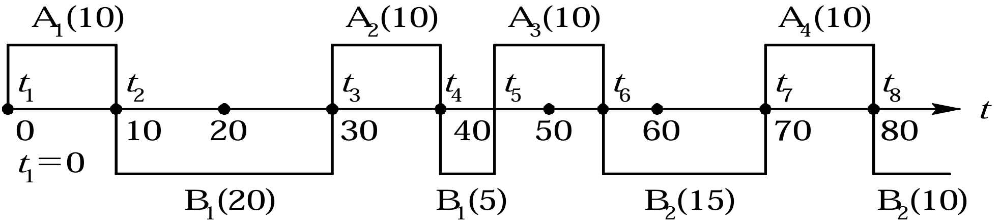
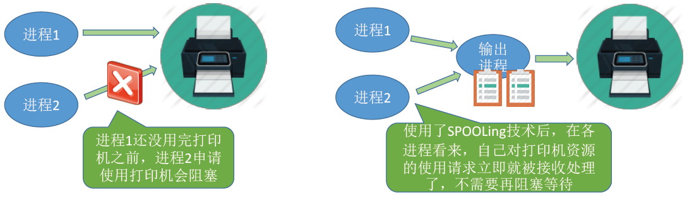

<h1>第3章 处理机调度与死锁</h1>

### 3.1 处理机调度的层次和调度算法的目标

#### 3.1.1 处理机调度的层次

1. ##### 作业调度——高级调度(High Level Scheduling)

   > 定义：高级调度(High Level Scheduling)又称为作业调度或长程调度(Long Term Scheduling)，其 把外存上处于**后备队列**中的那些作业调入内存，也就是说，它的调度对象是**作业**。
   >
   > 作业调度是**外存**和**内存**之间的调度。每个作业只调入一次、调出一次。作业调度时建立相应的PCB；作业调出时撤销相应的PCB。

2. ##### 进程调度——低级调度(Low Level Scheduling)

   > 定义：低级调度(Low Level Scheduling)称为**进程调度**或短程调度(ShortTerm  Scheduling)，它所调度的对象是进程(或内核级线程)。

   - 低级调度的功能

     1. 保存处理机的现场信息
     2. 按某种算法选取进程
     3. 把处理器分配给进程

   - 进程调度方式 

     - 非抢占方式

       > 只允许进程主动放弃处理机资源。即便有更高优先级的任务到达，也要等待当前进程主动终止或进入阻塞态。

       - 实现简单，系统开销小
       - 无法及时处理紧急任务

     - 抢占方式

       > 当有更重要的任务需要使用处理机时，立即暂停当前正在执行的进程，将处理机资源给更紧迫的任务。

       - 可以优先处理更紧急的任务（优先权原则）
       - 可以让各进程按照时间片轮流执行（时间片原则）
       - 适用于分时操作系统、实时操作系统

3. ##### 内存调度——中级调度(Intermediate Level Scheduling)

   > 定义：中级调度(Intermediate Level Scheduling)又称中程调度(Medium-Term Scheduling)。
   >
   > 引入目的： 中级调度的主要目的是为了提高内存利用率和系统吞吐量，通过中级调度来决定将哪个处于**挂起状态**的进程重新调入内存中。

4. ##### 七状态模型

   

5. ##### 三种调度的联系对比

| 调度类型 |              调度发生位置              | 发生频率 |             进程状态变化              |
| :------: | :------------------------------------: | :------: | :-----------------------------------: |
| 高级调度 |         外存→内存（面向作业）          |   最低   |           无→创建态→就绪态            |
| 中级调度 | 外存$\rightleftarrows$内存（面向进程） |   中等   | （挂起态→就绪态）/（阻塞挂起→阻塞态） |
| 低级调度 |                内存→CPU                |   最高   |             就绪态→运行态             |

#### 3.1.2 处理机调度算法的目标

1. ##### 处理机调度算法的共同目标

   - **资源利用率**
     $$
     \text{CPU的利用率}=\frac{\text{CPU的有效工作时间}}{\text{CPU的有效工作时间+CPU空闲等待时间}}
     $$
     
   - 公平性：确保诸进程都获得合理的CPU时间，**不会发生进程饥饿现象**
   
   - 平衡性
   
   - 策略强制执行
   
2. ##### 批处理系统的目标

   - 平均周转时间短

     > 作业周转时间：从作业被提交给系统开始，到作业完为止的这段时间间隔称为作业周转时间

     - 平均周转时间

     $$
     T=\dfrac{1}{n}\left[\sum_{i=1}^nT_i\right]
     $$

     - 平均带权周转时间
       $$
       W=\dfrac{1}{n}\left[\sum_{i=1}^n\dfrac{T_i}{T_s}\right]
       $$
       其中，系统提供服务的时间$T_s$

   - 系统吞吐量高

   - 处理机利用效率高

3. ##### 分时系统的目标

   - 响应时间快
   - 均衡性好

4. ##### 实时系统的目标

   - 截止时间的保证
   - 可预测性

### 3.2 作业与作业调度

#### 3.2.1 批处理系统种的作业

1. 作业运行时的三个阶段和三种状态

   > 作业从进入系统到运行结束，通常需要经历`收容`、`运行`和`完成`三个阶段。相应的作业也就有`后备状态`、`运行状态`和`完成状态`

#### 3.2.2 作业调度的主要任务

#### 3.2.3 先来先服务（FCFS）和短作业优先（SJF）调度算法

> 研究思路：
>
> 1. 算法思想
> 2. 算法规则
> 3. 用于作业调度还是进程调度?
> 4. 抢占式? 非抢占式?
> 5. 优点和缺点
> 6. 是否导致饥饿(某进程/作业长期得不到服务)

1. ##### FCFS算法

   > 按**进程请求CPU的先后顺序**为他们分配CPU，较为**公平**，只能是**非抢占式**的。

   - 思想: 先来先得
   - 规则: 按照到达先后顺序服务
   - 作业/进程调度: 都能使用, 作业调度考虑谁先到后背队列, 进程调度考虑谁先到就绪队列
   - 抢占: **非抢占式**
   - 优点: 公平, 实现简单
   - 缺点: **对长作业有利, 短作业不利**
   - 饥饿: 不会导致饥饿 

2. ##### SJF算法

   - 思想: 追求最少的平均等待时间, 平均周转时间, 平均带权周转时间
   - 规则: 最短的作业/进程优先得到服务(**服务时间最短**)
   - 作业/进程调度: 两者都可以, 用于进程时称为 "短进程优先 (SPF, *Shortest Process First*)" 算法
   - 抢占: 默认**非抢占式**, 也有**抢占式---最短剩余时间优先**算法 (SRTN, *Shortest Remaining Time Next*)
   - 优点: "最短" 平均等待时间, 周转时间
   - 缺点: **对短作业有利, 长作业不利**
   - 饥饿: **会发生饥饿** （考虑短作业占比很大，长作业会排不上号）

3. ##### 计算实例

   

#### 3.2.4 高响应比优先调度算法（Highest Response Ratio Next）

- 思想: 总和考虑等待时间和要求服务时间

- 规则: 次调度时计算各个作业/进程的**响应比**, 选择**最高**的来服务
  $$
  响应比=\frac{\text{等待时间+要求服务时间}}{\text{要求服务时间}}
  $$

- 作业/进程调度: 都能使用

- 抢占: **非抢占式**, 当前运行作业/进程主动放弃处理机才进行调度

- 优点: 综合考虑, 结合了 SJF 和 FCFS 的优点

- 缺点: 无

- 饥饿: 不会导致饥饿

#### 3.2.5 算法总结

> 这几种算法主要关心对用户的公平性、平均周转时间、平均等待时间等评价系统整体性能的指标，但是不关心“响应时间”，也并不区分任务的紧急程度，因此对于用户来说，交互性很糟糕。
>
> 因此这三种算法一般适合用于早期的批处理系统，当然，FCFS算法也常结合其他的算法使用，在现在也扮演着很重要的角色。

| 算法    | 思想规则 | 可抢占?                                                      | 优点                        | 缺点                                                 | 考虑到等待时间&运行时间? | 饥      饿? |
| ------- | -------- | ------------------------------------------------------------ | --------------------------- | ---------------------------------------------------- | ------------------------ | ----------- |
| FCFS    | 自己回忆 | 非抢占式                                                     | 公平；实现简单              | 对短作业不利                                         | 等待时间V 运行时间X      | 不会        |
| SJF/SPF | 自己回忆 | 默认为非抢占式，也有SIF的抢占式版本最短剩余时间优先算法（SRTN） | “最短的”平均等待/周转时间； | 对长作业不利，可能导致饥饿；难以做到真正的短作业优先 | 等待时间X 运行时间V      | 会          |
| HRRN    | 自己回忆 | 非抢占式                                                     | 综合考虑                    |                                                      | 等待时间V 运行时间V      | 不会        |

### 3.3 进程调度

#### 3.3.1 进程调度的任务、机制和方式

1. **进程调度的任务**

   - 保存处理机的现场信息
   - 按某种算法选取进程
   - 把处理器分配给进程

2. **进程调度机制的基本部分**

   - **排队器**：负责管理进程或任务的调度顺序，根据调度算法选择下一个要执行的进程
   - **分派器**：将CPU的控制权交给选定的进程，启动其执行，通常在排队器确定执行顺序后发挥作用
   - **上下文切换器**：负责在多任务环境下实现进程之间的切换，保存当前进程的状态并加载下一个要执行的进程的状态

3. **进程调度方式**

   - **非剥夺调度方式**，又称**非抢占方式**。

     > 只允许进程主动放弃处理机。在运行过程中即便有更紧迫的任务到达，当前进程依然会继续使用处理机，直到该进程终止或主动要求进入阻塞态。

   - **剥夺调度方式**，又称**抢占方式**。

     > 当一个进程正在处理机上执行时，如果有一个更重要或更紧迫的进程需要使用处理机，则立即暂停正在执行的进程，将处理机分配给更重要紧迫的那个进程

4. **进程切换与过程**

   - 狭义的进程调度”与“进程切换”的区别：
     - **狭义的进程调度**指的是从就绪队列中**选中一个要运行的进程**。（这个进程可以是刚刚被暂停执行的进程，也可能是**另一个进程**，后一种情况就需要**进程切换**）
     - **进程切换**是指一个进程让出处理机，由另一个进程占用处理机的过程
     
- **广义的进程调度**
   
  进程切换的过程主要完成了：
   
  - 对原来运行进程各种数据的保存
     - 对新的进程各种数据的加载或者恢复
   
  > 程序计数器、程序状态字、各种数据寄存器等处理机现场信息，这些信息一般保存在进程控制块）
   
  注意：**进程切换是有代价的，**因此如果**过于频繁的**进行进程**调度、切换**，必然会使整个**系统的效率降低**，使系统大部分时间都花在了进程切换上，而真正用于执行进程的时间减少

#### 3.3.2 轮转调度算法

1. **先序知识**

   - 周转时间=完成时间-到达时间
     $$
     带权周转时间=\frac{周转时间}{运行时间}
     $$
     

   - 等待时间=周转时间-运行时间（该公式仅适用于轮转调度算法）

2. **学习技巧**

   - 思想: 公平轮流服务, 每个进程在一定时间间隔内都得到响应

   - 规则: 按照各进程到就绪队列顺序, 轮流让各进程执行一个 **时间片** (如100ms), 时间片结束未执行完成将被剥夺处理机, 放到队尾

   - 作业/进程调度: **进程调度**, 作业放入内存建立了进程才能被分配时间片

   - 抢占: **抢占式**, 时钟装置产生**时钟中断**进行时间片轮转

   - 优点: 公平,响应快, 适用分时操作系统

   - 缺点: 高频率进程切换, 不区分任务紧急程度

   - 饥饿: 不会导致饥饿

3. **注意点**

   - 如果**时间片太大**, **退化为FCFS**, **会增大进程响应时间**

   - 如果**时间片太小**, **进程切换频繁**, 切换进程会花费大量时间

   - 一般来说, 设计时间片要让切换进程的开销占比**不超过 1%**

4. **计算实例**

   

#### 3.3.3 优先级调度算法

> - 思想: 根据任务紧急程度来调度
> - 规则: 每个任务有自己的优先级, 调度时选择优先级最高的
> - 作业/进程调度: 都可以, 甚至还能用于 I/O 调度
> - 抢占: **抢占式, 非抢占式均可**, 抢占式时就绪队列发生变化就可能要调度, 否则主动放弃处理机时调度
> - 优点: 优先级区分紧急程度, 适用实时操作系统
> - 缺点: 一直有高优先级进入，可能会有饥饿发生
> - 饥饿: **导致饥饿**

- 优先级可以动态改变:

  - 静态优先级: 进程创建后, 优先级一直不变，其参考因素如下
    - 进程类型
    - 进程对资源的需求
    - 用户要求

  - 动态优先级: 创建进程有个初始值, 之后根据情况动态调整

- 通常策略

  - 通常系统进程优先级 **高于** 用户进程

  - 前台进程优先级 **高于** 后台进程

  - 操作系统更**偏好I/O型进程(I/O繁忙型进程)**, 相对的是 **计算型进程(CPU繁忙进程)**, 两者可以并行, 选择更早进行 I/O 可以更优

- 动态策略

  - 如果某进程在就绪队列中**等待了很长时间**，则可以适当**提升**其优先级

  - 如果某进程占用**处理机运行了很长时间**，则可适当**降低**其优先级

  - 如果发现一个进程**频繁地进行I/O操作**，则可适当**提升**其优先级

#### 3.3.4 多级反馈队列(multileved feedback queue)调度算法

- 思想: 对其他算法的折中考虑

- 规则:

  1. 设置多级就绪队列, 优先级**从高到低**, 时间片**从小到大**
  2. ①新进程到达时**先进入第1级**队列, 按FCFS原则排队等待时间片；②如果用完时间片还未结束, 放入下一级队列队尾；③如果已经在最低级队列，但还未结束, 则重新放回最低级队列队尾，按照轮转调度算法在进行调度。④如果执行期间有更高优先级进程进入，则必须马上停止当前进程，并放入当前一级队列末尾；进而执行进程调度，执行高优先级的任务。
  3. 只有**第k级**队列为空（第k级队列已经完成了）, 才会为 k+1 级队列分配时间片

- 作业/进程调度: **用于进程调度**

- 抢占: **抢占式**算法

  > 在k级队列的进程运行过程中，若更上级的队列（1~k-1级）中进入了一个新进程，则由于新进程处于优先级更高的队列中，因此新进程会抢占处理机，**原来运行的进程放回 第k 级队列队尾**。

- 优点: 

  > 结合了前面所有调度算法的优点, 并且对于 CPU密集型进程, I/O密集型进程可以调整偏好程度 (如: 将因 I/O 阻塞的进程重新放回原队列, 这样可以保证 I/O 进程保持较高优先级)

- 缺点: 无明显缺点

- 饥饿: **会导致饥饿**

#### 3.3.5 三种算法的总结

<table style="width:100%; border-collapse: collapse; margin-bottom: 20px;">
  <tr style="background-color: #6a5acd;">
    <th style="padding: 10px; text-align: left; border: 1px solid #ddd; color: #fff;";>算法</th>
    <th style="padding: 10px; text-align: left; border: 1px solid #ddd; color: #fff; ">可抢占？</th>
    <th style="padding: 10px; text-align: left; border: 1px solid #ddd; color: #fff;">优点</th>
    <th style="padding: 10px; text-align: left; border: 1px solid #ddd; color: #fff;">缺点</th>
    <th style="padding: 10px; text-align: left; border: 1px solid #ddd; color: #fff; white-space: nowrap;">饥饿?</th>
    <th style="padding: 10px; text-align: left; border: 1px solid #ddd; color: #fff; white-space: nowrap;">补充</th>
  </tr>
  <tr style="background-color: #f0f8ff;">
    <td style="padding: 10px; border: 1px solid #ddd; white-space: nowrap;">时间片轮转</td>
    <td style="padding: 10px; border: 1px solid #ddd;">抢占式</td>
    <td style="padding: 10px; border: 1px solid #ddd;">公平，适用于分时系统</td>
    <td style="padding: 10px; border: 1px solid #ddd;">频繁切换有开销，不区分优先级</td>
    <td style="padding: 10px; border: 1px solid #ddd;">不会</td>
    <td style="padding: 10px; border: 1px solid #ddd;">时间片太大或太小有何影响？</td>
  </tr>
  <tr style="background-color: #fff0f5;">
    <td style="padding: 10px; border: 1px solid #ddd; white-space: nowrap;">优先级调度</td>
    <td style="padding: 10px; border: 1px solid #ddd;">有抢占式的，也有非抢占式的。注意做题时的区别</td>
    <td style="padding: 10px; border: 1px solid #ddd;">区分优先级，适用于实时系统</td>
    <td style="padding: 10px; border: 1px solid #ddd;">可能导致机饿</td>
    <td style="padding: 10px; border: 1px solid #ddd;">会</td>
    <td style="padding: 10px; border: 1px solid #ddd;">动态/静态优先级。各类型进程如何设置优先级？如何调整优先级？</td>
  </tr>
  <tr style="background-color: #f0fff0;">
    <td style="padding: 10px; border: 1px solid #ddd; white-space: nowrap;">多级反馈队列</td>
    <td style="padding: 10px; border: 1px solid #ddd;">抢占式</td>
    <td style="padding: 10px; border: 1px solid #ddd;">平衡优秀666</td>
    <td style="padding: 10px; border: 1px solid #ddd;">一般不说它有缺点，不过可能导致机饿</td>
    <td style="padding: 10px; border: 1px solid #ddd;">会</td>
    <td style="padding: 10px; border: 1px solid #ddd;"></td>
  </tr>
</table>

### 3.4 实时调度

#### 3.4.1 实时调度算法的分类

1. 非抢占式调度算法
   1. 非抢占式轮转调度算法
   2. 非抢占式优先调度算法
2. 抢占式调度算法
   1. 基于时钟中断的抢占式优先级调度算法
   2. 立即抢占（Immediate Preemption）的优先级调度算法

#### 3.4.2 EDF(Earliest Deadline First)算法

1. 非抢占式调度方式用于非周期实时任务

   

2. 抢占式调度用于周期实时任务

   

#### 3.4.3 最低松弛度优先 LLF(Least LaxityFirst)算法

- 思想：任务紧急度越高，赋予该任务的优先级就越高

- ⭐**松弛度计算公式**⭐
  $$
  \mathrm{xxx}\text{的松弛度}=\text{必须完成时间}-\text{其本身的运行时间}-\text{当前时间}
  $$

- 优先级倒置的解决办法：动态优先继承

- 例

  - 任务时间线图

    

  - LLF调度图

    

    > t=20这个时刻，A2的松弛度经计算为10（40-10-20），B1的松弛度为15（50-25-10；明明A2的松弛度更小，为什么还让B1继续执行了呢？
    >
    > 虽然A2松弛度小于B1的松弛度，但其毕竟还有10，B1此刻继续执行并不会影响A2，只有当t=30时，A2松弛度为0，此刻必须开始执行了，B1便让出处理机给A2。

    

### 3.5 死锁概述

1. **可重用性资源的特征**

   1. 每一个可重用性资源中的单元只能分配给一个进程使用，**不允许多个进程共享**。
   2. 可重用性资源的使用顺序①**请求资源**；②**使用资源**；③**释放资源**。
   3. 可重用性资源中的**单元数相对固定**，进程**运行期间既不能创建也不能删除**它。

2. **消耗性资源的特征**

   1. 进程运行期间，资源的单元数目可增加或减少
   2. 资源使用后可不必返还
   3. 进程可以一次请求多个可消耗性资源，区别于可重用资源

3. **死锁的定义**

   > 如果【**一组进程**】中的每一个进程都在等待仅由该组进程中的【**其它进程才能引发**】的事件，那么该组进程是死锁的(Deadlock)。

4. **常见引起死锁原因**

   1. 竞争不可抢占式资源引起死锁
   2. 竞争可消耗性资源引起死锁
   3. 进程推进顺序不当引起死锁

5. ⭐**产生死锁的必要条件**⭐

   1. **互斥条件**

      > 互斥资源只能一个进程使用，如果此时还有其它进程请求该资源，则请求进程只能等待，直至占有该资源的进程用毕释放。

   2. **请求和保持条件**

      > 已经持有一个资源，又请求一个新资源；新资源已经被别的进程占用，那么请求进程被阻塞；而持有的一个资源又不释放；就有可能造成死锁。

   3. **不可抢占条件**

      > 进程已获得的资源在未使用完之前不能被抢占，只能在进程使用完时由自己主动释放。

   4. **循环等待条件**

      > 在发生死锁时，必然存在一个进程一资源的循环链，即进程集合｛P0，P1，P2，···，Pn｝中的P0正在等待一个P1占用的资源，P1正在等待P2占用的资源，······，Pn正在等待已被P0占用的资源。

6. **处理死锁的方法**

   1. **预防死锁**：在资源分配策略上做限制,让死锁根本没有机会发生。

      > 该方法是通过设置某些限制条件，去破坏产生死锁四个必要条件中的一个或几个来预防产生死锁。

   2. **避免死锁**：在每个进程的每次提出动态资源申请时，加设“**银行家算法**“以决定 是否满足该请求。

      > 属于事先预防策略，但它并不是事先采取各种限制措施，去破坏产生死锁的四个必要条件，而是在资源的动态分配过程中，**用某种方法防止系统进入【不安全】状态**，从而可以避免发生死锁。
      >
      > **前提**：采用**动态资源分配**策略

   3. **检测死锁**

      > 通过检测机构及时地检测出死锁的发生，然后采取适当的措施，把进程从死锁中解脱出来。

   4. **解除死锁**

      > 当检测到系统中已发生死锁时，就采取相应措施，将进程从死锁状态中解脱出来。常用的方法是撤消一些进程，回收它们的资源，将它们分配给已处于阻塞状态的进程，使其能继续运行。

7. 死锁、死循环、饥饿的区别

   <table border="1" cellspacing="0" cellpadding="8" width="100%">
     <tr>
       <th  bgcolor="#f2f2f2">概念</th>
       <th bgcolor="#ffcccc" colspan="2" align='center'>区别</th>
     </tr>
     <tr>
       <th bgcolor="#ffebcc">死锁</th>
       <td bgcolor="#ffebcc">死锁一定是循环等待对方手里的资源导致的，因此如果有死锁现象，那至少有两个或两个以上的进程同时发送死锁。另外，发生死锁的进程一定处于阻塞态。</td>
     </tr>
     <tr>
       <th bgcolor="#ebffcc">饥饿</th>
       <td bgcolor="#ebffcc">可能只有一个进程发生饥饿。发生饥饿的进程既可能是阻塞态（如长期得不到需要的I/O设备），也可能是就绪态（长期得不到处理机）。</td>
     </tr>
     <tr>
       <th bgcolor="#ccffeb"><nobr>死循环</th>
       <td bgcolor="#ccffeb">可能只有一个进程发生死循环。死循环可以上处理机运行（可以是运行态），只不过无法像期待的那样顺利推进。死锁、饥饿是由于操作系统的策略不合理导致的，而死循环是由代码逻辑的错误导致的。</td>
     </tr>
   </table>

### 3.6 预防死锁

#### 3.6.1 破坏互斥条件

- 如果**把只能互斥使用的资源改造为允许共享使用的资源**，系统就不会进入死锁状态（SPOOLing（假脱机） 技术）

- **缺点：**并不是所有的资源都可以改造为可共享使用的资源。并且为了系统安全，很多地方还必须保护这种互斥性。因此，**很多时候都无法破坏互斥条件**

#### 3.6.2 破坏不可抢占条件

- **方案一：**当某个进程请求新的资源得不到满足时，它必须立即释放保持的所有资源。
- **方案二：**当某个进程需要的资源被其他进程所占有的时候，可以由操作系统协助，将想要的资源强行剥夺（考虑优先级）。

- **缺点：**
  1. 实现起来比较复杂
  2. 释放已获得的资源可能造成前一阶段工作的失效。因此这种方法一般只适用于易保存和恢复状态的资源，如CPU
  3. 反复地申请和释放资源会增加系统开销，降低系统吞吐量
  4. 若采用方案一，意味着只要暂时得不到某个资源，之前获得的那些资源就都需要放弃，以后再重新申请。如果一直发生这样的情况，就会导致进程饥饿

#### 3.6.3 破坏请求和保持条件

1. **静态分配方法**

   - 概念

     > 即进程在运行前一次申请完它所需要的全部资源，在它的资源未满足前，不让它投入运行。一旦投入运行后，这些资源就一直归它所有，该进程就不会再请求别的任何资源了

   - 缺点

     > 有些资源可能只需要用很短的时间，因此如果进程的整个运行期间都一直保持着所有资源，就会造成严重的资源浪费，**资源利用率极低**。另外，该策略也有**可能导致某些进程饥饿**

2. **动态分配方法**

   - 概念

     > 允许一个进程只获运行初期所需的资源后，便开始运行，运行过程中逐步释放已经分配给自己的、且已经使用完毕的全部资源，然后再申请新的所需资源

   - 缺点

     > 可能会导致资源碎片化。随着进程运行的不同阶段，它会释放不同类型和数量的资源，这可能会导致系统中存在大量的零散的、不连续的资源空闲区域。这种资源碎片化可能会增加资源分配的复杂性，并且可能导致系统无法有效地利用资源，从而影响系统性能。

#### 3.6.4 破坏循环等待条件

- **概念**：采用**顺序资源分配法**，首先给系统中的资源编号，规定每个进程**必须按编号递增的顺序请求资源**，同类资源（即编号相同的资源）一次申请完
- **原理分析：**一个进程只有已占有小编号的资源时，才有资格申请更大编号的资源。按此规则，已持有大编号资源的进程不可能逆向地回来申请小编号的资源，从而就不会产生循环等待的现象

- **缺点：**
  1. 不方便增加新的设备，因为可能需要重新分配所有的编号；
  2. 进程实际使用资源的顺序可能和编号递增顺序不一致，会导致资源浪费；
  3. 必须按规定次序申请资源，编程麻烦。

### 3.7 避免死锁

#### 3.7.1 安全序列、不安全状态、死锁的联系

- **安全序列**：如果系统按照这种序列分配资源，则每个进程都能顺利完成。
- **安全状态**：**安全状态是没有死锁危险的状态**
  - 只要能找出【一个】安全序列，系统就是安全状态。
  - 安全序列可能有多个。
  - 不是所有不安全状态都是死锁状态。
- **不安全状态**：如果分配了资源之后，系统中**找不出任何一个安全序列**，系统就进入了不安全状态。这就意味着之后可能所有进程都无法顺利的执行下去。如果有进程**提前归还**了一些资源，系统也有可能重新回到**安全状态**。
- **与死锁的联系**
  - 系统如果处于安全状态，则【一定】不会发生死锁；
  - 系统如果处于不安全状态，则【可能】会发生死锁；
  - 因此，可以通过提前判断是否会进入不安全状态来决定是否答应分配请求。

#### 3.7.2 利用银行家算法避免死锁

1. **银行家算法的数据结构**

   1. 可利用资源向量 Available。这如果Available[i]=K，则表示系统中现有$\text{R}_\text j$类资源K个。

   2. 最大需求矩阵Max。Max[i,j]=K，则表示进程i需要$\text{R}_\text j$类资源的最大数目为 K。

   3. 分配矩阵Allocation。 Allocation[i,j]=K，则表示进程i当前已分得$\text{R}_\text j$类资源的数目为 K。

   4. 需求矩阵Need。 Need[i,j]=K，则表示进程i还需要$\text{R}_\text j$类资源K个方能完成其任务。
      $$
      \text{Need[i,j]=Max[i,j]-Allocation[i,j]}
      $$

2. **银行家算法**

   > 设 $\text {Request}_\text{i}$是进程$\text {P}_\text i$的请求问量，如果【$\mathrm{Request_{i}[j]=K}$】表示进程$\text {P}_\text i$需要K个$\text{R}_\text{j}$类型的资源。当$\text {P}_\text i$发出资源请求后，系统按下述步骤进行检查:

   1. 如果【$\mathrm{Request_i[j]\leqslant Need[i,~j]}$】便转向步骤(2);否则认为出错，因为它所需要的资源数已超过它所宣布的最大值。

   2. 如果【$\mathrm{Request_i[j]\leqslant Available[j]}$】便转向步骤(3);否则，表示尚无足够资源，$\text {P}_\text i$须等待。

   3. 系统试探着把资源分配给进程$\text {P}_\text i$，并修改下面数据结构中的数值:
      $$
      \begin{aligned}
      \mathrm{Available[j]}&=\mathrm{Available[j]-Request_{i}[j];} \\
      \mathrm{Allocation[i,j]}&=\mathrm{Allocation[i,j]+Request_{i}[j];} \\
      \mathrm{Need[i,j]}&=\mathrm{Need[i,j]-Request_{i}[j];}
      \end{aligned}
      $$
      
   4. 系统执行安全性算法，检查此次资源分配后系统是否处于安全状态。若安全，才正式将资源分配给进程$\text {P}_\text i$，以完成本次分配;否则，将本次的试探分配作废，恢复原来的资源分配状态，让进程$\text {P}_\text i$等待。

3. **安全性算法**

   1. 设置两个向量:

      1. 工作向量 Work：它表示系统可提供给进程继续运行所需的各类资源数目，它含有m个元素，**在执行安全算法开始时，Work=Available**；
      2. Finish：它表示系统是否有足够的资源分配给进程，使之运行完成。开始时先做Finish[i]=false;当有足够资源分配给进程时，再令Finish[il:=true。

   2. 从进程集合中找到一个能满足下述条件的进程:

      1. Finish[i]=false;
      2. $\mathrm{Need[i,j]\leqslant Work[j];}$
      3. 若找到，执行步骤(3)，否则，执行步骤(4)。

   3. 当进程$\text {P}_\text i$获得资源后，可顺利执行，直至完成，并释放出分配给它的资源，故应执行:
      $$
      \begin{aligned}
      \mathrm{Work[j]}&=\mathrm{Work[ j] + Allocation[ i, j];} \\
      \mathrm{Finish[i]}&=\mathrm{true;} \\
      &\text{go to step 2;}
      \end{aligned}
      $$

   4. 如果所有进程的 Finish[i]=true 都满足，则表示系统处于安全状态;否则，系统处于不安全状态。

4. **小试40米大刀**

   - 已有如下PCB资源分配情况表，请按照要求完成试题

     |      | Max ABC | Allocation ABC | Need ABC | Available ABC |
     | :--: | :-----: | :------------: | :------: | :-----------: |
     |  P0  |   753   |      010       |   743    |      332      |
     |  P1  |   322   |      200       |   122    |               |
     |  P2  |   902   |      302       |   600    |               |
     |  P3  |   222   |      211       |   011    |               |
     |  P4  |   433   |      002       |   431    |               |

   - 若P1请求资源Request1 （1，0，2）

   - 若P4请求资源Request4 （3，3，0）

   - 若P0请求资源Request0（0，2，0）

   ⚠️**警告**⚠️上述3题是顺序执行的，也就是说，前面的结果会对后面的请求产生影响；该题的其中一种解决方案在教材上，若读者无法独立解决可以参考教材；答案不唯一。

### 3.8 死锁的检测与解除

#### 3.8.1 死锁的检测

1. **资源分配图**

   - **两种结点**
     - 进程结点：对应一个进程
     - 资源结点：对应**一类**资源（可能有多个）
   - **两种边**
     - 进程结点$\Rightarrow$资源结点（资源请求边）：进程对资源的申请（每条边代表一个）
     - 资源节点$\Rightarrow$进程结点（资源分配边）：已经为进程分配了资源（每条边代表一个）
   - **环路**
     - 若出现环路，意味着满足了循环等待条件，可能存在死锁
     - 若不存在环路，破坏了循环等待条件，必定不存在死锁

2. **死锁定理**

   1. 在资源分配图中，找到既不阻塞也不是孤点的进程$\text{P}_\text{i}$ ，消去他所有的请求边和分配
   2. 再找到下一个可以消去所有请求和分配的进程；
   3. 若能消去图中的所有边，则称该图是**可完全简化**的。

   - 死锁定理：S为死锁状态的充分条件是:当且仅当S状态的资源分配图是不可完全简化的。

#### 3.8.2 死锁的解除

> **在化简资源分配图后，还有边连接的进程就是死锁进程**。对于死锁的进程，需要解除死锁。

1. **资源剥夺法**：挂起某些死锁进程（暂存到外存上），抢占其资源并分配给其他死锁的进程。需要注意防止被挂起进程产生饥饿；
2. **撤销进程法（终止进程法）**：强制撤销部分甚至全部死锁进程并释放其资源。
   - 优点：实现简单；
   - 缺点：会导致进程之前的工作全部丢失；
3. **进程回退法**：让一个或多个进程回退到可以避免死锁的地步。需要系统记录进程的历史信息并设置还原点。
