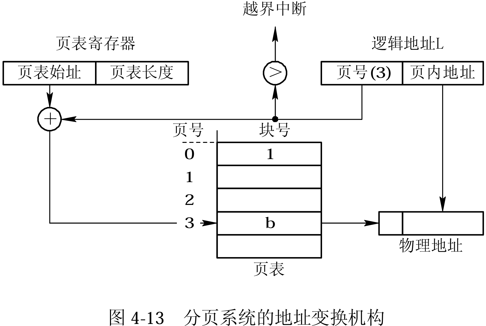
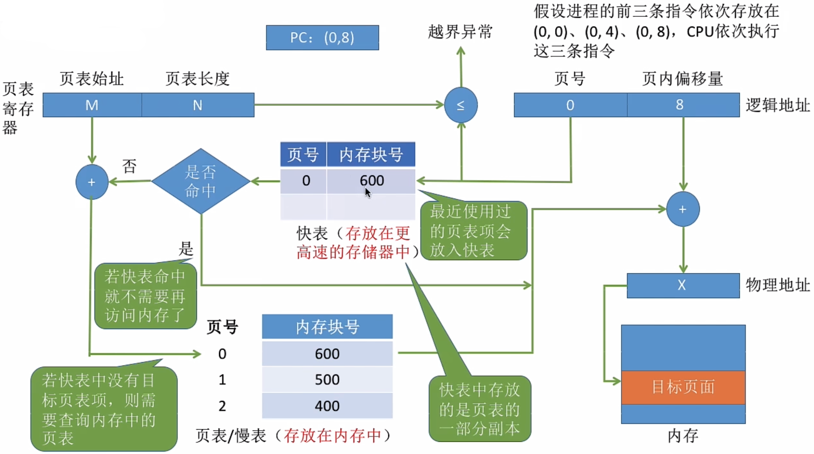
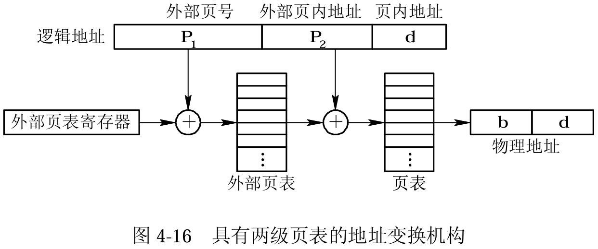

<h1>第4章 存储器管理</h1>

### 4.1 基本概念

1. **可执行存储器**：寄存器和主存储器被成为可执行存储器。

2. **存储单元**：内存地址从0开始，每一个地址对应一个**存储单元**（用于存放数据的最小单元）。

3. 程序执行前需要先放到内存中才能被CPU处理，内存是为了缓和CPU与外存之间的速度矛盾。

   > - 若计算机按**字节**编址，则每个存储单元大小为一字节（1Byte），即8个二进制位；
   > - 若计算机按**字**编址，且字长为16位，则存储单元大小为一个字长，即16个二进制位。

4. **程序的装入**

   1. **绝对装入**

      > 在编译时，如果知道程序将放在内存的位置，**编译程序就直接产生绝对地址的目标代码**
      >
      > **缺点：**如果分配的内存地址发生改变，需要重新编译链接生成新的目标代码，灵活性不高

   2. **可重定位装入（静态重定位）**

      > 编译链接生成目标代码的时候，依然生成相对地址，**当装入内存的时候，把所有地址都加上起始物理地址**
      >
      > **缺点：**在装入一个作业时，**必须分配其要求的全部内存空间**，如果没有足够的内存，就不能够装入该作业。作业一旦装入内存，**在运行期间也不可以移动，也不可以申请新的内存空间**

   3. **动态运行时装入（动态重定位）**

      > - 装入内存的时候，依然采用相对地址，**把地址转换工作推迟到程序真正要执行时才进行**。需要借用一个**重定位寄存器**的支持
      > - 重定位寄存器中保存装入模块存放的**起始位置**
      >
      > **特点：**
      >
      > - 可将程序分配到**不连续**的内存空间中
      > - 运行某一部分代码时，装入相应的代码即可
      > - 便于用户共享程序段

5. **链接方式**

   1. **静态链接**：在程序运行之前，先将各目标模块及它们所需的库函数连接成一个完整的可执行文件（转入模块），之后不再拆开

      

   2. **装入时动态链接**：将各目标模块装入内存时，边装入边链接的方式

      

   3. **运行时动态链接**：在执行程序中需要用到的目标模块才对它进行链接。

      - 优点：方便修改和更新，便于对目标模块的共享

      

### 4.3 连续分配存储管理方式

#### 4.3.1 **单一连续分配**

- 在单一连续分配方式中，内存被分为**系统区**和**用户区**；
  - **系统区**：常常位于内存的低地址部分，存放操作系统数据
  - **用户区**：仅装有一道应用程序

- **优点：**实现简单；**无外部碎片**；可以采用覆盖技能扩充内存；不一定需要采取内存保护（因为只有一道用户程序）
- **缺点：**只能用于单用户、单任务的操作系统中；**有内部碎片**；存储器利用率极低

> **内部碎片**：系统分配给进程的内存空间中，没有被利用到的区域
>
> **外部碎片**：内存中的某些空闲分区太小而难以被再次分配和利用

#### 4.3.2 **固定分区分配**

> 将整个用户空间划分为若千个**固定大小**的分区，在每个分区中只装入一道作业。

- 分配方式

  - 分区大小相等：

  - 分区大小不等

- 额外说明

  > 操作系统需要建立一个数据结构——**分区说明表**，来实现各个分区的分配与回收。每个表项对应一个分区，通常按分区大小排列，内容包括对应分区的大小、起始地址、状态(是否已分配)。

- 优缺点

  - 优点：实现简单；**无外部碎片**
  - 缺点：当用户程序太大时，可能所有的分区都不能满足需求，此时不得不**采用覆盖技术**来解决，但这又会降低性能；**会产生内部碎片**，内存利用率低。

#### 4.3.3 **动态分区分配**

1. **分配**
   - 情况一：当从空闲分区表中选择一个分区分配后，内存还有剩余，则修改表项
   - 情况二：当从空闲分区表中选择一个分区分配后，刚刚好分配完，则删除该表项
2. **回收**
   - 情况一：回收区后面有一个相邻的空闲分区，则合并
   - 情况二：回收区前面有一个相邻的空闲分区，则合并
   - 情况三：回收区前后各有一个相邻的空闲分区，则三个合并为一个
   - 情况四：回收区前后无相邻的空闲分区，则新增一个表项

> 如果内存中零碎的空间太多，导致无法满足内存较大的进程，可采用**拼凑技术**来解决外部碎片

#### 4.3.4 基于顺序搜索的动态分区分配算法

1. ##### 首次适应（first fit，FF）算法

   - **算法思想：**每次都从**低**地址开始查找，直到找到第一个能满足大小的空闲分区
   - **实现方法**：空闲分区以地址递增的次序开始排序。每次分配内存时顺序查找**空闲分区链**（或空闲分区表），找到第一个满足大小的空闲分区
   - **缺点**：低址部分不断被划分，会留下许多难以利用的、很小的空闲分区，称为**碎片**；而每次查找又都是从低址部分开始的，这无疑又会增加查找可用空闲分区时钓开销。

2. ##### 循环首次适应（next fit，NF）算法

   - **算法思想：**首次适应算法，每次都从低地址开始遍历，导致低地址产生越来越多很小的空闲块。邻近适应算法就是接着从上一次查找结束的位置开始检索
   - **实现方法：**空闲分区按地址递增次序排列（可排成一个循环链表）。每次分配内存时**从上次查找结束的位置**开始查找空闲分区链（或空闲分区表），找到第一个满足大小的空闲分区
   - **优点：**无论低地址还是高地址都有相同的概率被使用

3. ##### 最佳适应（best fit，BF）算法

   - **算法思想：**考虑大内存的进程有地可留，优先使用更小（与申请的大小越符合）内存的空闲区
   - **实现方法：**空闲分区**按容量升序链接**。每次分配内存时顺序查找空闲分区链（或空闲分区表），找到第一个满足大小的空闲分区
   - **缺点：**每次都选小内存的分区进行分配，**会留下越来越多很小的、难以利用的内存块**。因此这种方法会产生很多外部碎片

4. ##### 最坏适应（worst fit，WF）算法

   - **算法思想：**避免留下越来越多的小内存块，优先使用更大内存的空闲块
   - **实现方法：**空闲分区**按容量降序链接**。每次分配内存时顺序查找空闲分区链（或空闲分区表），找到第一个满足大小的空闲分区
   - **缺点：**导致**更快是使用完大内存的空闲块**，使之后的大内存的进程无分区可用

5. **总结**

<table style="width:100%; border-collapse:collapse; font-family:Arial, sans-serif; color:#333;">
  <tr style="background-color:#81c784;">
    <th style="padding:8px; text-align:left; border-bottom:1px solid #ddd;">算法</th>
    <th style="padding:8px; text-align:left; border-bottom:1px solid #ddd;">算法思想</th>
    <th style="padding:8px; text-align:left; border-bottom:1px solid #ddd;">分区排序列顺序</th>
    <th style="padding:8px; text-align:left; border-bottom:1px solid #ddd;">优点</th>
    <th style="padding:8px; text-align:left; border-bottom:1px solid #ddd;">缺点</th>
  </tr>
  <tr style="background-color:#c5e1a5;">
    <td style="padding:8px; border-bottom:1px solid #ddd;">首次适应</td>
    <td style="padding:8px; border-bottom:1px solid #ddd;">从头开始找到第一个满足大小的内存空闲分区</td>
    <td style="padding:8px; border-bottom:1px solid #ddd;">按地址递增</td>
    <td style="padding:8px; border-bottom:1px solid #ddd;">综合性能最好 算法开销小 回收分区后一般不需要对空闲分区重新排序</td>
    <td style="padding:8px; border-bottom:1px solid #ddd;">会产生很多小分区 难以利用的碎片(需要重新排序)</td>
  </tr>
  <tr style="background-color:#c5e1a5;">
    <td style="padding:8px; border-bottom:1px solid #ddd;">最佳适应</td>
    <td style="padding:8px; border-bottom:1px solid #ddd;">优先使用蛋小的分区 以保留更多更大的分区</td>
    <td style="padding:8px; border-bottom:1px solid #ddd;">按容量递增</td>
    <td style="padding:8px; border-bottom:1px solid #ddd;">会有更多更大的内存空间热保留 能满足更大进程的需求</td>
    <td style="padding:8px; border-bottom:1px solid #ddd;">会产生很多小分区 难以利用的碎片 算法开销大(需要重新排序)</td>
  </tr>
  <tr style="background-color:#c5e1a5;">
    <td style="padding:8px; border-bottom:1px solid #ddd;">最坏适应</td>
    <td style="padding:8px; border-bottom:1px solid #ddd;">优先使用更大的分区 以防止产生大多的小碎片</td>
    <td style="padding:8px; border-bottom:1px solid #ddd;">按容量递减</td>
    <td style="padding:8px; border-bottom:1px solid #ddd;">可以减少分配难以利用的小碎片(外部碎片) 算法开销大(需要重新排序)</td>
    <td style="padding:8px; border-bottom:1px solid #ddd;">大分区容易被用完 不利于大进程</td>
  </tr>
  <tr style="background-color:#c5e1a5;">
    <td style="padding:8px;">邻近适应</td>
    <td style="padding:8px;">每次从上次结束的位置开始查找</td>
    <td style="padding:8px;">按地址递增</td>
    <td style="padding:8px;">不用每次从头开始检索,算法开销小</td>
    <td style="padding:8px;">会是高地址的大分区也被用完</td>
  </tr>
</table>

#### 4.3.5 基于索引搜索的动态分区分配算法

1. ##### 快速适应（quick fit）算法

   - 算法思想：将空闲分区根据容量大小进行分类，对于每一类具有相同容量的所有空闲分区，单独设立一个空闲分区链表
   - 优点：查找效率高
   - 缺点：在分区归还主存时的算法复杂，系统开销较大；一个分区只属于一个进程，具有空间浪费。

2. ##### 伙伴系统(buddy system)

   - 算法思想：内存总大小$2^m$，我们空闲分区大小按照$2^k$进行分类，这样最多可以有`k`个类。当需要为进程分配一个长度为`n`的存储空间时

     - 首先计算一个i值，使$2^{\mathrm{k-1}}<n\leqslant2^{\mathrm{k}},$然后在第大小为的空闲分区链里找，若存在这样一个分区，则分配；
     - 若不存在则在第$2^{k+1}$个空闲分区链里找，如果找到了，则将其分割为两个大小为$2^k$的分区，一个用于分配，一个划入大小为$2^k$的空闲分区链
     - 若$2^{k+1}$大小的分区链也没找到，则进一步在$2^{k+2}$分区链中找，如果找到了，此时要进行两次分割：①平等分割成大小为$2^{k+1}$的两块，一块划入$2^{k+1}$，另一块用作分配；②将用作分配的那一块继续分割成大小为$2^k$的两块，一块用作分配，另一块划入大小为$2^k$的空闲分区链中。

   - 伙伴地址的通式
     $$
     \begin{aligned}
     buddy_k(x)=\begin{cases}x+2^k(若x\space mod\space 2^{k+1}=0)\\
     x-2^k(若x\space mod \space 2^{k+1}=2^k)
     \end{cases}
     \end{aligned}
     $$
     其中，x为内存地址，大小为$2^k$。

     > 如果 $x\mod 2^{k+1} = 0$，这意味着地址$x$是父块左半部分的起始地址，因此它的伙伴块就是父块右半部分的起始地址，即 $x + 2^k$。
     >
     > 如果 $x \mod 2^{k+1} = 2^k$，这意味着地址$x$是父块右半部分的起始地址，因此它的伙伴块就是父块左半部分的起始地址，即 $x - 2^k$。

3. ##### 哈希算法

#### 4.3.6 动态可重定位分区分配

1. **动态重定位**示意图

   

2. **动态分区分配**算法流程

   

### 4.4 对换（Swapping）与覆盖

1. **对换的类型**
   - **整体对换**：实指中级调度，其以整个进程为单位
   - **页面（分段）对换**：目的是为了支持虚拟存储系统
2. **进程的换出**
   - 选择被换出的进程
     1. 首先选择处于**阻塞**状态或**睡眠**状态的进程
     2. 有多个这样的进程时，应当选择**优先级最低**的进程作为换出进程
     3. 如果系统中已无阻塞进程，而现在的内存空间仍不足以满足需要，便选择**优先级最低**的就绪进程换出。
   - 进程换出过程
     1. 只能换出**非**共享的程序和数据段，而对于那些共享的程序和数据段，只要还有进程需要它，就不能被换出。
3. **进程的换入**
   1. 查看PCB集合中所有进程的状态，从中找出“就绪”状态但已换出的进程。
   2. 选择其中已换出到磁盘上时间最久(必须大于规定时间，如2s)的进程作为换入进程，为它申请内存。
   3. 如果申请成功，可直接将进程从外存调入内存;如果失败，则需先将内存中的某些进程换出，腾出足够的内存空间后，再将进程调入。
4. **覆盖技术**
   - **定义：**把程序划分为若干个功能上相对独立的程序段，按照其自身的逻辑结构将那些**不会同时执行的程序段共享同一块内存区域**。程序段先保存在磁盘上，当有关程序段的前一部分执行结束， 把后续程序段调入内存，覆盖前面的程序段（内存“扩大” 了）。
   - **缺点：**对用户不透明，增加了用户的负担。

### 4.5 分页存储管理方式

#### 4.5.1 分页存储管理的基本办法

1. **名词定义**

   - **页面**：页面是虚拟内存中固定大小的连续地址范围，是内存分配和地址转换的基本单位。
   - **页框**：页框是物理内存中与页面大小相同的固定区域，用于存储虚拟页的数据。

2. **什么是分页管理?**

   > 分页管理通过将**物理内存**和**虚拟内存**划分为**固定大小**的页，并使用**页表**将虚拟地址映射到物理地址，从而实现内存的高效分配和回收，同时解决了外部碎片问题，但可能会产生内部碎片。
   >
   > 将进程的**逻辑地址空间**分为与**页框**相等的一个个部分，每个部分称为一个**页**或**页面**。每个页面也有一个编号，即页号

3. **细枝末节**

   - 一个进程对应一张页表
   - 页表通常存在进程的**PCB**中，使用专门的**页表基址寄存器**存放
   - 页面的页号是从**0**开始的
   - 进程的每个**页面**对应一个**页表项**，
   - 每个页表项由**页号**和**块号**组成，页号是隐藏的，因为页表的地址连续，一旦我们拥有某个具体的地址，我们就可以直接推导出**页号p**和**位移量w**
   - 页表记录进程页面和实际存放的**页框**之间的映射关系

4. **分页地址的地址结构**

   

   以上面结构为例，页号占用20位，位移量占用12位，我们可推到得到以下结论：

   - 页面大小为$2^{12}\text{Byte}=4\text{KB}$
   - 地址空间最多有$2^{20}\text{Byte}=1\text{M}$页

   若给定一个逻辑地址空间中的地址,则**页号P**和**页内地址d**可按下式求得:
   $$
   \mathrm{P=INT\biggl[\frac{A}{L}\biggr],\quad d=[A]\space MOD\space L}\tag{1}
   $$
   其中

   - $\mathrm{A}$为逻辑地址空间的地址
   - $\mathrm{L}$为页面大小

5. **页表映射示意图**

   

6. **记录内存使用情况的数据结构——【位示图】**

   - **描述**：**整个系统一张**，记录内存使用情况。
   - **位示图的使用**：设字号i、位号j、帧号k取值均从0开始，字长记为L

#### 4.5.2 地址变换机构

1. **基本任务**：实现从逻辑地址到物理地址的转换，其实质是将逻辑地址中的页号，转换为内存中的物理块号。

2. **基本的地址变换机构** 

   - **基本原理**

     > 通常会在系统中设置一个**页表寄存器PTR(Page-Table Register)**，存放**页表在内存中的起始地址 F** 和**页表长度 M**.
     >
     > 进程未执行时，**页表的始址** 和 **页表长度** 放在**进程控制块（PCB）**中，当进程被调度时，操作系统内核会把它们放到**页表寄存器**中
     >
     > 因此，在单处理机环境下，虽然系统中可以运行多个进 程，但只需一个页表寄存器。

   - **注意事项**

     - 进程装入之前，逻辑地址是一维的。
     - 进程装入之后，逻辑地址分为两维（页号+页内偏移量）。
     - ⭐CPU每次存取一个数据，需要访问内存**两次**⭐：①访问内存中的页表，以获 得页面号；②由页面号与页内相对地址 拼接形成的物理地址，访 问内存单元。

   - **实现步骤**

     > **页表长度**：这个页表中总共有几个页表项，即总共有几个页；
     >
     > **页表项长度**：每个页表项占多大的存储空间；
     >
     > **页面大小**：一个页面占多大的存储空间

     1. 根据逻辑地址计算公式【$\mathrm{P=INT\biggl[\frac{A}{L}\biggr],\quad d=[A]\space MOD\space L}\tag{1}$】计算出页号、页内偏移量

     2. 判断页号是否越界（页号应当**小于**页表长度）,如果越界则产生越界中断，否则继续执行第三步

     3. 利用公式【**页表始址+页号**】可得到该表项在页表中的位置，此时可以确定页面的内存块号

     4. 用**内存块号**和**页内偏移量**，通过公式【**内存块号*块大小+页面偏移量**】得到物理地址

     5. 根据物理地址访问内存单元

        整个步骤可用如下流程图表示

     

     > 若页面大小`L`为`1K`字节，页号2对应的内存块号b=8，将逻辑地址`A=2500`转换为物理地址`E`。这里页面大小1K也可以描述为“**按照字节编址，页内偏移量占10位**”
     >
     > 1. 计算页号、页内偏移量
     >
     >    - 页号：$\text{P}=\frac{\mathrm{A}}{\mathrm{L}}=\frac{2500}{1024}=2$
     >    - 页内偏移量：$\text{W}=\mathrm{A}\space\%\space\mathrm{L}=2500\space\%\space1024=452$
     >
     >    由题可知，页号2没有越界，且内存块号为8
     >
     > 2. 求物理地址
     >
     >    - 物理地址：E = 块号 * 块大小 + 页内偏移量 = 8 * 1024 + 452 = 8644

3. **具有快表的地址变换机构**

   > **时间局部性：** 如果执行了程序中的某条指令，那么不久后这条指令很有可能再次执行；如果某个数据被访问过，不久之后该数据很可能再次被访问。（因为程序中存在大量的循环）
   >
   > **空间局部性：** 一旦程序访问了某个存储单元，在不久之后，其附近的存储单元也很有可能被访问。（因为很多数据在内存中都是连续存放的）

   - **快表：**又称**联想寄存器**（TLB，Translation Lookaside Buffer），是一种**访问速度比内存快很多**的**高速缓存**（TLB不是内存），用来存放**最近访问的页表项的副本**，可以加速地址变换的速度。

     快表存储在**高速缓存**

   - **快表变换机构的执行步骤**

     - 每一次切换进程时处理机会清空快表

     - 在检查完页号是否越界后会尝试访问快表中的副本，若命中，则直接得到内存块号

     - 否则，正常查询，并在找到页表项之后将其存入快表

       我们注意到，如果在快表中我们找到了对应项则**快表少了一次内存访问**：因为快表存储在缓存中，不涉及内存访问。

   

   - **例题**
   
   > 某系统使用基本分页存储管理，并采用了具有快表的地址变换机构。
   >
   > 访问一次快表耗时`1us`,访问一次内存耗时`100us`。若快表的命中率为`90%`，那么访问一个逻辑地址的平均耗时是多少?
   > $$
   > (1+100)\times0.9+(1+100+100)\times0.1=111us
   > $$
   > **注意：**做题时，要注意到题目中是否支持快慢表一起查询
   
   

#### 4.5.3 访问内存的有效时间

- **定义：**从进程发出指定逻辑地址的访问请求，经过地址变换，到在内存中找到对应的实际物理地址单元并取出数据，所需要花费的总时间， 称为内存的有效访问时间（Effective Access Time，**EAT**）
- **计算公式：**设访问快表的时间为$t_1$，访问内存的时间为$t_2$，快表的命中率为P我们有如下结论：

1. 快表命中时
   $$
   t_1+t_2
   $$
   
2. 快表未命中时
   $$
   t_1+2t_2
   $$
   
3. 访问内存的平均有效时间
   $$
   \text{Avg}\_\text{EAT}=P*(t_1+t_2)+(1-P)*(t_1+2t_2)
   $$

#### 4.5.4 两级和多级页表

为了更好地理解多级页表，我们假设在单极页表机制下，我们有32位逻辑地址，其中12位是页表项大小，另外20位为页表项个数；此时可以产生个4K的页表项；

难以想象1个多G的页表常驻内存会是怎样的情景，为了缓解这种问题，我们对页表进行分级，例如上述$2^{20}Byte=1\text{M}$我们拆解成$2^{10}\times2^{10}Byte=1\text{M}$，那么外层页表有$2^{10}$个表项，每一个表项其地址映射到一个具有$2^{10}$个表项的页表，这个页表为内层页表，这样就完成了分级；

这样做的好处是不必一次顶存入巨大空间的页表，其次页减少了内存连续的要求。

比如说两级页表其示意图如下：

其地址变换机构如下：

#### 4.5.5 总结：基本分页式存储管理

- 离散存储，利于大进程装入
- 只有很少的页内碎片，提高内存利用率
- 数据结构：位示图、页表；动态地址重定位
- 页面共享不易实现

### 4.6 分段存储管理方式

#### 4.6.1 什么是分段存储？

- **什么是段？**

  “段”是一个逻辑单位，是进程的一个组成部分。如主程序段、 子程序段、数据段等。

  在分段机制中，一个进程的地址空间可以包含以下不同的段：

  - 代码段（Code Segment）
  - 数据段（Data Segment）
  - 堆栈段（Stack Segment）
  - 内存共享段（Share Memory Segment）

- 分页存储管理，每个页面的大小都是固定相同的，这样可能导致某些程序的逻辑被拆分，不利于信息的共享和保护
- **分段：**按照程序的**自身逻辑**关系**划分为若干个段**，每个段都有一个段名，**每段从 0 开始编址**
- 内存分配规则：以**段**为单位进行分配，**每个段在内存中占据连续空间**，但**各段之间可以不相邻**
- 什么代码可共享？
  - 不能被修改的代码称为**纯代码或可重入代码（不属于临界资源）**，这样的代码是可以共享的。
  - 可修改的代码是不能共享的 （比如，有一个代码段中有很多变量，各进程并发地同时访问可能造成数据不一致）

#### 4.6.2 分段系统的基本原理

1. **分段地址结构**

   

2. **段表**

   

   - 用于实现从逻辑段到物理内存区的映射，类似于页表
   - 每个段都对应一个段表项，其中记录了该段在内存中的**起始位置（基址）**和**段的长度**
   - 各个段表项的长度都是相同的，**段号可以隐含**，不占存储空间

3. **地址变换机构**

   

#### 4.6.3 总结：基本分段式存储管理

- 离散存储，一段连续装，各段不连续
- 内存按分区存储管理，会产生外碎片
- 数据结构：MAT、段表；动态地址重定位
- 分段共享非常方便

#### 4.6.4 信息共享

1. 分页系统中对程序和数据的共享示意图

   

2. 分段系统中程序和数据的共享示意图

   

   - **可重入代码**
     - 可重入代码(Reentrant Code)又称为“纯代码”(Pure Code)，允许多个进程同时访问
     - 可重入代码在执行中不允许有任何改变

#### 4.6.5 段页式存储管理方式

1. **基本原理示意图**

   

2. **地址变换机构**

   

3. **注意点：**

   - 为获得一条指令或数据，须**三次访问内存**：段表、页表、指令或数据

#### 4.6.6 分页和分段的异同

- 分页是由于系统管理的需要，分段是为了满足用户的需要
- 页的大小和划分由系统决定，段的大小和划分由用户所编写的程序决定；
- 分页的虚拟地址空间是一维的，而分段的虚拟地址空间是二维的。

### 4.7 内存保护

#### 4.7.1 寄存器保护法

- **上、下界防护**：硬件为分给用户 作业的连续的主存空间设置一对 上、下界寄存器，分别指向该存 储空间的上、下界。
- **基址、限长防护**：基址寄存器存 放当前正在执行的程序地址空间 所占分区的起始地址，限长寄存器存放该地址空间的长度。

#### 4.7.2 保护键法

- 系统将主存划分若干存储 块，并给每个被保护的存 储块分配一个单独的保护 键（锁）；
- 在**PSW**中设置有保护键字段， 对不同的作业赋予不同的代码（钥匙），钥匙和锁 相配才允许访问。
