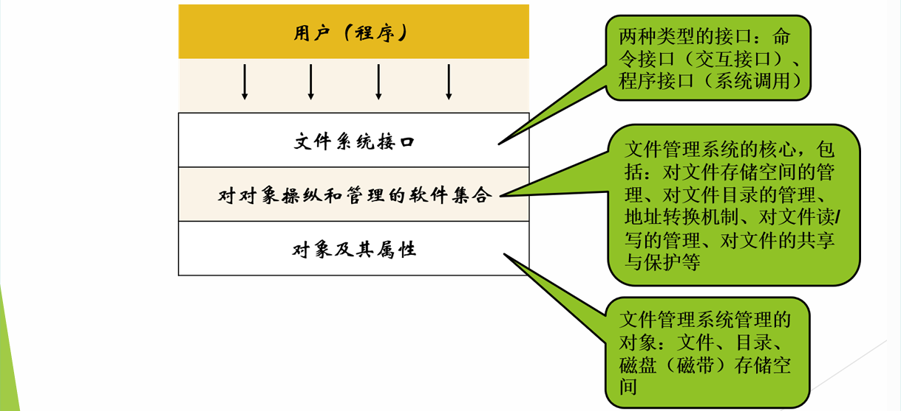

<h1>第7章 文件管理</h1>

### 7.1 文件与文件管理概述

#### 7.1.1 基本概念

- **数据项**：基本数据项、组合数据项
- **记录**：一组相关数据项的集合。关键字（key）
- **文件**：由创建者所定义的、 具有文件名的一组相关元素的集合。
- **文件属性**：文件类型、文件长度、文件的物理位置、文件的建立时间
- **文件名和扩展名**：文件名通常见名知义，对应文件内容；扩展名通常用于**标识文件类型**。

#### 7.1.2 文件的分类

- 按**用途**分类：系统文件、用户文件、库文件 
- 按文件中**数据的形式**分类：源文件、目标文件、可执行文件 
- 按**存取控制属性**分类：只执行文件、只读文件、读写文件 
- 按**组织形式和处理方式**分类：普通文件、目录文件、特殊文件

#### 7.1.3 文件系统的层次结构

### 7.2 文件的结构

1. 文件的**逻辑**结构：是指呈现在用户面前的文件结构，是文件逻辑上的组织形式。
2. 文件的**物理**结构：是指**文件在存储介质上的存储结构**，是文件在外存空间 上的组织形式。

#### 7.2.1 文件的逻辑结构

-  **流式文件**：是指文件内的数据是一个完整的字符流，不可以进一步细分。
- **记录式文件**：在逻辑上可看成是一组记录的集合，每个记录由彼此相关的若 干个数据项组成。

#### 7.2.2 文件的物理结构

- 连续存储结构：文件体在磁盘上占用连续的存储空间

- 非连续存储结构：文件体在磁盘上占用不连续的存储空间

  - **链接存储**：隐式链接存储、显式链接存储
  - 索引存储

  ⭐注意：文件存取方式（存取≠存储）⭐

#### 7.2.3 连续文件

- **基本思想**：文件信息占用一组连续的盘块，文件在外存上顺序存放。
  - 文件目录中登记起始盘块和所占块数
  - 连续文件不仅在逻辑上是连续的，在外存上存放的空间也是连续的。

#### 7.2.4 文件的链式存储

- **基本思想**：每个文件占用不连续的盘块，文件目录中只登记起始 盘块和末盘块号，其它盘块号均由链接指针记录 。
  - 隐式链接
  - 显式链接
- **文件的隐式链接存储结构**
  - **优点**：采用离散分配方式，易于文件增长或收缩，减少了外存空间出现外碎片的现象。
  - **缺点**：只能顺序存取，指针本身需占用存储空间，链接指针的可靠性是个问题。
- **文件的显式链接存储结构**
  - **基本思想**：将用于链接文件各盘块的指针“显式”地存放在外存的一张链接表当中
  - 该表在整个磁盘仅设置一张，登记了分配给文件的所有盘块的链接关系，故将该表称为**文件分配表FAT（File Allocation Table）**。
  - **优点**：①采用离散存储方式②易于文件增长或收缩③减少了外存空间出现外碎片的现象④既可以顺序存取，又可以随机存取
  - **缺点：**①FAT表占用较大的存储容量②FAT表使用时，占用较大内存空间③FAT表的读取、维护加大了系统开销

#### 7.2.5 文件的索引存储结构

- **优点**：①离散存储②既适合顺序存取，也方便随机存取③索引结构容易实现记录的增、删
- **缺点**：①索引块实际是存储开销②一个索引块能存放的盘块号有限，所以一级索引存储限制了文件的容量，需要建立二级甚至多 级索引存储结构。

### 7.3 文件存储空间的管理

- **文件存储空间管理的主要任务**：保证多个用户共享文件存储设备和实现文件的**按名存取**。
- **文件存储空间管理的实质**：空闲块的组织和管理(空闲块的组织、空闲块 的分配与空闲块的回收)

#### 7.3.1 空闲表法和空闲链表法

- **空闲表法**：属于**连续分配**方式，即为每个文件分配一块连续的存储空间。
  - 系统为外存上的**所有空闲区**建立 一张空闲表。
  - **优点**：分配速度快 
  - **缺点**：存储空间利用率不高 适用于小文件的存储
- **空闲链表法**
  - **空闲盘块链**:分配回收过程简单，但效率低
  - **空闲盘区链**:分配回收过程复杂，但效率高

#### 7.3.2 位示图法

- **位示图**：一个二进制位代表一个物理盘块，其值为“0”，表示空闲盘块； 为“1”表示已分配的盘块。

- **盘块的分配**

  - 顺序扫描位示图，从中找出一个或一组其值为“0”的二进制位(“0” 表示空闲时)。
  -  将所找到的一个或一组二进制位， 转换成与之相应的盘块号。假定 找到的其值为“0”的二进制位，位于位示的第i行、第j列，则其相 应的盘块号应按下式计算： 【**b=n(i-1)+j**】（ n代表每行的位数）。
  - 修改位示图， 令【**map［i,j］=1**】。

- **盘块的回收**

  - 将回收盘块的盘块号转换成位示图中的行号和列号
    $$
    \begin{aligned}&\text{i=(b-1) DIV n+1}\\&\text{j=(b-1) MOD n+1}\end{aligned}
    $$

  - 修改位示图，令【**map ［i,j］=0**】。

#### 7.3.3 成组链接法

### 7.4 文件目录

- **对目录管理的要求**：① 实现“按名存取”② 提高对目录的检索速度③ 文件共享④ 允许文件重名。

#### 7.4.1 文件控制块和索引结点

- **文件的组成**：从文件管理角度看，一个文件包括两部分：文件 说明、文件体
- **文件体**：文件本身的信息，记录式或字符流式文件
- **文件说明**：文件控制块FCB（File Control Block）
- ⚠️文件说明组成目录文件，文件系统利用目录文件完成按名存取 和对文件信息的共享与保护。
- **文件控制块**：用于描述和控制文件的数据结构。
  - 文件与FCB一一对应。
  - FCB的有序集合构成文件目录。
  - 一个文件目录也被看成是一个文件，称为目录文件。
  - FCB的内容：基本信息、存取控制信息、使用信息
- **索引结点**：把文件名与文件描述信息分开，使文件描述信息单独形成一个称为索引结点的数据结构，简称为i结点。在文件目 录中的每个目录项仅由文件名和指向该文件所对应的i结点的指针所构成
  - **磁盘索引结点**：存放在磁盘上的索引结点，每个文件有唯一 的一个磁盘索引结点。
  - **内存索引结点**：存放在内存中的索引结点，当文件被打开时， 将磁盘索引结点拷贝到内存的索引结点中。

#### 7.4.2 简单的文件目录

-  **单级目录结构**：整个文件系统中建立一张目录表，每个文件占 一个目录项
  - **优点**：简单且能实现按名存取
  - **缺点**：查找速度慢；不允许重名；不便于实现文件共享
- **两级目录结构**：为每一个用户建立一个单独的用户文件目录UFD（User File  Directory），由用户所有文件的文件控制块组成；在系统中建立一个主文件目录 MFD（Master File Directory），每个用户目录文件在其中都占有一个目录项， 包括用户名和指向该用户目录文件的指针。
  - 优点：①提高了检索目录的速度②在不同的用户目录中，可以使用相同的文件名③不同用户可使用不同的文件名来访问系统中的同一个共享文件

#### 7.4.3 树形目录结构

- 根目录、树叶、子目录
- 路径名
- 当前目录

#### 7.4.4  目录查询技术

- **线性检索法**：顺序检索法
  - 在单级目录中，利用用户提供的文件名，用顺序查找法直接 从文件目录中找到指名文件的目录项。
  - 在树型目录中，用户提供的文件名是由多个文件分量名组成 的路径名，此时须对多级目录进行查找。
- 

### 7.5 文件的共享与保护
