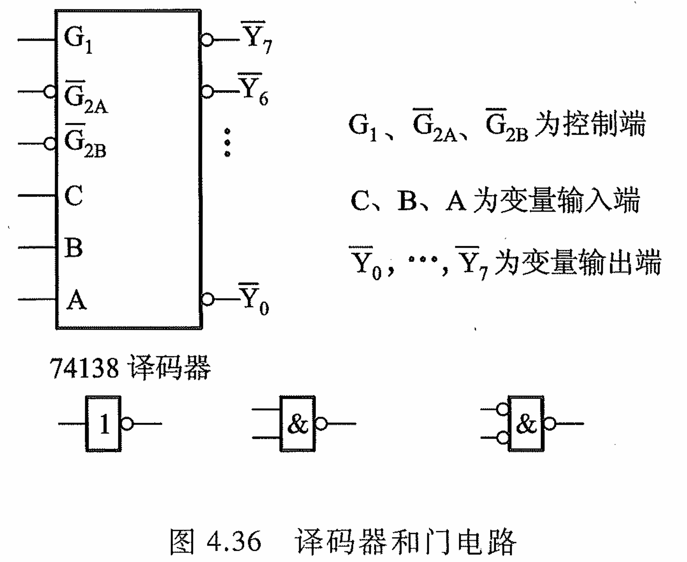
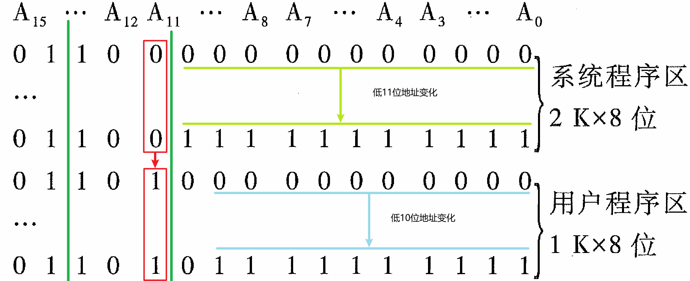
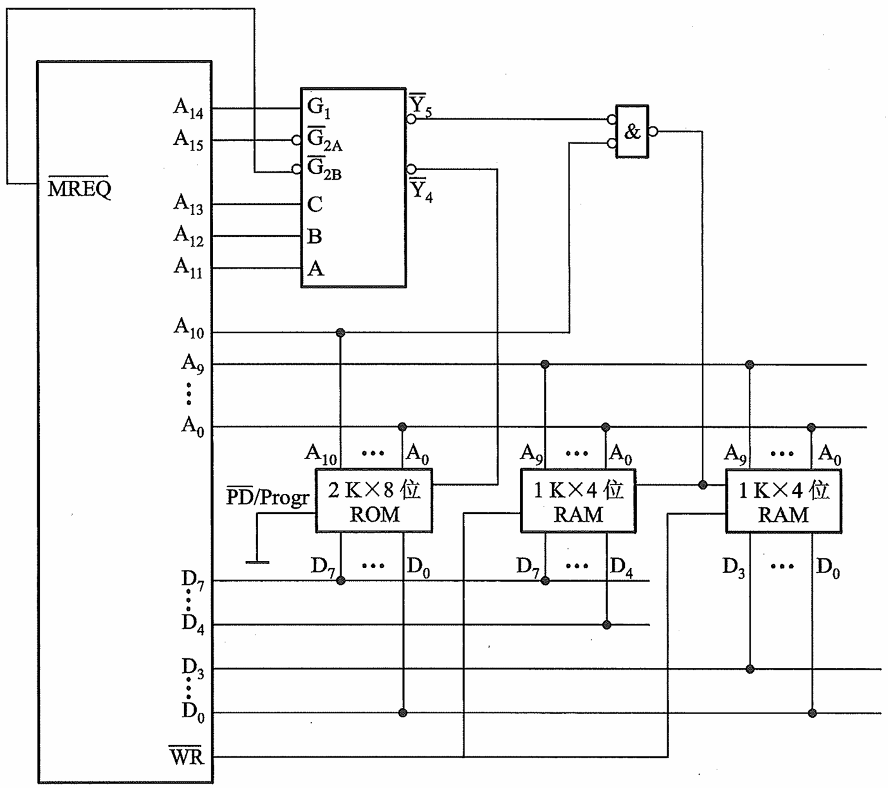

#### 一、题目

> 例 4.1 设 CPU 有 16 根地址线、8 根数据 线，并用 $\overline{\text{MREQ}}$ 作为访存控制信号（低电平有效），用$\overline{\text{MR}}$作为读／写控制信号（高电平为读，低 电平为写）。现有下列存储芯片：1 Kx4 位 RAM、 4 Kx8 位 RAM、8 Kx8 位 RAM、2 Kx8 位 ROM、 4 Kx8 位 ROM、8 Kx 8 位 ROM 及 74138 译码器 和各种门电路，如图 4.36 所示。画出 CPU 与存 储器的连接图，要求如下：

1. 主存地址空间分配：
   - 6000H ~ 67FFH 为系统程序区
   - 6800H ~ 6BFFH 为用户程序区
2. 合理选用上述存储芯片，说明各选几片
3. 详细画出存储芯片的片选逻辑图

#### 二、题解

##### （1）说明

为了，后续画图的舒适度，我们先对图4.36进行一定量的讲解：

- $\mathrm{G}_{1}$、$\overline{\mathrm{G}}_{2\mathrm{A}}$和$\overline{\mathrm{G}}_{2\mathrm{B}}$共同组成译码器驱动信号，其中特别需要说明的是$\overline{\mathrm{G}}_{2\mathrm{A}}$和$\overline{\mathrm{G}}_{2\mathrm{B}}$为【`低电平有效`】
- 变量C、B、A为输入信号，3位输入产生8个输出信号（$\overline{\mathrm{Y}}_0,\cdots,\overline{\mathrm{Y}}_7$），但在实际我们并非能用全这8个输出信号
- $\overline{\mathrm{Y}}_0,\cdots,\overline{\mathrm{Y}}_7$为输出信号，我们将利用各输出信号，完成存储器的片选

##### （2）答题

1. 题目给出了空间分配，但那是16进制的表示，不直观；我们需要转化为2进制表示才能更好地发现其中的规律：

   

2. 我们观察上图，可得到如下几点结论：

   1. 系统程序区
      - 地址的变化只发生在【低11位】（可寻址范围为$2^{11}=2\text{K}$）上；
      - 题目说CPU数据线有8根（即可同时输入或输出8位），我们可以考虑到一块【$2\text{K}\times8$】位的存储芯片即可满足CPU的寻址要求；
      - 系统程序是不容更改的，因此该存储芯片的选型必须位【ROM】
   2. 用户程序区
      - 地址的变化只发生在【低10位】（可寻址范围为$2^{10}=1\text{K}$）上
      - 数据线有8根；按理说我们应该选择一块【$1\text{K}\times8$】位的芯片，但是题目未提供，我们此时可用2块$1\text{K}\times4$的芯片顶替；
      - 用户区可写，芯片选型为【RAM】
   3. 未使用的地址线（$\text{A}_{11}\sim\text{A}_{15}$）
      - 5根地址线尚未用到，这5根线中，又可以发现4根线（$\text{A}_{12}\sim\text{A}_{15}$）是恒定不变的，刚好驱动电路是固定的。因此可考虑使用某些线作为连接驱动电路。
      - 正因驱动电路不变，而输入是变的，我们应该首先满足片选输入线的选择。别忘了$\text{A}_{11}$还没用，而且从图中观察，从用户区到系统区，$\text{A}_{11}$刚好从0变化为1。真是惊喜啊😁，这根线的变化就可以帮助我们完成2个区芯片的片选；别高兴太早，输入可是3根线哦，既然这1根线就足以片选，那么其他2根线可固定，那么我们就取其邻居$\text{A}_{12}$、$\text{A}_{13}$吧。加上这两根线后，当译码器输出为【4】即$\overline{\text{Y}}_4$（片选信号为100）选中系统程序区的ROM芯片；当输入为5即$\overline{\text{Y}}_5$（片选信号为101）选中用户程序区的两块RAM芯片；其他译码器输出未用到，可屏蔽。
      - 此时，3根驱动信号线尚未连接，而我们还剩余两根地址线，其中$\text{A}_{14}$恒为高电平，则$\text{A}_{14}$接$\text{G}_1$口；那还有驱动信号接口$\overline{\text{G}}_{2\text{A}}$、$\overline{\text{G}}_{2\text{B}}$怎么办,我们只有一根低电平线了，哦不，有个东西似乎被我们给忘掉了——访存控制信号（ $\overline{\text{MREQ}}$），其为低电平，这样加上我们剩余的一根低电平线，则可完成驱动电路的连接。其实如果没有 $\overline{\text{MREQ}}$也没关系，我们可以将$\text{A}_{15}$分线为两路低电平接上$\overline{\text{G}}_{2\text{A}}$、$\overline{\text{G}}_{2\text{B}}$口。

3. 有了以上知识我们可以画图了：

   

4. 图解与补充说明

   1. 上图大部分如果看不懂可以返回求看一下上面的分析
   2. $\overline{\mathrm{PD}}/\mathrm{Progr}$是ROM的可编程信号线，让其接地，因为我们不需要对其进行编程
   3. 芯片与地址线的连接反映了我们之前的分析结果，$2\text{K}\times8$的ROM芯片连接了CPU的$\text{A}_{0}\sim\text{A}_{10}$共11根地址线；后面两块芯片均连接了低10位地址线，满足寻址需求。
   4. CPU是8位数据线，第一块ROM是8位的，因此直接连接即可；后面两块RAM芯片，都是4位芯片，因此对于CPU的八根数据线，中间的RAM连接高四位，后面的RAM连接低四位。
   5. $\overline{\text{Y}}_{5}$即可完成片选，$\text{A}_{10}$并未起作用，那为什么要连接呢？其实是为了连线的完备性。不连接的话那就得在CPU与ROM芯片$\text{A}_{10}$地址线相交处阻断，避免线路接地，不然就始终为低电平了。

#### 三、后话

每个人的生命中

都有无比艰难的那一年

将人生变的美好而辽阔

——加·译文《岛上书店》
