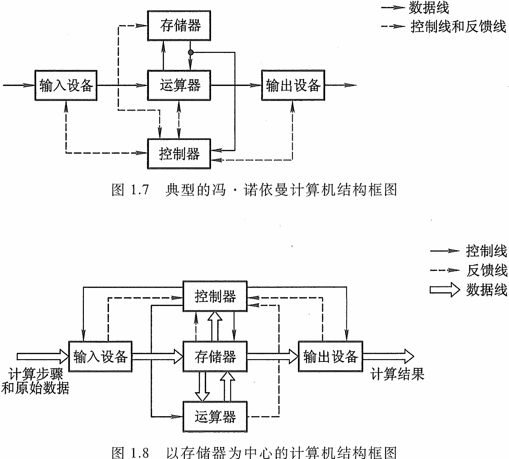
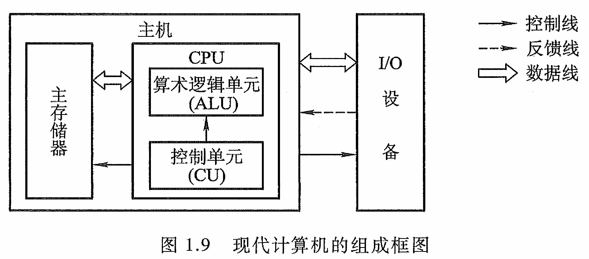
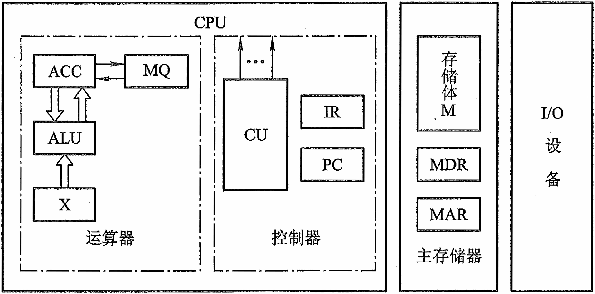
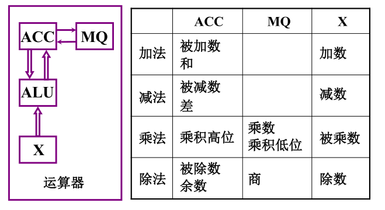
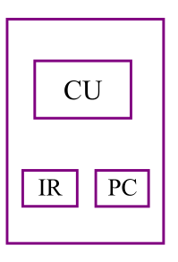

<h1>第一章 计算机系统概论</h1>

### 1.1 计算机系统简介

- **计算机系统组成**：
  - 硬件：计算机的实体，如主机、外设等
  - 软件：由具有各类特殊功能的信息（程序）组成，分为应用软件，系统软件
- **计算机体系结构和计算机组成的区别**：
  - 计算机体系结构研究的是程序员所见到的计算机系统的属性概念性的结构与功能特性，具体来说就是指令系统、数据类型、寻址技术、I/O 机理
  - 计算机组成研究的是如何实现计算机体系结构所体现的属性，例如如何实现乘法指令

### 1.2 计算机系统基本组成

#### 1.2.1 基本概念

- ##### 冯诺依曼计算机的特点

   - 计算机5部分组成
   - 指令和数据具有同等地位，按照**地址寻访**
   - 指令和数据用**二进制**表示
   - 指令由**操作码**和**地址码**组成
   - **存储程序**
   - 以**运算器**为中心

   

- ##### 现代计算机硬件框图

   

#### 1.2.2 五大部件的基本组成

- ##### 存储器的基本组成

   - **存储体**：由若干个存储单元构成
   - **存储单元**：也叫存储存放一串二进制代码，每个存储单元赋予一个地址号，按地址寻访
   - **存储字**：存储单元中二进制代码的组合，和存储单元意思相近
   - **存储字长**：存储单元中二进制代码的位数存储字长：存储单元中二进制代码的位数，按字编址时，机器字长=存储字长。假如按字节编址，存储器一个存储单元大小为1个字节。现在的计算机都是按字节编址了。
   - **主存地址寄存器（MAR）**：连接地址总线，可以反映存储单元的个数
   - **主存数据寄存器（MDR）**：连接数据总线，可以反映存储字长
     - 例：MAR=4，MDR=8，则由$2^4=8$个存储单元，每个存储单元可以存储8个数，因此存储体容量为$8\times8=64$

- ##### 运算器的基本组成

   

   - **ALU（Arithmetic&logical Unit）**：**算术逻辑单元**是能实现多组算术运算和逻辑运算的组合逻辑电路。ALU是组合逻辑电路，要保存就需要用到时序逻辑电路
   - **ACC（Accumulator）**：**累加寄存器**，专门用来存放操作数或运算结果。两个操作数中的指令的通常一个操作数在累加器A中，运算完成后累加器A中便可得到运算结果。
   - **MQ（Multiple—Quotient Register）**：**乘商寄存器**。主要负责数据的乘法与除法运算并可保存运算结果

- ##### 控制器的基本组成

   

   - **PC（Program Counter）**：**程序计数器**，存放当前欲执行指令在存储器的存放位置
   - **IR（Instruction Register）**：**指令寄存器**，用来存放指令的，存放当前正在执行的指令，包括指令的操作码，操作数
   - **CU（Control Unit）**：**控制单元**，是整个控制器的核心，分析指令，然后发出各种控制信号

#### 1.2.3 指令的执行过程

- 取指令（1、2、3 、4）： PC MAR M MDR IR ,(PC)+1 PC
- 分析指令 （5）：OP(IR) CU
- 执行指令 （6、7、8、9）Ad(IR) MAR M MDR ACC

### 1.3 计算机硬件的主要技术指标

- **机器字长**：机器字长是指 CPU一次能处理数据的位数，通常与 CPU 的寄存器位数有关。

- **存储容量**：存储器的容量应该包括**主存容量**和**辅存容量**。
- 主存容量：指主存中存放二进制代码的总位数，定义为【**存储容量＝存储单元个数X存储字长**】，例如，MAR=16，MDR=32，则【存储容量=$2^{16}\times32=2^{21}$位】

  - **辅存容量**：辅存容量通常用字节数来表示，如硬盘有80G（$1G=1024M=2^{10}\times2^{20}=2^{30}$Byte）容量
  - 区别：是否为易失性存储器。

- MIPS (Million Instructions Per Second)：每秒钟CPU能执行的指令总条数 (单位：百万条/秒)。
  $$
  \mathrm{MIPS}=\frac{\text{Instruction count}}{\text{Execution time}\times10^6}
  $$

- CPI（Cycle Per Instruction）：执行一条指令所需时钟周期数。
- FLOPS（Floating Point Operation Per Second）：每秒浮点运算次数