
<h1>第三章 系统总线</h1>

### 3.1 总线的基本概念

- 以存储器为中心的双总线结构

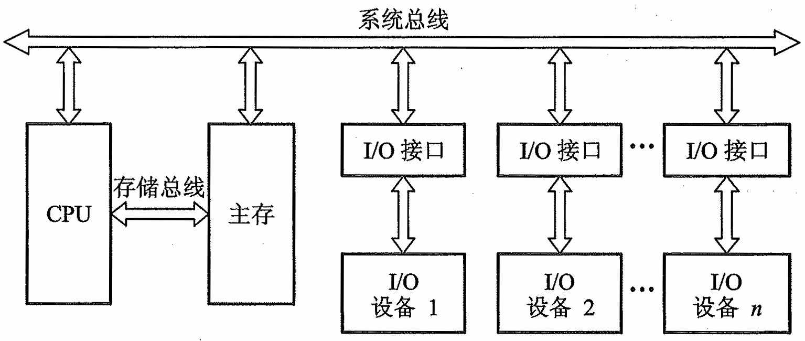

### 3.2 总线的分类

- **片内总线**：芯片内部各部件之间的的总线，如CPU内部连接各寄存器及运算器之间的总线。
- **系统总线**：计算机各部件之间 的信息传输线
  - **数据总线**：**双向** 与机器字长、存储字长有关，但不一定等于字长，一个字可以分多次传输
  - **地址总线**：**单向** 与存储地址、 I/O地址有关，和 MAR 位数相等
  - **控制总线**：**双向**，存储器读、存储器写，总线允许、中断确认，中断请求、总线请求。
- **通信总线**：用于 计算机系统之间 或 计算机系统与其他系统（如控制仪表、移动通信等）
- **按照传输方式分类**：
  - **并行通信总线**：同一时刻，可以传输多个bit位的信号，有多少个信号位就需要多少根信号线。并行通讯的效率高，但是对信号线路要求也很高，很容易产生干扰，反而传输速度不能很快。
  - **串行通信总线**：同一时刻，只能传输一个bit位的信号，只需要一根信号线。串行通讯效率较低，但是对信号线路要求低，抗干扰能力强，传输速度可以很快。

### 3.3 总线特性及性能指标

- **总线特性**
  - **机械特性**：尺寸、形状、管脚数及排列顺序
  - **电气特性**：传输方向和有效的 电平 范围
  - **功能特性** ：每根传输线的功能，如地址线，数据线，控制线，反馈线
  - **时间特性**：信号的时序 关系
- **总线的性能指标**
  - **总线宽度**：数据线的根数
  - **标准传输率** ：每秒传输的最大**字节**数（MBps）
  - **时钟同步/异步**： 同步、不同步
  - **总线复用**：地址线 与 数据线 复用，8086的20根地址线和16根数据线复用，减少芯片的管脚数量。
  - **信号线数**：**地址线、数据线和控制线的总和**
  - **总线控制方式** ：突发、自动、仲裁、逻辑、计数

### 3.4 总线结构

- **单总线结构**

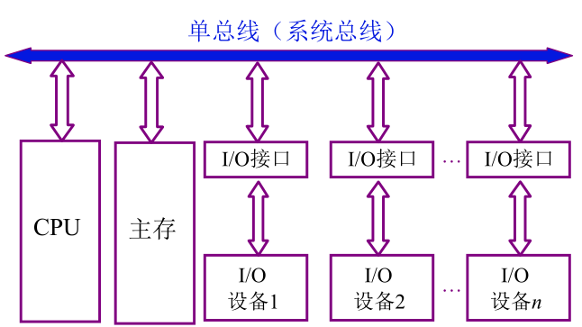

- **双总线结构**

  通道既是硬件数据通路，又是具有特殊功能的处理器，由**通道对I/O统一管理**。

  通道的作用：①**存储**；②**串并转换**；③**计算**

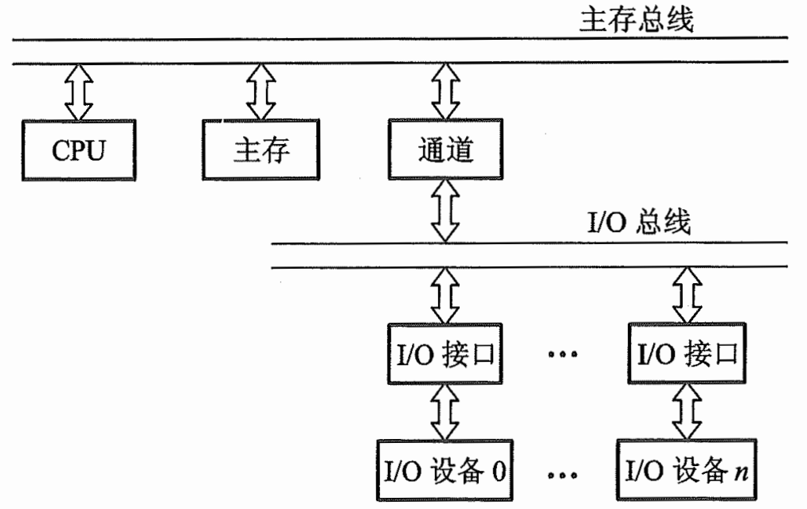

- **三总线结构**
  - **主存总线和DMA总线不能同时工作**，要进行判优工作。
  - **当主存总线和DMA总线出现竞争时，我们把优先权交给DMA总线**

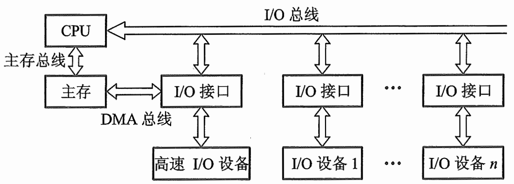

- **三总线结构的又一形式**
  - 在此结构中，主机由**缓存**、**主存**、**CPU**组成，而不再是2部分组成。

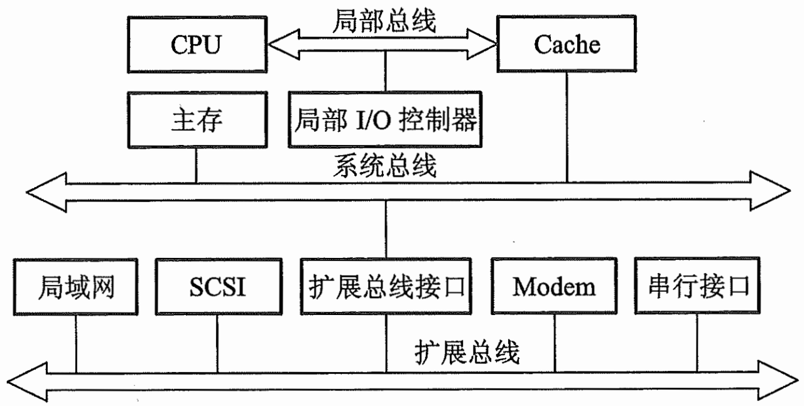

- **四总线结构**

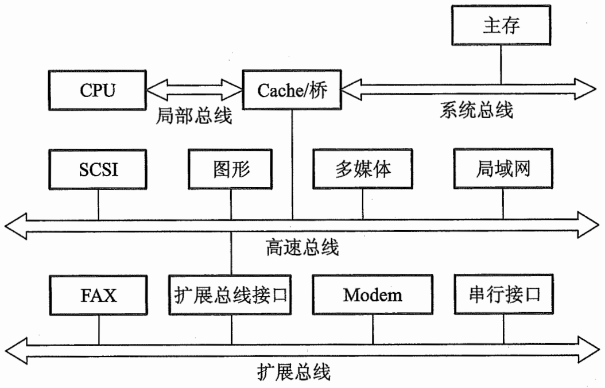

- **传统微型机总线结构**

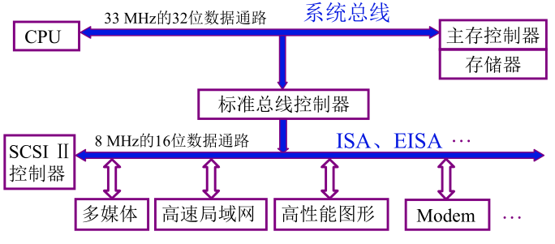

- **VL-BUS局部总线结构**

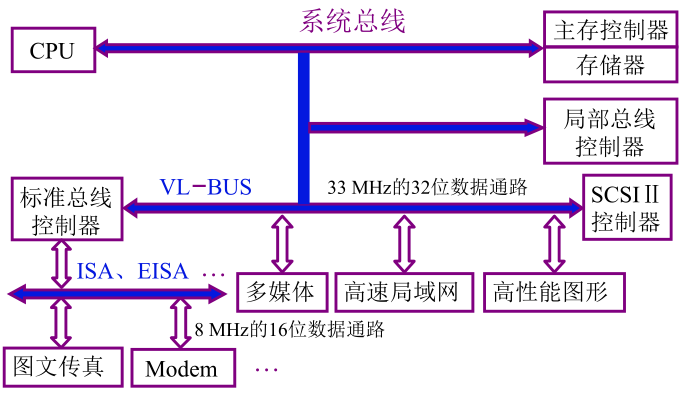

- **PCI 总线结构**

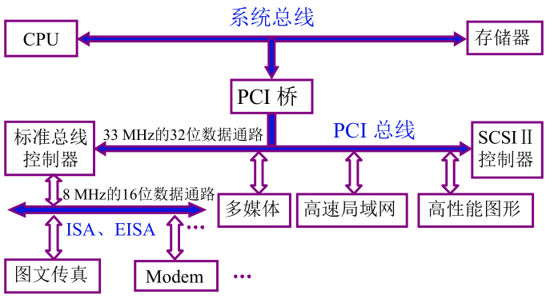

- **多层 PCI 总线结构**

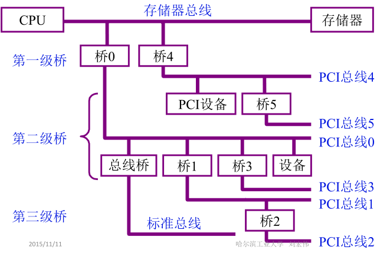

### 3.5 总线控制

#### 3.5.1 总线判优控制

- **主设备( 模块)**： 对总线有 控制权

- **从设备( 模块)** ：响应 从主设备发来的总线命令

- 总线判优控制两种方式：**分布式（针对多机系统）**、**集中式**

  下面给出集中式的三种优先权仲裁方式，注意其中（BS总线忙、BR总线请求、BG总线同意）

  - **链式查询**

    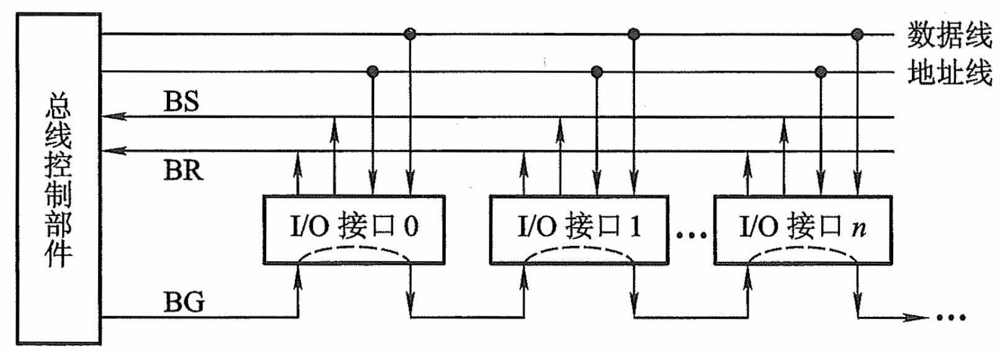

    - 缺点：①请求不公平，越靠近总线控制部件，优先级越高；②不可靠，一旦BG链断裂，其后接口均无法再获得BG信号。

  - **计数器定时查询**

    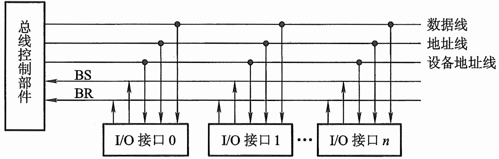

    - 缺陷：计数器的设计要重点考虑，是总线同意后重置位还是继续计数  

  - **独立请求方式**

    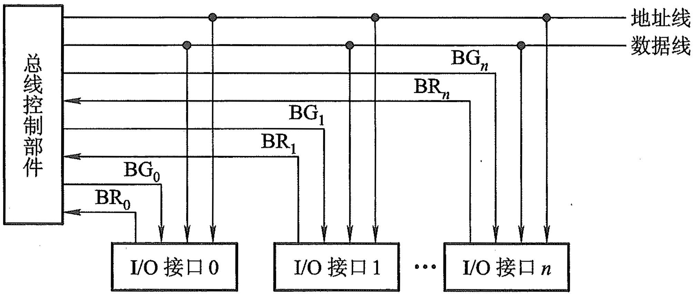

    - 缺陷：线路冗余

#### 3.5.2 总线通信控制

- **总线传输周期**

  - **申请分配阶段**：主模块申请，总线仲裁决定
  - **寻址阶段**：主模块向从模块给出 地址 和 命令
  - **传输阶段**：主模块和从模块 交换数据
  - **结束阶段**：主模块 撤消有关信息

- **总线通信**：为解决通信双方 协调配合 问题

  - **同步通信**

    由 统一时标 控制数据传送 ，一般在总线长度比较短，各个部件速度比较一致的时候使用，存在短板效应。
    
    地址线为高电平有效，读命令为低电平有效，数据线为高电平有线；三线非方波是因为操作不是一瞬间的，而是有缓冲时间的。
    
    地址线传输一直有信号是因为数据具有指向性，一旦地址失效，则传输无法寻址，因此必须长期有效才行。

  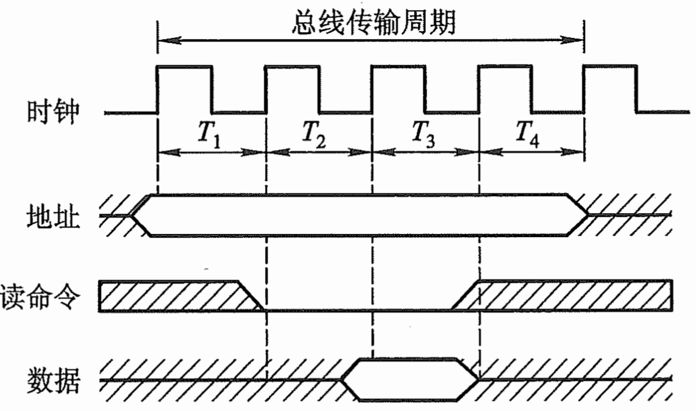

  - **异步通信**

    异步通信克服了同步通信的缺点,允许各模块速度的不一致性，它没有公共的时钟标准，,不要求所有部件严格的统一操作时间,而是采用应答方式。

    异步通信的应答方式又可分为不互锁、半互锁和全互锁三种类型

    - **不互锁**：通信双方非必须收到对方的响应消息才做出反应，如，主模块发送请求信号后，过了一段时间，自动确认从模块已收到，此时主动撤销请求信号，而不是等到从模块的回答才撤销；从模块亦然。
    - **半互锁**：此时主模块对从模块持有锁，须等到从模块的回答才撤销请求信号；而从模块依然无锁，回答后过一段时间自动撤销回答信号。
    - **全互锁**：双方均持有锁。

    以上三种应答方式，我们可用下图进行表述：

    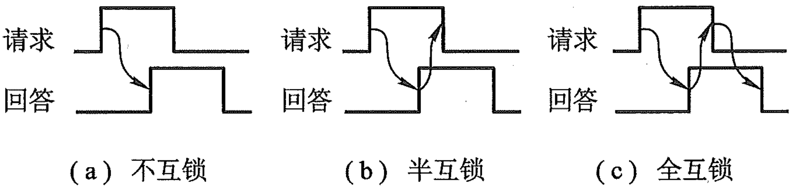

    异步串行通信的数据传送速率用**波特率**来衡量。波特率是指单位时间内传送二进制数据的位数,单位用bps(位/秒)表示,记作波特，特别注意的是严格来说，波特率与比特率不同，仅仅在一个一个波特位用一个比特位表示时，波特率和比特率相等。

  - **半同步通信**

    同步、异步 结合，发送方 用系统 时钟前沿 发信号，接收方 用系统 时钟后沿 判断、识别。增加一条 “等待”响应信号。当从设备数据没有准备好时发出$\overline {\text{WAIT}}$信号，数据准备好了再开始开始同步传输数据。

    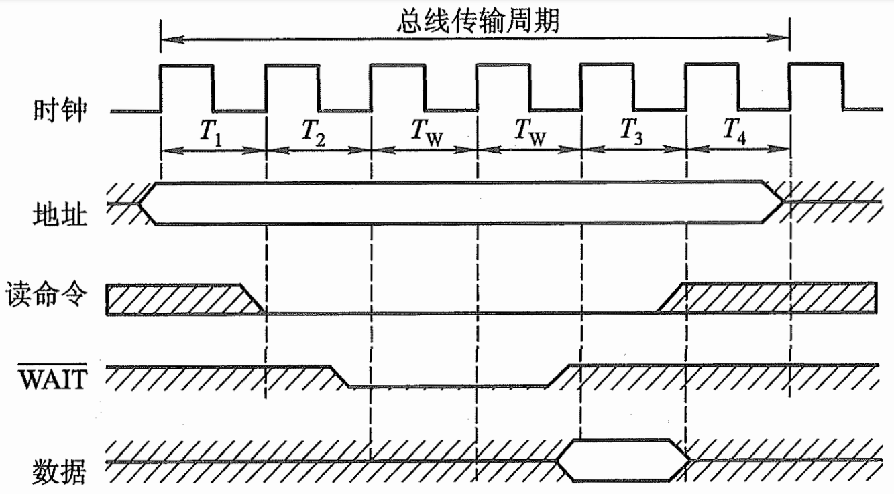

    上面三种数据通信的共同点
    
    - 主模块发地址、命令	需占用总线
    - 从模块准备数据                不占用总线
    - 从模块向主模块发数据 占用总线

  - **分离式通信**

    主模块申请占用总线发地址 、命令，使用完后放弃总线的使用权；从模块准备数据完毕后，从模块申请占用总线（身份转换为主设备），向主模块发数据。从模块<u>准备数据</u>是不占用总线的，这时候其他设备可以请求总线，充分挖掘系统总线每个瞬间的潜力。
    
    - 各模块有权申请占用总线
    - 同步通信，不等回答
    - 各模块准备数据不占用总线
    - 总线被占用时，不空闲

  
