
<h1>第4章 存储器</h1>

### 4.1 概述

#### 4.1.1 存储器分类

- **按存储介质分类**：

  - 半导体存储器：TTL，集成度低，功耗高，速度快，MOS反之
  - 磁表面存储器：磁头、载磁体（磁盘，磁带）
  - 磁芯储存器：硬磁材料、环状元件
  - 光盘存储器：激光、磁光材料·

- **按存取方式分类**：

  - ##### 随机储存器（Random Access Memory,RAM）

    RAM是一种可**读/写**存储器,其特点：①**随机存取**性；②存取时间与存储单元的物理位置无关：访问存储器的任一物理单元的时间均相等。③**易失性**

    根据存储信息原理的不同分类：RAM又分为**静态RAM**(以**触发器**原理寄存信息)和**动态RAM**(以**电容**充放电原理寄存信息)。

  - ##### 只读储存器（Read Only Memory,ROM）

    特点：①存储内容**只能读**不能重新写；②**非易失**性

    应用：存放固定不变的程序、常数和汉字字库,甚至用于操作系统的固化；**它与随机存储器可共同作为主存的一部分,统一构成主存的<u>地址域</u>**。

    后来发展的ROM存储器：

    - 掩模型只读存储器(MaskedROM,MROM)
    - 可编程只读存储器(Programmable ROM,PROM)
    - 可擦除可编程只读存储器(Erasable Programmable ROM,EPROM)
    - 电擦除可编程只读存储器(Electrically-ErasableProgrammableROM,EEPROM)
    - 闪速存储器FlashMemory

  - ##### 串行访问存储器（存储时间与物理地址有关）

    对存储单元进行读/写操作时,需按其物理位置的先后顺序寻找地址,**存取时间与物理位置有关**，则这种存储器称为串行访问存储器。

    - 顺序存取存储器：磁带
    - 直接（半顺序）存取存储器：磁盘

- **按在计算机中的作用分类**：

  按在计算机系统中的作用不同,存储器主要分为**主存储器**、**辅助存储器**、**缓冲存储器**。

  按照这种方法分类，其直观分类可从下图得知：

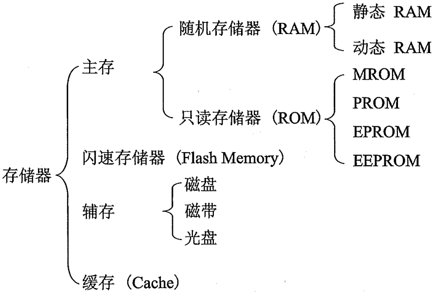

#### 4.1.2 存储器的层次结构

- 存储器速度、容量和 位价的关系图

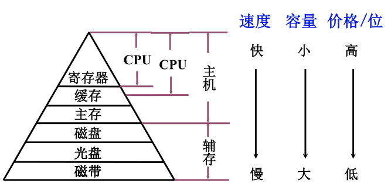

- 缓存－主存层次和主存－辅存层次图

  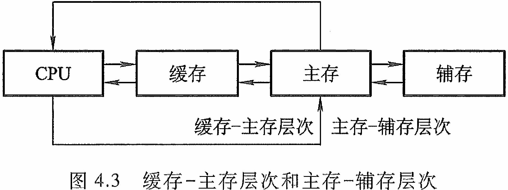

  - **主存和缓存**之间匹配的是**速度**，它们之间的数据调动是由硬件自动完成的
  - **主存和辅存**之间匹配的是**容量**，它们之间的数据调动是 由硬件和操作系统共同完成的。

### 4.2 主存储器

#### 4.2.1 概述

- 现代计算机的主存都由半导体集成电路构成,，**MAR**和**MDR**制作在CPU芯片内，如下图所示。下图中虽然MAR和MDR是在CPU内部，但是这并不代表内存的MAR和MDR在CPU中。下图的MDR和MAR为CPU的器件，主存有但未画出来。

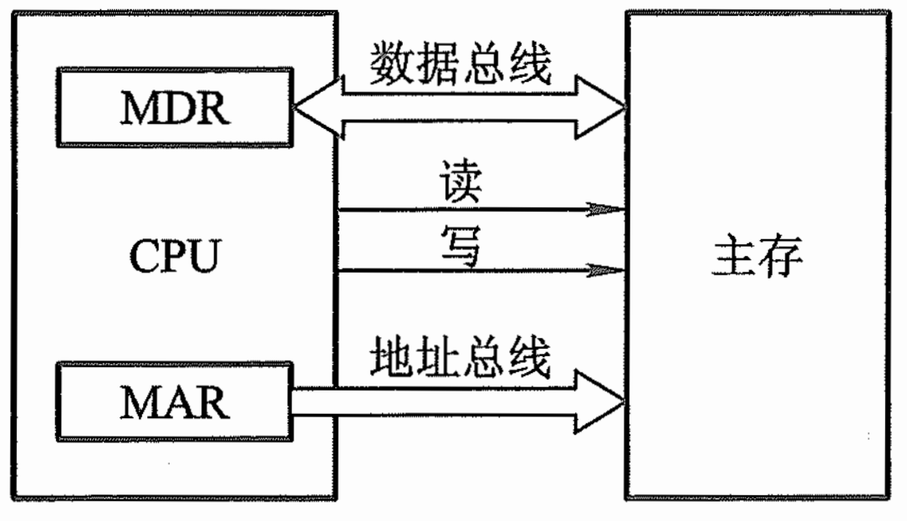

- **寻址范围计算**

  - 按字节寻址范围计算为【$2^\text{地址线位数}$】Byte
  - 按字寻址范围计算为【$\frac{2^\text{地址线范围}\times8}{字长}$】bit

- **主存的技术指标**

  - **存储容量**：指主存能存放二进制代码的总位数

    ①存储容量=存储单元个数x存储字长	（以位数表示）
    ②存储容量=存储单元个数x存储字长/8	（以字节表示）
  
  - **存储速度**

    存储速度是由存取时间和存取周期来表示

    - **存取时间**

      存取时间又称为存储器的访问时间(Memory Access Time),是指启动一次存储器操作(读或写)到完成该操作所需的全部时间。

      存取时间分读出时间和写人时间两种。读出时间是从存储器接收到有效地址开始,到产生有效输出所需的全部时间。写人时间是从存储器接收到有效地址开始,到数据写人被选中单元为止所需的全部时间。

    - **存取周期**

      存取周期(Memory Cycle Time)是指存储器进行<u>连续两次</u>独立的存储器操作(如连续两次读操作)所需的<u>最小间隔</u>时间

  - **存储器带宽**
    表示单位时间内存储器存取的信息量,如下例：
  
    > 存取周期为500ns,每个存取周期可访问16位,则它的带宽为32M位/秒，计算如下
    > $$
    > 32\text{Mbit/s}=\frac{16bit}{500\times10^{-9}s}
    > $$
    > 
  
    为了提高存储器的带宽,可以采用以下措施:

    ① 缩短存取周期。
    ②)增加存储字长,使每个存取周期可读/写更多的二进制位数。
    ③增加存储体

#### 4.2.2 半导体存储芯片简介

- **半导体存储芯片的译码驱动方式有两种**:线选法和重合法

  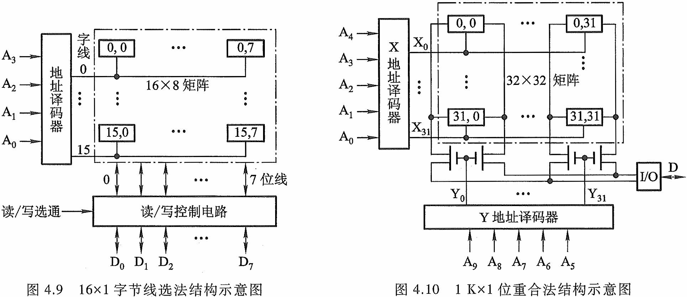

  

- **控制线**

  - **片选线**：用来选择存储芯片
    - $\overline{\text{CS}}$：片选线，低电平有效

    - $\overline{\text{CE}}$：使能线，低电平有效

  - **读/写控制线**：决定芯片进行读/写操作
    - 单独$\cancel{\text{WE}}$：低电平写 高电平读
    - $\cancel{\text{WE}}$搭配$\cancel{\text{OE}}$：允许写

#### 4.2.3 随机存储器

- ##### 静态 RAM(Static RAM, SRAM)

  由千静态 RAM是用**触发器**工作原理存储信息的，因此即使信息读出后，它仍保持其原状 态，不需要再生。但电源掉电时，原存信息丢失，故它属**易失性**半导体存储器。

  -  ##### 静态 RAM 基本单元电路

  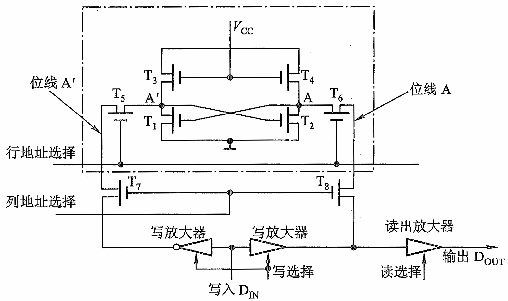

  > 读出时，$V_{CC}$家电，$T_3$和$T_4$开关都闭合电路连通；接着A‘和A同时加电，$T_1$和$T_2$闭合，数据从存储芯片内流向A与A’（两侧数据是一致的）；$T_5$和$T_6$从行地址选择线上获取行地址，$T_7$和$T_8$从列地址选择线上获取列地址，此时两侧数据流通；左侧数据流通至左侧写放大器后反向，无法通过；右侧数据不经过放大器直接送到$\text{D}_\text{OUT}$中。
  >
  > 写入时，数据经过左侧放大器将取反，右侧正常通过；我们选择好行地址与列地址，打开两侧通路。当数据到达A‘与A的时候有两种情况：
  >
  > - ①$$\text{D}_\text{IN}$$为1，则A’为0，A为1，此时$T_2$断开，$T_1$连接，正常写入1；
  > - ②$\text{D}_\text{IN}$为0，则A‘为1，A为0，此时$T_1$断开，$T_2$连接，正常写入0.

  - ##### 静态 RMA 芯片举例（Intel 2114）

    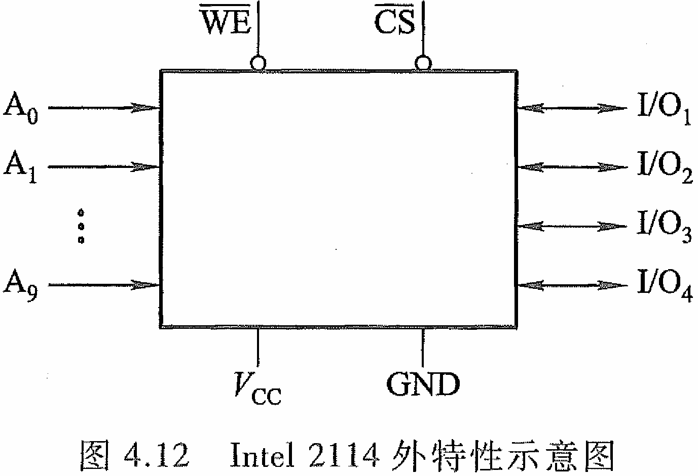

    当 $\overline{\mathrm {CS}}$ 和$\overline{\mathrm {WE}}$ **均为低电平**时，输入（**写**）三 态门打开，$\mathrm{I/O}_{4}\sim\mathrm{I/O}_{1}$上的数据即写入指定地址单元中。**当$\overline{\mathrm {CS}}$为低电平、$\overline{\mathrm {WE}}$ 为高电平**时， 输出（**读**）三态门打开，列 I/0 电路的输出经片内总线输出至数据线 $\mathrm{I/O}_{4}\sim\mathrm{I/O}_{1}$ 上。

    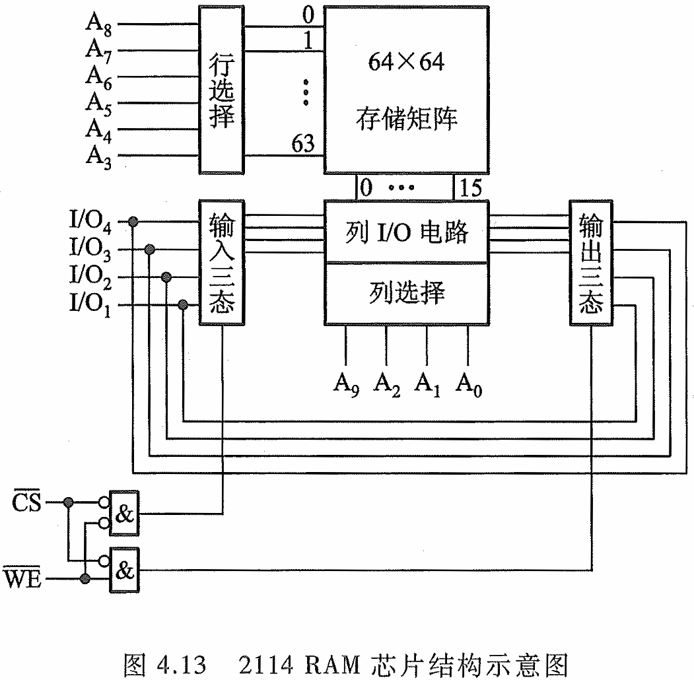

    - 存储矩阵结构：

    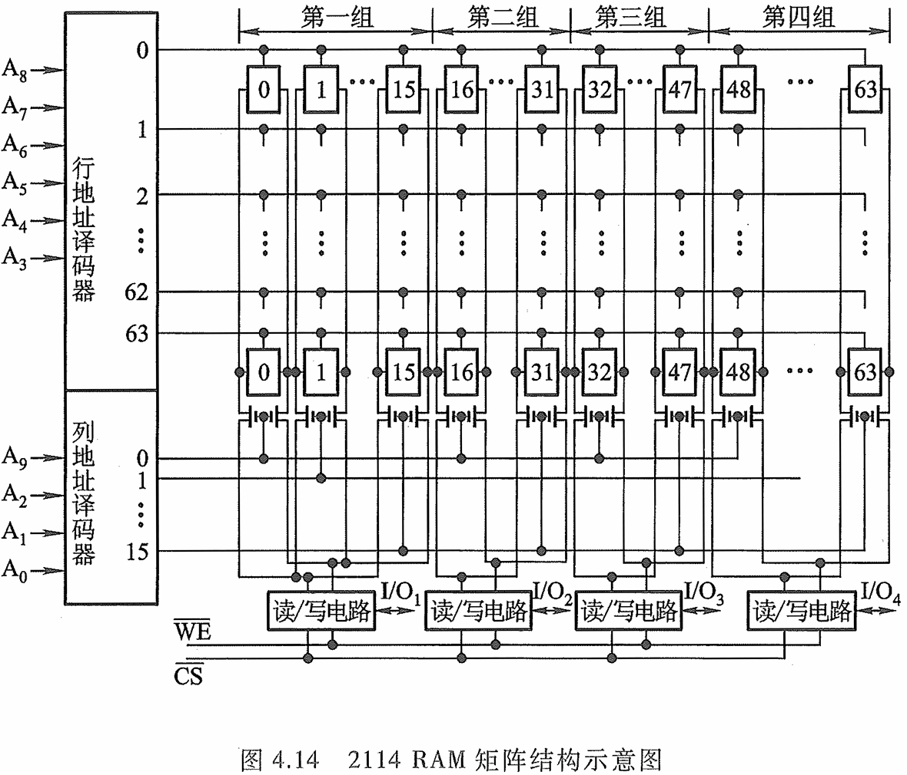

    - 读周期时序：

    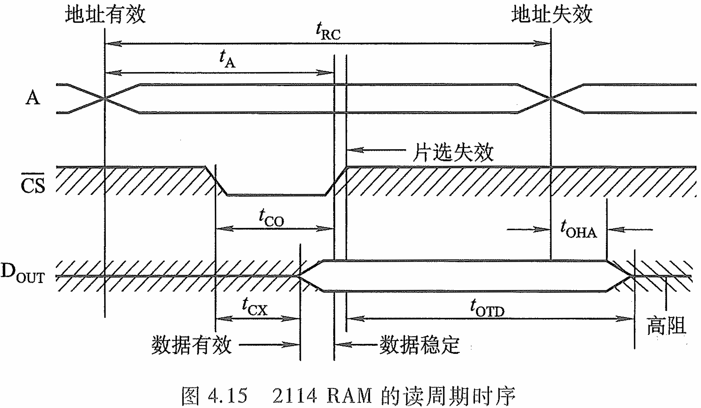

    - 写周期时序

    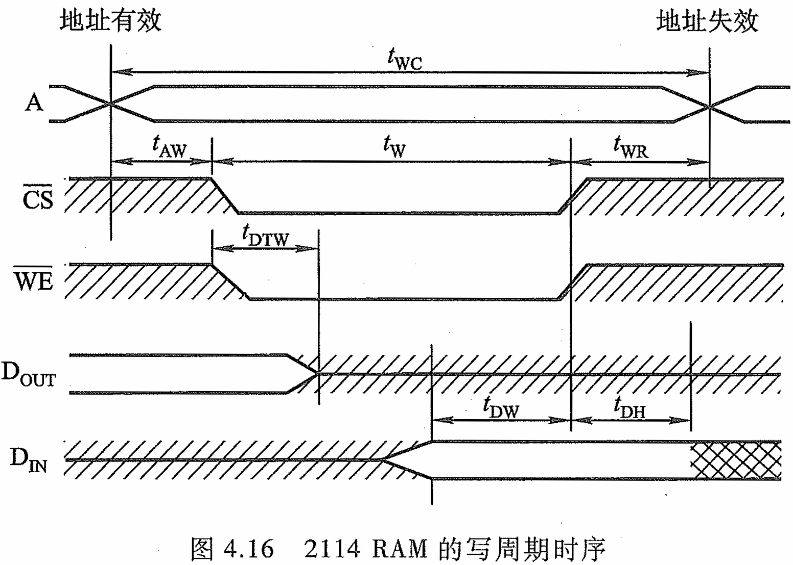

    地址有效后，先发出写命令开始片选，片选完成了后，等待上一个读周期的数据滞后完成我们便开始写。由于写始终要知道内存单元的地址，所以地址失效一定在$\mathrm {D_{IN}}$之后

    

- ##### 动态 RAM(Dynamic RAM, DRAM)

  常见的动态RAM基本单元电路有**三管式**和**单管式**两种，它们的共同特点都是靠**电容存储 电荷**的原理来寄存信息，若电容上存有足够多的电荷表示存”1"，电容上无电荷表示存“0”。

  电 容上的电荷一般只能维持 1~ 2 ms，因此即使**电源不掉电，信息也会自动消失**；为此，必须在 2 ms内对其所有存储单元恢复一次原状态，这个过程称为**再生**或**刷新**。

  由千它与静态 RAM 相 比，具有**集成度更高**、**功耗更低**等特点，目前被各类计算机广泛应用。

  -  ##### 动态 RAM 的基本单元电路

    - ##### 三管 MOS 动态 RAM 基本单元电路

    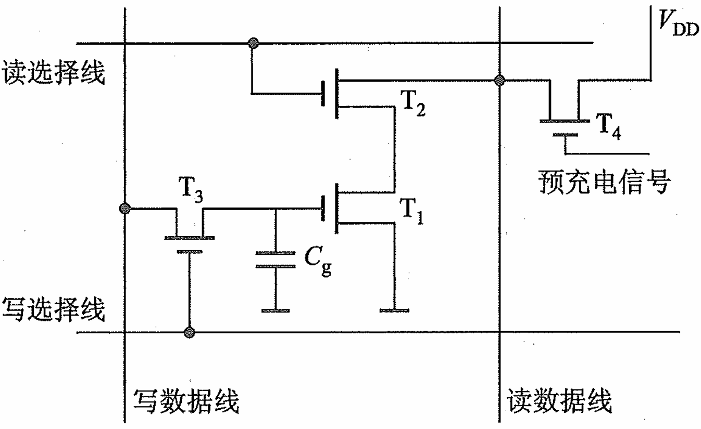

    > 1. **读操作**：当`读选择线`被选中时，晶体管`T2`导通，若存储在$\text{C}_\text{g}$上的电荷足够则`T1`导通，那么T1和T2接地，使`读数据线`降为`低电平`，读出0；若$\text{C}_\text{g}$的电荷不足以导通`T1`，则读数据线保持`高电平`不变。
    >
    >    因此我可以发现读出的信息与原存入的信息是反相的，若要恢复真正的数据，需要将读出的数据进行取反。
    >
    > 2. **写操作**：在写操作期间，`写选择线`被选中，晶体管`T3`导通，允许电流通过写数据线流向电容Cg。写入数据是正相的。

    -  ##### 三管 MOS 动态 RAM 结构示意图

    

    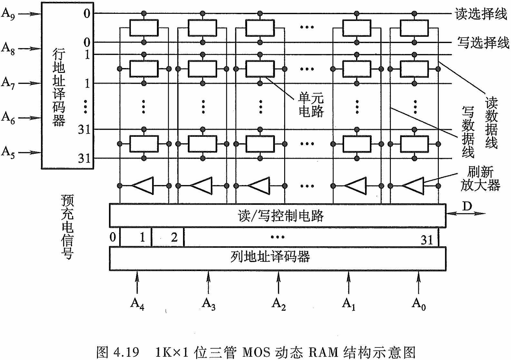

    - ##### 单管 MOS 动态 RAM 基本单元电路

    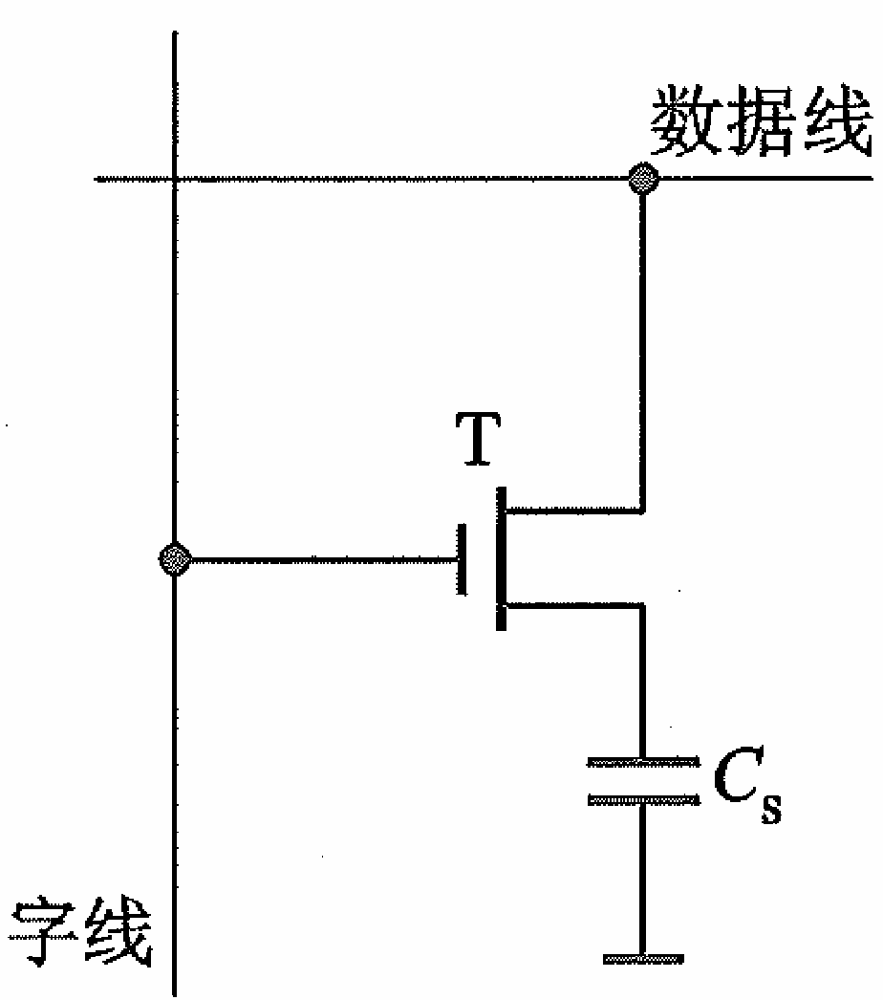

    - #####  16 Kx 1 位 4116 动态 RAM 存储矩阵示意图

      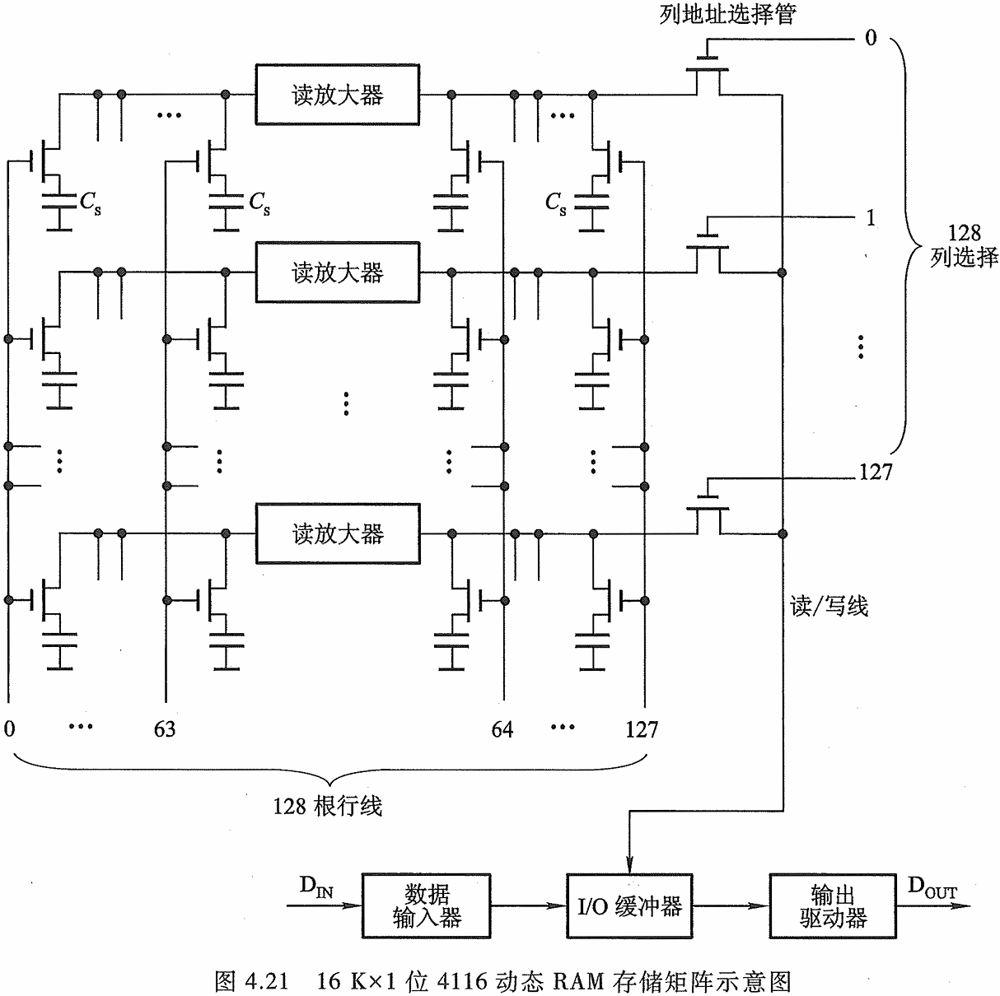

  -  ##### 动态RAM读时序

     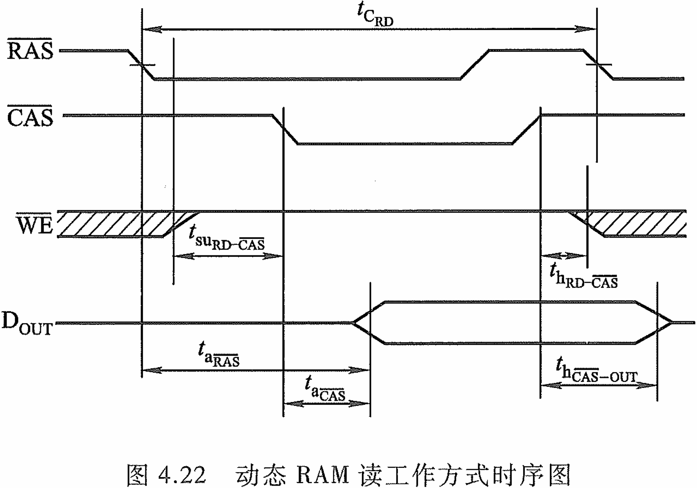

     先用$\overline{\mathrm{RAS}}$将行地址送入行地址缓冲器，再由$\overline{\mathrm{CAS}}$送入列地址缓冲器。地址确定才能读，因此$\mathrm{D}_\mathrm{OUT}$有效在行列地址选通之后；读信号结束后，数据还存在一定时间在线路上的传输，因此$\mathrm{D}_\mathrm{OUT}$必须滞后。

  -  ##### 动态RAM写时序

     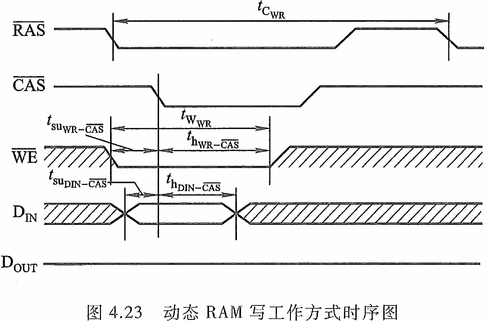

     同样的，先用$\overline{\mathrm{RAS}}$将行地址送入行地址缓冲器，再由$\overline{\mathrm{CAS}}$送入列地址缓冲器。但是在$\overline{\mathrm{WE}}$低电平写信号生效后，就要开始准备数据了，因此即使$\overline{\mathrm{CAS}}$还没有有效，$\mathrm{D_IN}$也得开始了。

     等到$\overline{\mathrm{CAS}}$有效了，那么$\mathrm{D_IN}$也稳定了。

- ##### 动态 RAM 的刷新

  刷新的过程实质上是先将原存信息读出，再由刷新放大器形成原信息并重新写入的再生过程。由于存储单元被访问是随机的，有可能某些存储单元长期得不到访问，不进行存储器的 读／写操作，其存储单元内的原信息将会慢慢消失。

  为此，必须采用定时刷新的方法，它规定在一 定的时间内，对动态 RAM 的全部基本单元电路必作一次刷新**，一般取2 ms，这个时间称为刷新周期**，又称再生周期。

  刷新是一行行进行的，必须在刷新周期内，由专用的刷新电路来完成对基 本单元电路的逐行刷新，才能保证动态 RAM 内的信息不丢失。通常有三种方式刷新：**集中刷新**、**分散刷新**和**异步刷新**。

  - **集中刷新**：集中刷新是在规定的一个刷新周期内，对全部存储单元集中一段时间逐行进行刷新，此刻必 须停止读／写操作。

    > 例如，对 128x128 矩阵的存储芯片进行刷新时，若存取周期为 0.5 µs，刷新周 期为2 ms（占 4 000 个存取周期），则对 128 行集中刷新共需 64 µs（占 128 个存取周期），其余的 1 936 µ,s （共 3 872 个存取周期）用来读／写或维持信息，如下图所示。由于在这 64 µs 时间内不能进行读／写操作，故称为“死时间”，又称访存“死区”，所占比率为 128/4000x 100% = 3.2%,  称为死时间率
    >
    > 🈲刷新一行占一个存储周期

  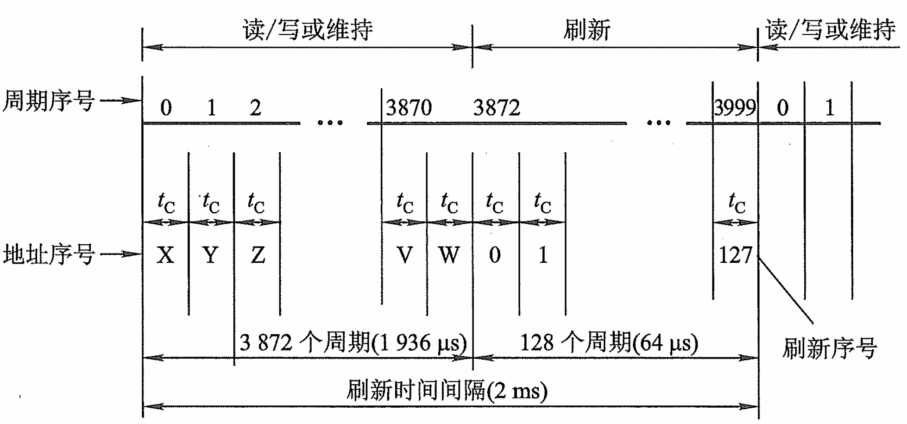

  - **分散刷新**：分散刷新是指对每行存储单元的刷新分散到每个存取周期内完成。

    该模式中，所有的行刷新被分配到了各存取周期，即完成一次读/写就做一行的刷新；存取周期由0.5µs扩充到了1µs，这是因为前0.5µs用来进行读/写；后0.5µs用来刷新；这样做的好处是不存在读写停止读写的死区时间了，坏处是存储周期变长了，降低系统效率。

  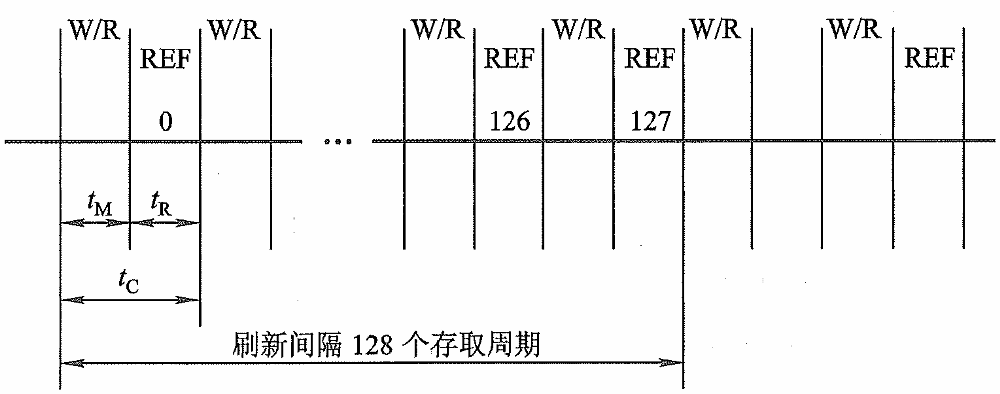

  - **异步刷新**

    结合分散刷新与集中刷新，每隔若干秒刷新一行。此般，经过一个刷新周期后所有行都得到了刷，即克服了集中刷新的长时死区效应又解决了

  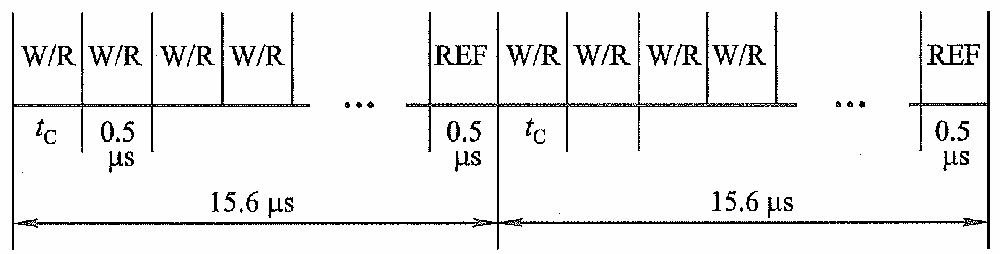

- ##### 动态 RAM 和静态 RAM 的比较

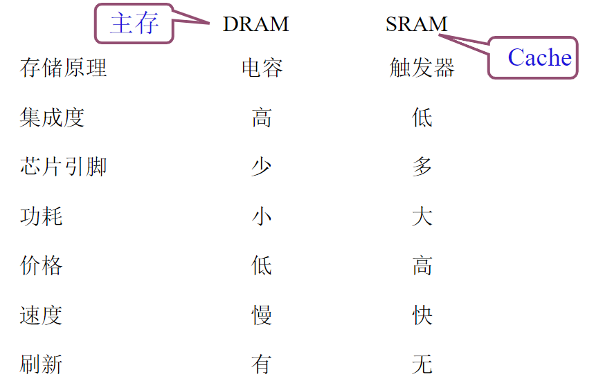

#### 4.2.4 只读存储器（ROM）

半导体ROM基本器件为两种：**MOS** 型和 **TTL** 型。

- ##### 掩模 ROM

  - 有耦合元件 MOS 管的节点，若导通将使列线输出为低电平
  - 列线的输出经过放大器将**反相**

  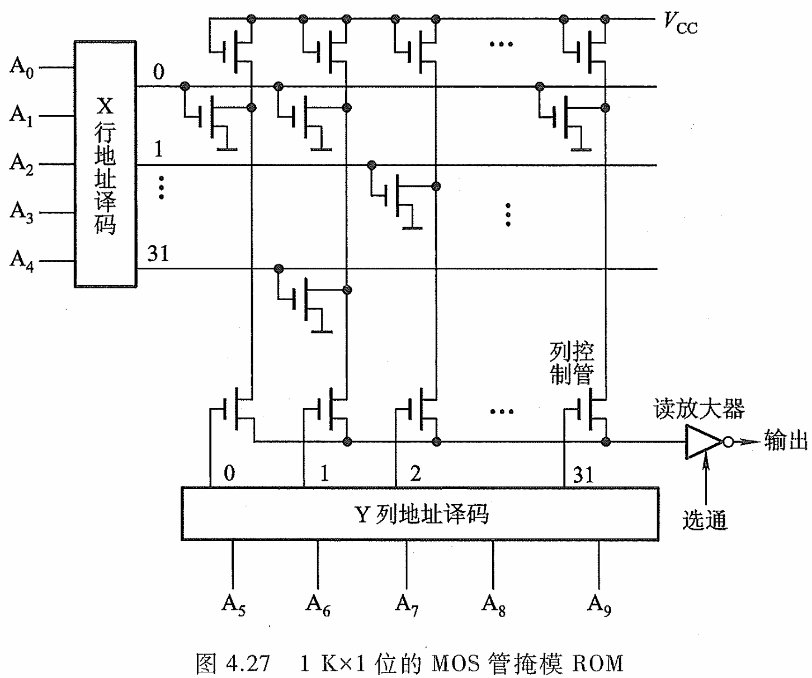

- ##### PROM

  - 熔丝未断和断可区别其所存信息是 " 1” 或“0” 。
  - 已断的熔丝是无 法再恢复的，故这种 ROM往往只能实现一次编程，不得再修改。

  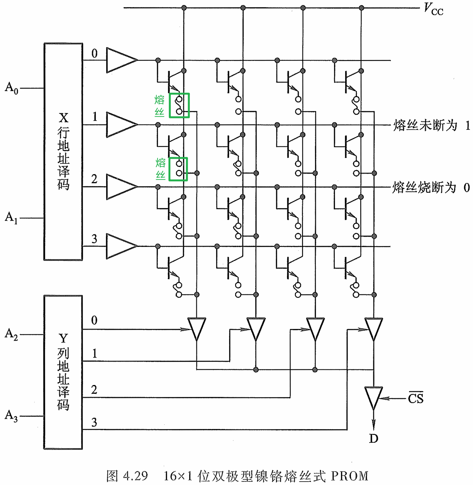

- ##### EPROM

  - ##### N 型沟道浮动栅 MOS 电路

    在**漏端 D 加上正电压**会形成一个浮动栅，源 S 与漏 D 之间不导通，MOS管处于“0”状态。D 端不加正电压，则不能形成浮动栅，MOS管正常导通，呈“1”状态。

    用户需重 新改变其状态，可用**紫外线照射**，驱散浮动栅

    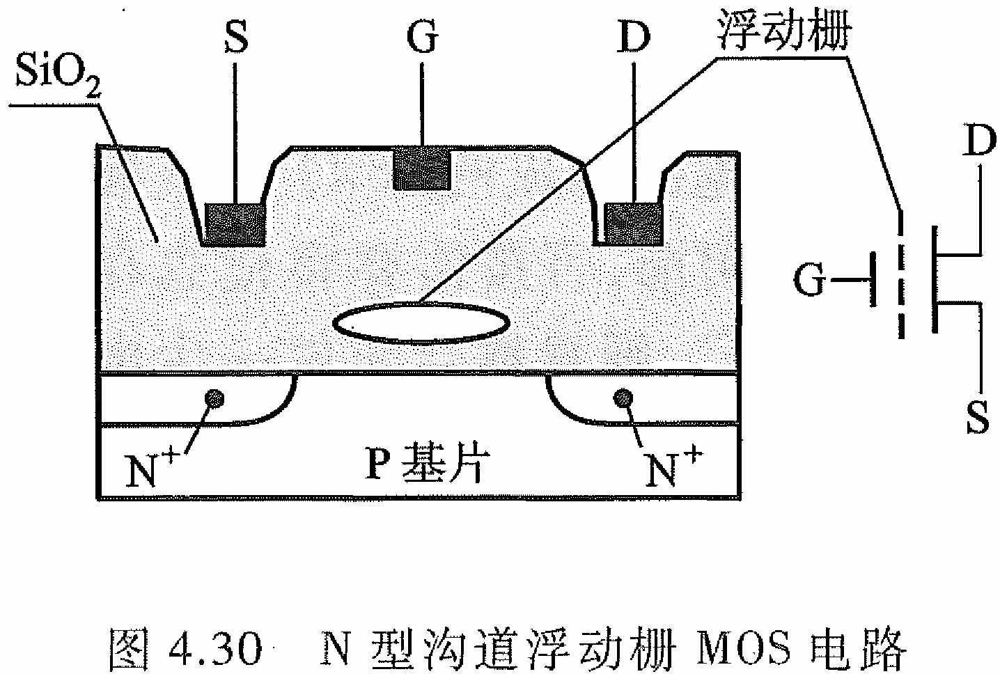

  - #####  2716 型 EPROM 逻辑图及引脚图

    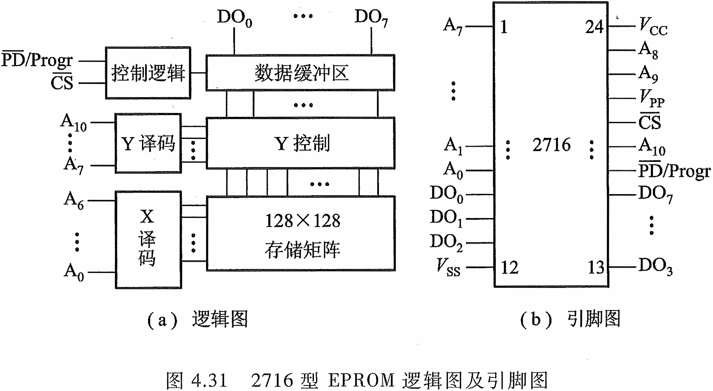

    - $V_{ss}$为地,$V_{cc}$进而$V_{pp}$为两个电源头；$\overline{\mathrm{CS}}$为片选端，读出时为低电平，编程写入时为高电平。$\overline{\mathrm{PD}}/\mathrm{Progr}$为功率下降／编程输入端，在读出时为低电平。
    - EPROM 的改写可用两种方法：一种用紫外线照射（该方法不能对个别单元进行单独擦除或重写），另一种方法用电气方法将存储内容擦除，再重写。

#### 4.2.5 存储器容量的扩展

- ##### 位扩展 （增加存储单元长度（即字长））

  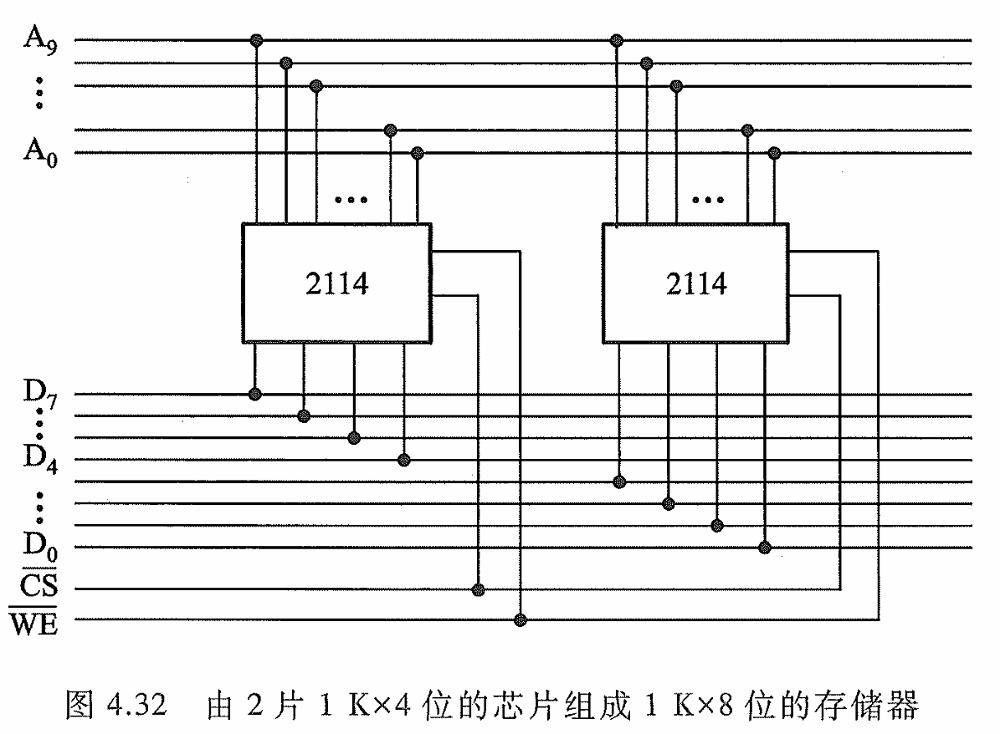

  注意各芯片的数据线连接方式。

- ##### 字扩展（增加存储字的数量），用高位地址线充当片选线

  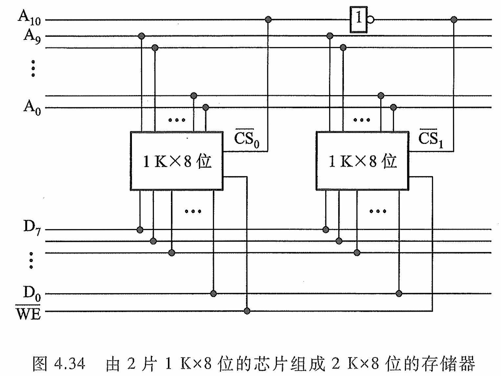

  对于字扩展，片选逻辑是非常重要的。

  

- ##### 字、位扩展

  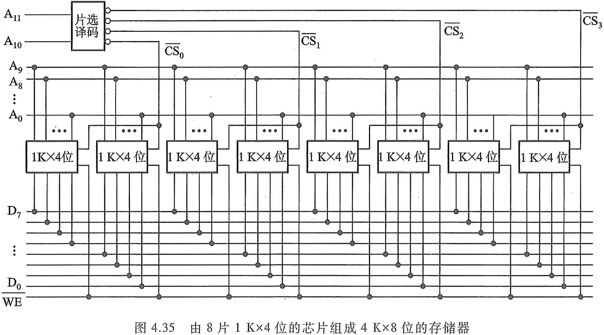

#### 4.2.6 存储器与CPU的连接

- ##### 存储器与 CPU 的连接步骤：

  - ##### (1) 写出对应的二进制地址码

    - ##### (2) 确定芯片的数量及类型

    - ##### (3) 分配地址线

    - ##### (4) 确定片选信号和片选逻辑以及接线

    - ##### (5) 画图

- ##### 存储器于CPU连接实例1

  - ##### 问题描述

    > 例 4.1 设 CPU 有 16 根地址线、8 根数据 线，并用 $\overline{\mathrm{MREQ}}$ 作为访存控制信号（低电平有 效），用$\overline{\mathrm{WR}}$作为读／写控制信号（高电平为读，低 电平为写）。现有下列存储芯片：1 Kx4 位 RAM、 4 Kx8 位 RAM、8 Kx8 位 RAM、2 Kx8 位 ROM、 4 Kx8 位 ROM、8 Kx 8 位 ROM 及 74138 译码器 和各种门电路，如图 4.36 所示。画出 CPU 与存 储器的连接图，要求如下：
    >
    > - 主存地址空间分配： 6000H ~ 67FFH 为系统程序区。；6800H ~ 6BFFH 为用户程序区。 
    > - 合理选用上述存储芯片，说明各选几片。 
    > - 详细画出存储芯片的片选逻辑图。

    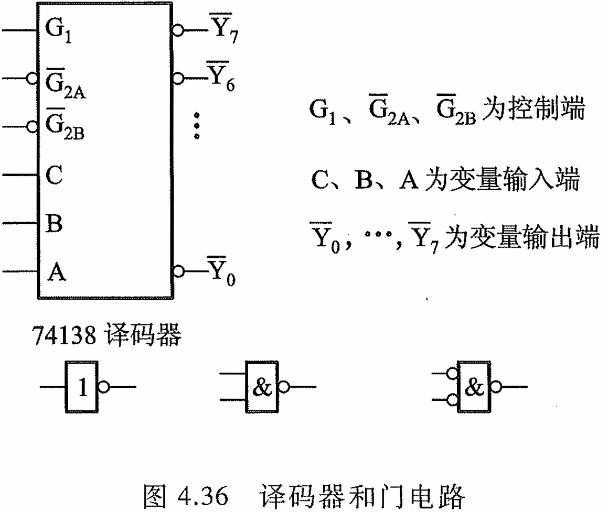

  - ##### 问题解答

    - ##### 写出对应的二进制地址码

      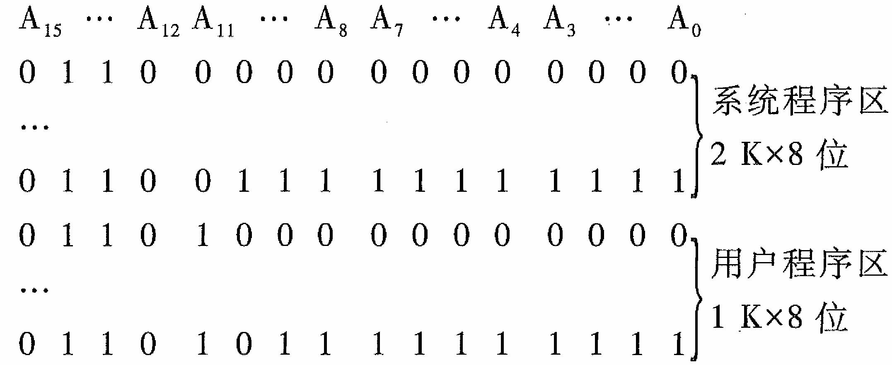

    - ##### 确定芯片的数量及类型

      根据6000H~ 67FFH 为系统程序区的范围，应选择 1 片 2 Kx8 位的 ROM 

      根据6800H~ 6BFFH 为用户程序区的范围，选 2 片 1 Kx4 位的 RAM 芯片正好满足 1 Kx8 位 的用户程序区要求。

    - #####  分配地址线

      将 CPU 的低 11 位地址$\mathrm {A_{10}}\sim \mathrm{A_0}$。与 2 Kx 8 位的 ROM 地址线相连；将 CPU 的低 10 位地址 $\mathrm {A_{9}}\sim \mathrm{A_0}$。与 2 片 1 Kx4 位的 RAM 地址线相连。

    - ##### 确定片选信号和片选逻辑以及接线

      由74138 译码器输入逻辑关系可知，必须保证控制端$\mathrm G_1$为高电平，$\mathrm{\overline{G}_{2A}}$与$\mathrm{\overline{G}_{2B}}$为低电平，才能使译码器正常工作。

      根据第一步写出的存储器地址范围得出，$\mathrm {A_{15}}$始终为低电平，，$\mathrm {A_{14}}$始终为高电平，它们正好可分别与译码器的$\mathrm{\overline{G}_{2A}}$（低）和 $\mathrm G_1$（高）对应。

      而访存控制信号 $\overline{\mathrm{MREQ}}$ （低电平有效）又正好可与$\mathrm{\overline{G}_{2B}}$（低）对应。剩下的 $\mathrm{A}_{13}\mathrm{~、A}_{12}\mathrm{~、A}_{11}$可分别接到译码器的 C、B、A 输入 端。

      其输出 $${\overline{\mathrm{Y_4}}}$$ 有效时，选中 1 片 ROM；$${\overline{\mathrm{Y_5}}}$$ 与 $${\mathrm{A_{10}}}$$ 同时有效均为低电平时，与门输出选中 2 片 RAM，如图 4.37 所示。

      图中 ROM 芯片的 $${\mathrm{PD/Prog}}$$ 端接地，以确保在读出时低电平有效。RAM 芯片的读写控制端与 CPU 的读写命令端 $${\overline{\mathrm{WR}}}$$ 相连。

      ROM 的 8 根数据线直接与 CPU 的 8 根数据线相连，2 片 RAM 的数据线分别与 CPU 数据总线的高 4 位和低 4 位相连。

    - ##### 画图

      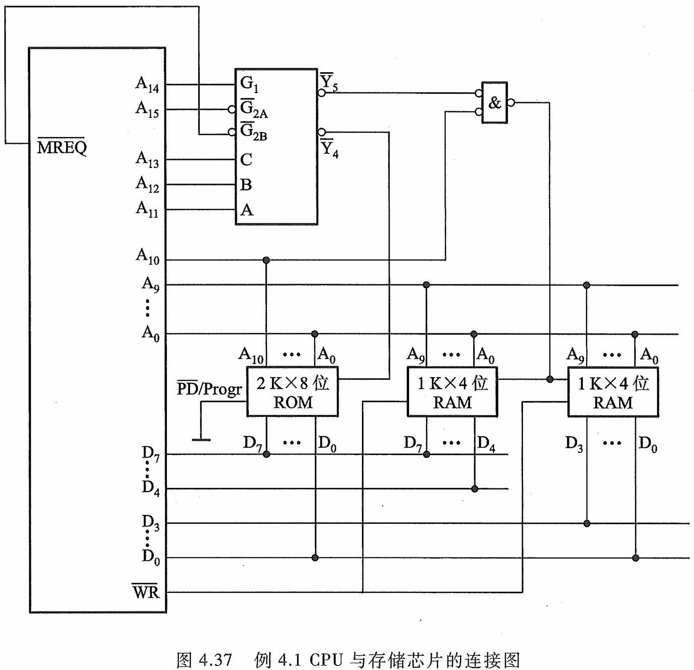

#### 4.2.7 存储器的校验（汉明码）

- ##### 简介

汉明码是由 Richard Hanming 于 1950 年提出的，它具有**一位**纠错能力。

新增的汉明码校验位数应满足如下关系：$2^{k}\geqslant n+k+1$，其中k为校验位位数，n位数据位数。

同时，我要强调的是汉明校验码的生成和校验都都两种原则，希望读者要对概念进行清晰地把握，不可一知半解：
$$
\text{汉明校验}\begin{cases}
\text{按配偶原则的校验}\\
\text{按配奇原则的校验}
\end{cases}
$$
这里直接阐述配偶和配奇的原则会比较抽象，我们放到具体的例子中来看，会更加易懂。

- ##### 汉明码生成

1. ###### 确定校验位的个数

   使用公式【 $2^{k}\geqslant n+k+1$】计算需要的k，其中 k 是检验位的数量，n 是数据位的数量；

   > 举个逆子：原欲发送数据为：0101，此时我们可得n=4，则欲使$2^k\geq4+k+1$，k最小为3，即校验位个数为3。

2. ###### 安置校验位

   我们规定：所有的校验位均放置在第$2^n$位，也就是第1、2、4、8...位置等都是校验位，n从0开始，到k-1结束。

   上例中k=3，则校验位的位置为：①$2^0=1$；②$2^1=2$；③$2^2$=4；即3位校验位放在最后要发送数据的第1，第2，第4个位置。

3. ###### 填充数据位:

   在非校验位的其他位置上填写真正的数据，填充后汉明码应如如下形式才对：

   | $c_1$ | $c_2$ |  0   | $c_3$ |  1   |  0   |  1   |
   | :---: | :---: | :--: | :---: | :--: | :--: | :--: |

   其中$c_1$，$c_2$，$c_3$为待确定值的校验位。

4. ###### 画表计算校验位的值

   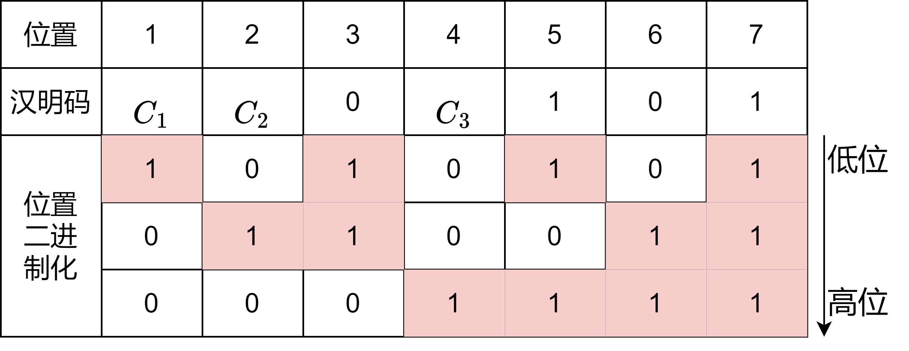

   我们的原则是，位置代表的二进制写好后，**每一行值为`1`的二进制位分为一组**；然后，你会发现，**每一行校验位的位置是互斥的，只有一个校验位值为`1`**。也就是说，一个校验位会和若干数值位搭配，组成一组。

   然后我们可以引出配奇和配偶原则了：

   - **配奇原则**：通过配置校验位$C_j$，使得该组1的个数为**奇数**个，那么该组的各位进行异或操作必为`1`
   - **配奇原则**：通过配置校验位$C_j$，使得该组1的个数为**偶数**个，那么该组的各位进行异或操作必为`0`

   基于这样的发现，我们让**同一组各数据位进行异或**（两个二进制位异或，相同结果为0，不同为1）运算，按照**配偶原则**，可得结果如下计算所示：
   $$
   \text{配偶原则}\begin{cases}C_1\oplus0\oplus1\oplus1\Longrightarrow C_1=0\\
   C_2\oplus0\oplus0\oplus1\Longrightarrow C_2=1\\
   C_3\oplus1\oplus0\oplus1\Longrightarrow C_3=0
   \end{cases}
   $$
   我们怎么理解上面的$C_1 C_2C_3$的取值？

   【$C_1$=0】，是因为和它一组的数据位为`011`中有偶数个1，按照**配偶**原则，已经有偶数个1了，那我就不用管了；反之看第二组，【$C_2$=1】,这是因为第二组的数据位为`001`，只有奇数个1，按照配偶原则，$C_2$要置1才能保证第二组的1为偶数个。第三组同理。

   > 刚好在这里把配奇的原则也讲一下，上面的$C_1 C_2C_3$如果按照配奇原则会是多少呢？如下（如果你理解了配偶原则，配奇也很简单）：
   > $$
   > \text{配奇原则}\begin{cases}C_1=\overline{0\oplus1\oplus1}\Longrightarrow C_1=1\\
   > C_2=\overline{0\oplus0\oplus1}\Longrightarrow C_2=0\\
   > C_3=\overline{1\oplus0\oplus1}\Longrightarrow C_3=1
   > \end{cases}
   > $$
   > 可见，配奇的结果和配偶的结果刚好相反，这是因为异或操作的原理使得如果同一组中的数据位有偶数个1那么异或必为0，那么取反得校验位为1，那么组合起来（数据位有偶数个1，校验位有1个1，相加肯定是奇数咯）1的个数就是奇数个咯，完成奇配置。

5. ###### 书写完整的汉明码（配偶原则）

   如第四步所计算，得到三个校验位的值后，将其值填充到校验位所对应的位置，将校验位的值填充进行，写出完整的汉明码，上例的汉明码为

   |   1   |   2   |   3   |   4   |   5   |   6   |   7   |
   | :---: | :---: | :---: | :---: | :---: | :---: | :---: |
   | $C_1$ | $C_2$ | $P_1$ | $C_3$ | $P_2$ | $P_3$ | $P_4$ |
   |   0   |   1   |   0   |   0   |   1   |   0   |   1   |

6. ###### 书写完整的汉明码（配奇原则）

   |   1   |   2   |   3   |   4   |   5   |   6   |   7   |
   | :---: | :---: | :---: | :---: | :---: | :---: | :---: |
   | $C_1$ | $C_2$ | $P_1$ | $C_3$ | $P_2$ | $P_3$ | $P_4$ |
   |   1   |   0   |   0   |   1   |   1   |   0   |   1   |

- ##### 汉明码校4验

> 按照配偶原则，假设我们收到了0110101，已知这是一个传输出错的汉明码
>
> 按照配偶原则，假设我们收到了1001100，已知这是一个传输出错的汉明码

1. ###### 提取小组（配偶原则）

   0110101总位数为7，则易推得校验位为3位；再根据分组规则，我们可得到三组数据如下：

   - 组1（1357）=0111
   - 组2（2367）=1101
   - 组3（4567）=0101

2. ###### **提取小组（配奇原则）**

   1001100总位数为7，则易推得校验位为3位；再根据分组规则，我们可得到三组数据如下：

   - 组1（1357）=1010
   - 组2（2367）=0000
   - 组3（4567）=1100

3. ###### 校验（配偶原则）

   我们按照**配偶**原则，将原来的分组的各组各位**异或**运算，若为`0`则表示该位没出错，否则表示出错。

   上述汉明码，我们进行如下计算：
   $$
   g1=0\oplus1\oplus1\oplus1=1\\
   g2=1\oplus1\oplus0\oplus1=1\\
   g3=0\oplus1\oplus0\oplus1=0
   $$
   欸，汉明码只能纠错1位，那到底是哪一位出错了呢？其实呀，这里并不能只管看出来，但是汉明码的神奇之处就在于，校验后的k位数值的二进制逆序组合转化为十进制表示的数值就是出错的位置。

   如上例，计算完得到$g_1g_2g_3$=`110`，我们逆序得到`011`，其十进制表示3，那么就是第三位出错了，瞅瞅是不是😁发的是`0100101`接收到的是`0110101`,确实是第3位出错了。

4. ###### 校验（配奇原则）

   我们按照**配奇**原则，将原来的分组的各组各位**异或后取反**运算，若为`0`则表示该位没出错，否则表示出错。

   上述汉明码，我们进行如下计算：
   $$
   g1=\overline{1\oplus0\oplus1\oplus0}=1\\
   g2=\overline{0\oplus0\oplus0\oplus0}=1\\
   g3=\overline{1\oplus1\oplus0\oplus0}=1
   $$
   此时得到$g_1g_2g_3$=`111`，逆序得到`111`。`111`十进制表示7，那么第七位出错了；检查一下呗，发的是`1001101`接收到的是`1001100`,确实是第7位出错了。

#### 4.2.8 提高访存速度的措施（多位交叉）

- **多体并行系统**：高位交叉可以用于容量的扩展，低位交叉可以提高带宽和访问速度

  - ##### 高位交叉，顺序编址（提升容量）

    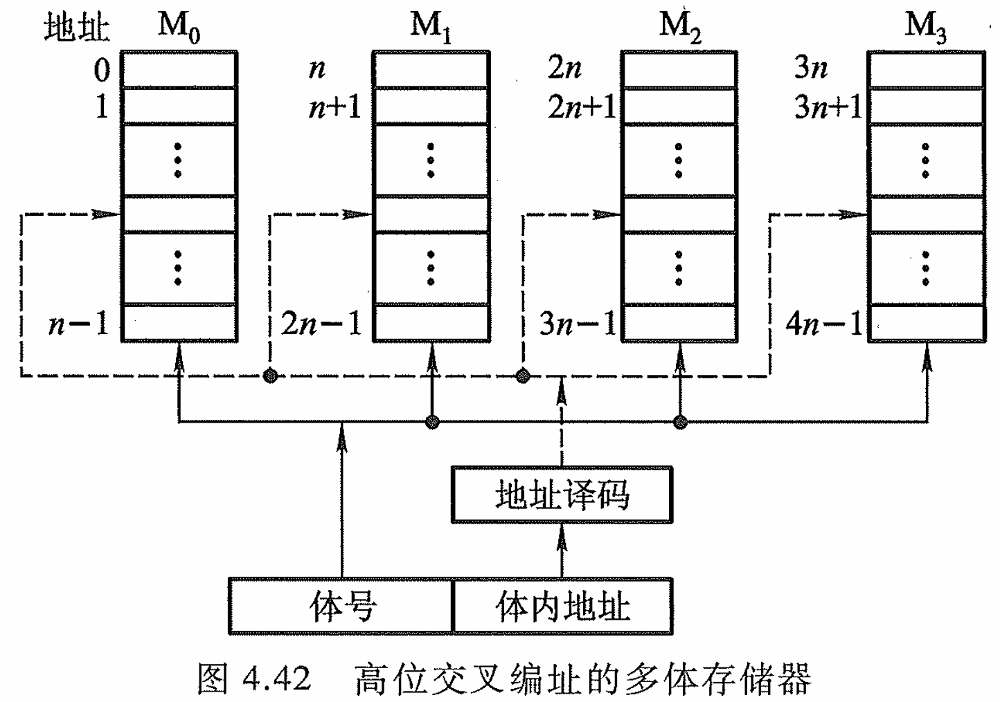

  - ##### 低位交叉，各个体轮流编址（提升带宽）

    

  - 四体低位交叉存储器，存取周期为T，总线传输周期（地址信号通过总线传输的时延）为$\tau$ ，为实现流水线方式存取，应满足 T ＝ 4$\tau$ 

  - 对于低位交叉的存储器，连续读取n个字所需的时间 $t_i$ 为
    $$
    t_{1}=T+(n-1)\tau
    $$

  - 若采用高位交叉编址，则连续读取 n个字所需的 时间$t_2$为
    $$
    t_2=nT
    $$

### 4.3 高速缓冲存储器

#### 4.3.1 概述

- ##### 程序局部性原理

  - **时间局部性**：被引用过一次的存储器位置在未来会被多次引用（通常在循环中）。
  - **空间局部性**：如果一个存储器的位置被引用，那么将来他**相邻**的位置也会被引用。

- ##### 存储墙

  存储器提供数据的速度远远落后处理器处理数据的速度，存储器速度成为各类计算体系的最大瓶颈。

- ##### Cache——主存的基本结构图

  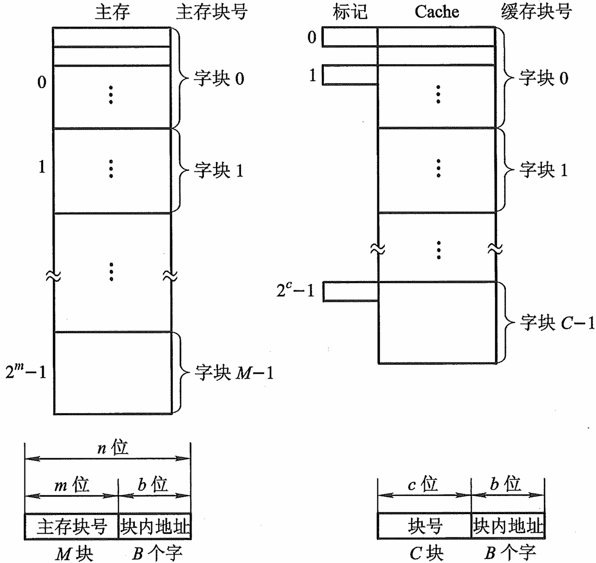

  在图中，主存与缓存之间块的数量是有着巨大差异的，因此必须有一种方案，使得缓存的块能对应到主存的块上；这种方式是做标记，比如上图Cache字块0的标记是0，因此字块0存储的信息来自于主存的信号0。

- ##### 命中与未命中
  
  - 命中：【主存块】 **调入** 缓存，【主存块】与【缓存块】**建立** 了对应关系，
  - 未命中：主存块 **未调入** 缓存，主存块与缓存块 **未建立** 对应关系
  
- ##### Cache的命中率、Cache-主存平均访问时间、访问效率

  - ##### 命中率
    
    $$
    h=\frac{N_c}{N_c+N_m}
    $$
    其中$N_c$ 为访问 Cache 的总命中次数，$N_m$为访问主存的总次数，$h$为命中率
    
  - ##### Cache-主存平均访问时间
    
    $$
    t_{_a}=ht_{_c}+\left(\begin{array}{c}1-h\end{array}\right)t_{_m}
    $$
    其中$t_{c}$为命中时的 Cache 访问时间，$t_{m}$为未命中时的主存访问时间，$1-h$ 表示未命中率，$t_{a}$为Cache-主存平均访问时间
    
  - ##### 访问效率
    
    $$
    e=\frac{t_c}{t_a}\times100\%=\frac{t_c}{ht_c+(\begin{array}{c}1-h\end{array})t_m}\times100\%
    $$

- ##### Cache的基本结构

  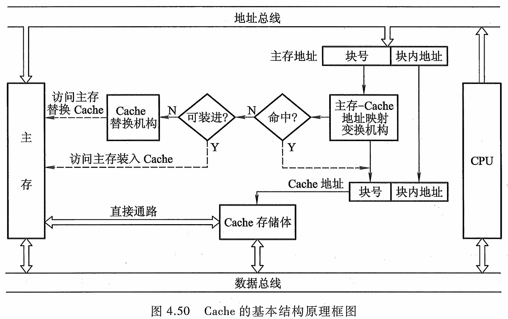

  - 主存块调入Cache的任务全部由**硬件**自动完成

  - ##### Cache的读数操作流程图

    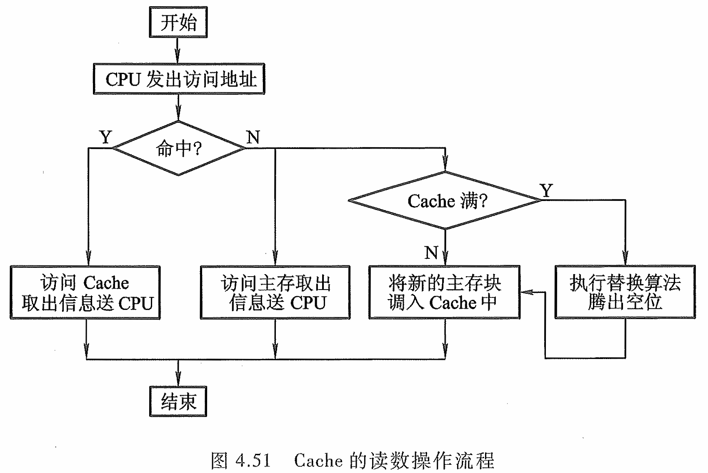

  - ##### Cache的写操作方法

    - **写直达法**

      > 写操作时数据既写入 Cache 又写入主存。它能随时保证主存和 Cache 的数据始终一致，但增加了访存次数；这种方法由于需要和内存进行容量匹配，因此数据范围较小。

    - **写回法**

      > 写操作时只把数据写入 Cache 而不 写入主存，仅当 Cache 数据被替换出去时才写回主存。

  - ##### 统一缓存与分立缓存：
    
    - 统一缓存是指指令和数据都存放在同一缓存内的 Cache
    - 分立缓存是指指令和数据分别存 放在两个缓存中，一个称为**指令 Cache**，另一个称为**数据 Cache**
    - 如果计算机的主存是统一的（指令、数据存储在同一主存内），则 相应的 Cache 采用统一缓存；如果主存采用指令、数据分开存储的方案，则相应的 Cache 采用分 立缓存。
    - 当采用**超前控制或流水线控制方式时，一般都 采用分立缓存**。

#### 4.3.2 Cache-主存地址映射

- ##### 直接映射

  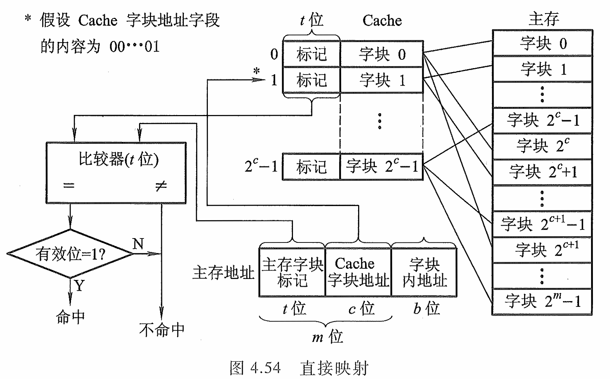

- ##### 全相联映射

  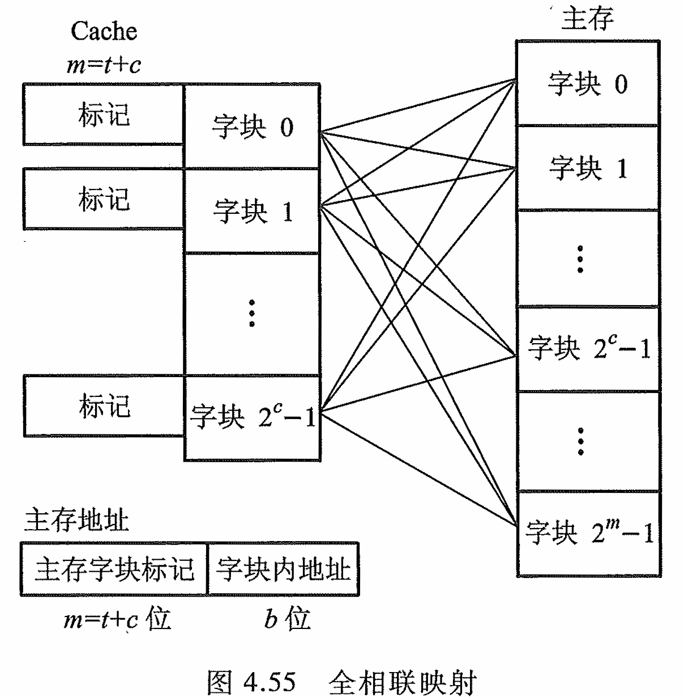

  - **优点**：方式灵活，命中率也更高， 缩小了块冲突率
  - **缺点**：访问 Cache 时主存字块标记需要和 Cache 的全部“标记”位进行比较，才能 判断出所访问主存地址的内容是否已在 Cache 内

- ##### 组相联映射

  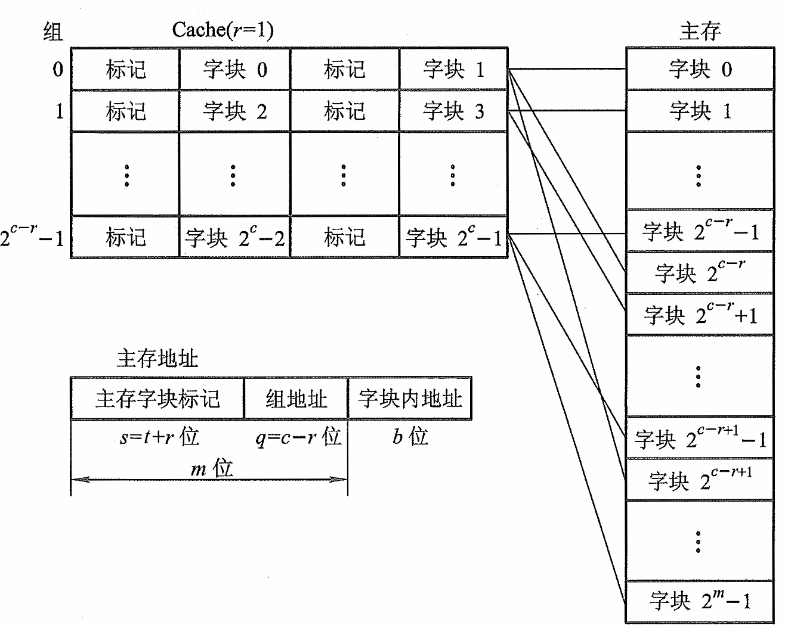
  
  当r=0时是直接映射，当r=c时是全相联映射。

### 4.4 循环冗余校验码

- **编码步骤**

  - 给定【**信息码**】，给定【**生成多项式**】
  - 根据【**生成多项式**】确定确定校验位的长度【**k**】，以及【**模2除的除数**】
  - 确定被除数，【**被除数=信息码+k个0**】
  - 使用模2除方法确定余数，【**余数作为校验位**】
  - 用【**校验位**】替换刚才添加到信息码后面的0后面组成【**CRC**】码

- ##### 举例

  >  已知有效信息为 1100，试用生成多项式 G(x)= 1011 将其编成 CRC 码。

  - ##### 确定校验位长度k-1，以及除数

    将生成多项式还原成代数形式为：
    $$
    \mathrm{G(x)=x^3+x+1}
    $$
    那么有
    $$
    \mathrm{k=max(i_{G(x)})}=3
    $$
    其含义为【**k=生成多项式的最高次=3**】。

    且我们有【**除数=生成多项式的数值形式**】，所以题目已经给出了除数就是【**1011**】

  - ##### 确定被除数

    有效信息为【**1100**】，【**k=3**】，那么【**被除数=有效信息+0*k=1100 000**】

  - ##### 确定校验位（余数）

    | 除   | 数   |      |      |            |      |      | 商   | 1    | 1    | 1    | 0    |          |      |      |      |      |      |      |      |      |      |      |
    | ---- | ---- | ---- | ---- | ---------- | ---- | ---- | ---- | ---- | ---- | ---- | ---- | -------- | ---- | ---- | ---- | ---- | ---- | ---- | ---- | ---- | ---- | ---- |
    | 1    | 0    | 1    | 1    | **被除数** | 1    | 1    | 0    | 0    | 0    | 0    | 0    |          |      |      |      |      |      |      |      |      |      |      |
    |      |      |      |      |            | 1    | 0    | 1    | 1    |      |      |      |          |      |      |      |      |      |      |      |      |      |      |
    |      |      |      |      |            |      | 1    | 1    | 1    | 0    |      |      |          |      |      |      |      |      |      |      |      |      |      |
    |      |      |      |      |            |      | 1    | 0    | 1    | 1    |      |      |          |      |      |      |      |      |      |      |      |      |      |
    |      |      |      |      |            |      |      | 1    | 0    | 1    | 0    |      |          |      |      |      |      |      |      |      |      |      |      |
    |      |      |      |      |            |      |      | 1    | 0    | 1    | 1    |      |          |      |      |      |      |      |      |      |      |      |      |
    |      |      |      |      |            |      |      |      |      | 0    | 1    | 0    | **余数** |      |      |      |      |      |      |      |      |      |      |

  - ##### 书写CRC码制

    1100 010

- ##### 校验步骤

  校验直接用收到的CRC码模2除我们当初确定的除数，如果余数为0则信息未出错，否则出错。

  假设使用上例生成的CRC码，且我们收到的是1100 011，除数为1011

  则经如下校验，发现出错，因为余数不为0（余1）:

  | 除   | 数   |      |      |            |      |      | 商   | 1    | 1    | 1    | 0     |          |      |      |      |      |      |      |      |      |      |      |
  | ---- | ---- | ---- | ---- | ---------- | ---- | ---- | ---- | ---- | ---- | ---- | ----- | -------- | ---- | ---- | ---- | ---- | ---- | ---- | ---- | ---- | ---- | ---- |
  | 1    | 0    | 1    | 1    | **被除数** | 1    | 1    | 0    | 0    | 0    | 1    | 1     |          |      |      |      |      |      |      |      |      |      |      |
  |      |      |      |      |            | 1    | 0    | 1    | 1    |      |      |       |          |      |      |      |      |      |      |      |      |      |      |
  |      |      |      |      |            |      | 1    | 1    | 1    | 0    |      |       |          |      |      |      |      |      |      |      |      |      |      |
  |      |      |      |      |            |      | 1    | 0    | 1    | 1    |      |       |          |      |      |      |      |      |      |      |      |      |      |
  |      |      |      |      |            |      |      | 1    | 0    | 1    | 1    |       |          |      |      |      |      |      |      |      |      |      |      |
  |      |      |      |      |            |      |      | 1    | 0    | 1    | 1    |       |          |      |      |      |      |      |      |      |      |      |      |
  |      |      |      |      |            |      |      |      |      | 0    | 0    | 1     |          |      |      |      |      |      |      |      |      |      |      |
  |      |      |      |      |            |      |      |      |      |      |      | **1** | **余数** |      |      |      |      |      |      |      |      |      |      |

