<center><h1>第6章 计算机的运算方法</h1></center>

### 6.1 无符号数和有符号数

#### 6.1.1 无符号数

所谓无符号数，即没有符 号的数，在寄存器中的每一位均可用来存放数值，它没有正负，只有大小。

#### 6.1.2 有符号数

1. ##### 机器数与真值

   - 符号“数字化”的数称为机器数，如【11100】表示【-1100】；【01011】表示【1011】即正数。

   - 带”+”或“-”符号的数称为真值，例如【+1100】或【-0.1011】。

   - 如下图所示，机器表示中，小数点已不可见，这是为何？这是因为机器中整数和小数是分开存的，因此无需存储小数点，提高了存储效率。

     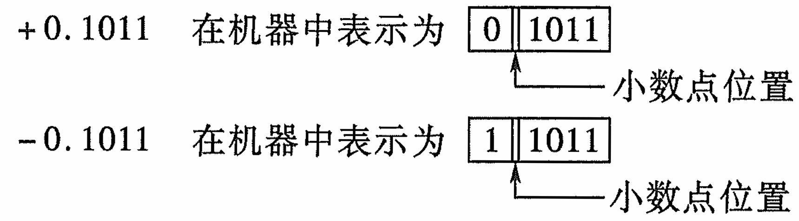

2. ##### 原码表示法

   - ##### 约定

     - 符号位为 0表示正数，符号位为 1 表示负数；
     - 整数的符号位与数值位之间用**逗号**隔 开，如【 1,1100】表示正数【+1100】；【 0,1001】表示负数【-1001】。
     - 小数的符号位与数值位之间用**小数点**隔开，如【0.1011】表示正小数【+0.1011】；【1.1011】表示负小数【-0.1011】。

   - ##### 整数原码的定义

     $$
     \begin{bmatrix}x\end{bmatrix}_\text{原}=\begin{cases}0,x&2^n>x\geqslant0\\2^n-x&0\geqslant x>-2^n&\end{cases}
     $$
     式中，$x$为真值，$n$为整数的位数。

     **例**：

     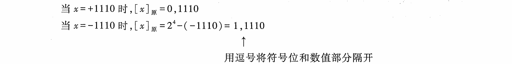

     由以上实例我们可以看出，负数部分【$2^n$】的作用是给原来的数加上**符号位**，而**相减**是为了**将负号变成正号**（因为负号已经用符号位替代了）

   - ##### 小数原码的定义

     $$
     \left[\begin{array}{c}x\\\end{array}\right]_\text{原}=\left\{\begin{array}{cc}x&1>x\geqslant0\\1-x&0\geqslant x>-1\end{array}\right.
     $$

     例：

     

     

     其原理同整数。

3. ##### 补码表示法

   - ##### 相关结论：

     - 一个负数可用它的正补数来代替，而$\text{正补数=模+负数本身}$。 
     - 一个正数和一个负数互为补数时，它们绝对值之和即为模数。 
     - 正数的补数即该正数本身。

   - ##### 整数补码的定义：
     
     $$
     \begin{bmatrix}x\end{bmatrix}_\text{补}=\begin{cases}0,x&2^n>x\geq0\\2^{n+1}+x&0>x\geqslant-2^n&(\text{ mod }2^{n+1})\end{cases}
     $$

     可以看到，其负数补码是由其模（$2^{n+1}$）加上负数本身（$x$）得到的。
     
   - ##### 小数补码的定义：

     $$
     \begin{bmatrix}x\end{bmatrix}_\text{补}=\begin{cases}x&1>x\geqslant0\\2+x&0>x\geqslant-1&(\text{ mod }2)\end{cases}
     $$

   - ##### 负数求补码口诀：**由原码除符号位外，每位求反，末位加 1 求补码**

4. ##### 反码表示法

   - ##### 整数补码的定义

     $$
     \begin{bmatrix}x\end{bmatrix}_\text{反}=\begin{cases}0,x&2^n>x\geq0\\\\(2^{n+1}-1)+x&0\geq x>-2^n&(\text{ mod }(2^{n+1}-1))\end{cases}
     $$

     其中x为真值，n为整数的位数。

   - ##### 小数补码的定义

     $$
     \begin{bmatrix}x\end{bmatrix}_\text{反}=\begin{cases}x&1>x\geq0\\(2-2^{-n})+x&0\geq x>-1&(\mathrm{~mod~}(2-2^{-n}))\end{cases}
     $$

     其中x为真值，n为小数的位数。

   - ##### 相关结论

     - [+0]不等于[-0]反，即反码中的“零”也有两种表示形式。

   - ##### 三种机器数的总结

     - 最高位均为符号位
     - 小数数值和符号位用【**.**】分隔；整数数值和符号位用【**.**】分隔
     - 正数的原反补码都一样，负数原反补符号位用【**1**】表示，数值按照既定规则计算
     - 补码的【0】只有一种表达，反码有2种，因此补码在表示数时可以比反码和原码多一个负数

     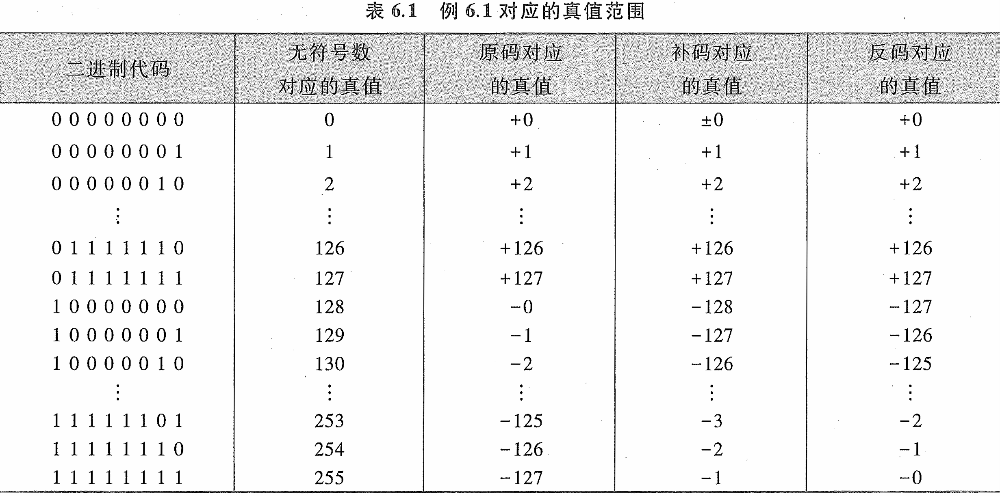

5. ##### 移码表示法

   - ##### 移码的定义

     $$
     \left[\begin{array}{c}x\end{array}\right]_\text{移}=2^n+x(2^n>x\geqslant-2^n)
     $$

     其中x为真值，n为整数的位数

   - ##### 真值与移码和补码的关系

     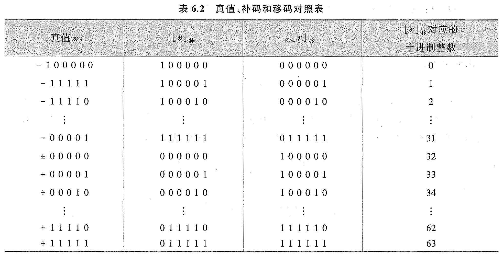
   
   - **关注点**
   
     - $[+0]_\text{移}=[-0]_\text{移}$
     - 最小真值的移码全为0

### 6.2 数的定点表示和浮点表示

#### 6.2.1 定点表示

1. ##### 定点数的表示形式

   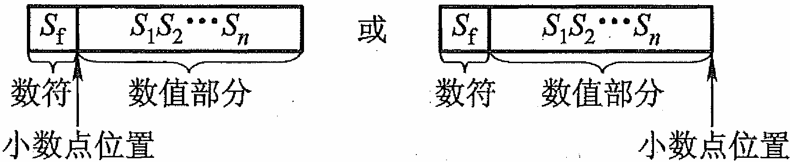

2. ##### 常见概念

   - **纯小数**：小数点位于**符号位和数值位之间**的机器数为纯小数；
   - **纯整数**：小数点位于**数值位之后** 的机器数为纯整数。
   - **定点机**：采用定点数的机器称为定点机。
   - ⚠️定点机中，小数点位置固定，如果机器处理的数非纯整数或小数，必须乘上一个比例因子，否则会产生＂**溢出**”。

#### 6.2.2 浮点表示

1. ##### 浮点数的表示

   $$
   N=S\times r^j
   $$

   其中，S 为尾数，j为阶码，r是基数。

2. ##### 浮点数的表示形式

   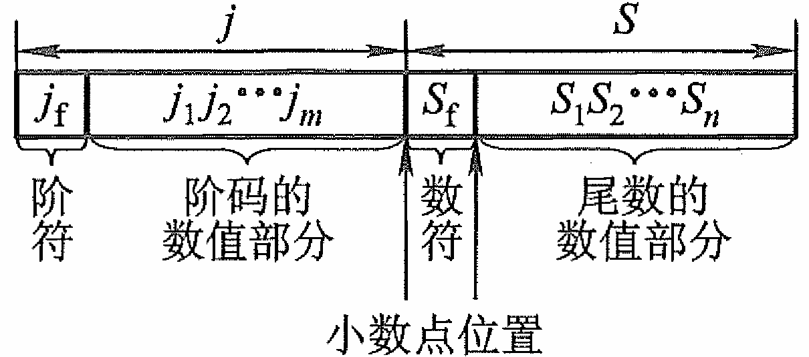

3. ##### 浮点数的表示范围

   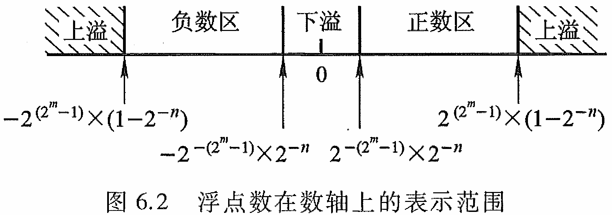

4. 1

#### 6.2.3 定点数和浮点数的比较

- 位数固定时，浮点数的表示范围比定点数的大得多。
- 当浮点数为规格化数时，其相对精度远比定点数高。
- 浮点数运算要分**阶码部分**和**尾数部分**，而且**运算结果都要求规格化**，浮点运算步骤比 定点运算步骤多；运算速度比定点运算的低；运算线路比定点运算的复杂。
- 在溢出的判断方法上，浮点数是对规格化数的阶码进行判断，而定点数是对数值本身进行判断。

#### 6.2.4 举例

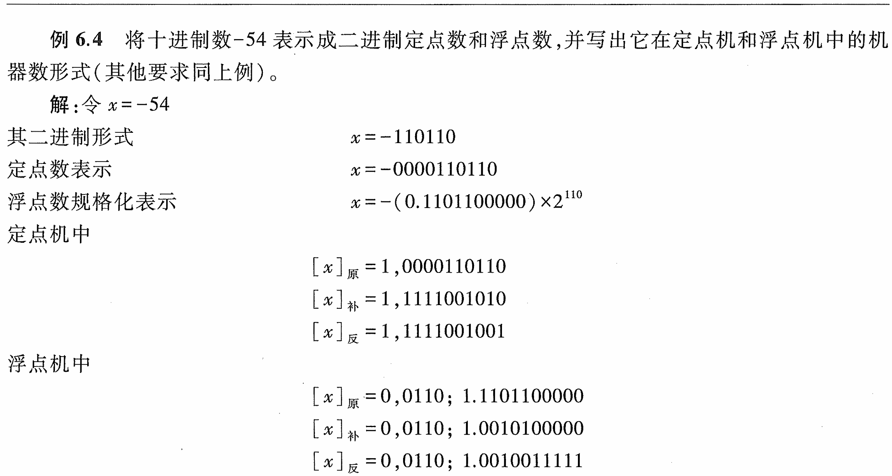


#### 6.2.5 IEEE 745标准

1. ##### 标准

   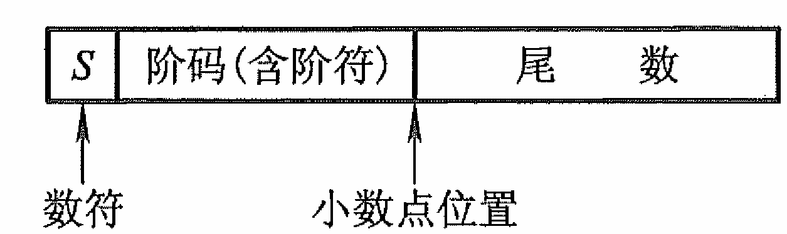

   - 非 “0” 的有效位最高位为 “1”，如下图

     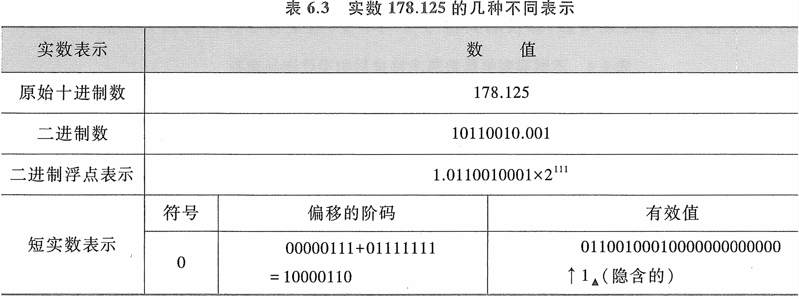

2. ##### 该标准常见的3种浮点数

   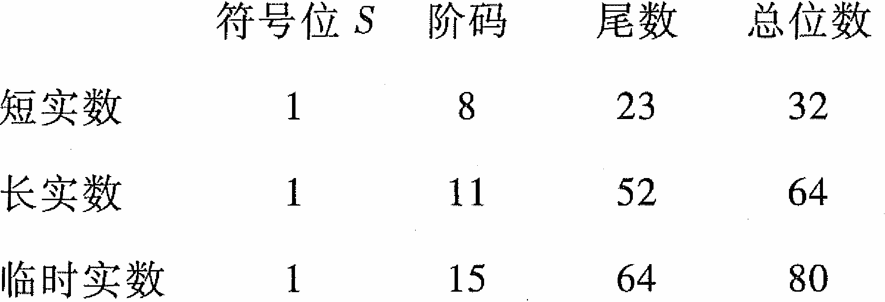

### 6.3 定点运算

#### 6.3.1 移位运算

1. ##### 移位运算的规则

   

   - ⭐不论是正数还是负数，移位后其符号位均不变
   - 这张表怎么记忆，我认为教材对此移位空位添补规则的解释很棒，理解了就很容易记忆，因此不再赘述

2. ##### 逻辑移位和算术移位的规则

   - **逻辑左移规则**：逻辑左移时，高位移丢，低位添0
   - **逻辑右移规则**：逻辑右移时，低位移丢，高位添0
   - **算术左移规则**：算术左移时，高位移丢（不是符号位），低位添0
   - **算术右移规则**：算术右移时，低位移丢，高位添符号位

   例：对有符号数10101101

   - 算术左移：11011010
   - 算术右移：11010110

3. 2

#### 6.3.2 加法和减法运算

1. ##### 补码加减运算的基本公式

   - **加法**
     - 加法运算：$\left[\begin{array}{c}A\end{array}\right]_\text{补}+\left[\begin{array}{c}B\end{array}\right]_\text{补}=\left[\begin{array}{c}A+B\end{array}\right]_\text{补}(\begin{array}{c}\mathrm{mod~}2^{n+1}\end{array})$
     - 减法运算：$\left[\begin{array}{c}A\\\end{array}\right]_\text{补}+\left[\begin{array}{c}B\\\end{array}\right]_\text{补}=\left[\begin{array}{c}A+B\\\end{array}\right]_\text{补}(\begin{array}{c}\mathrm{mod}\end{array}2)$
   - **减法**
     - 整数运算：$[A-B]_\text{补}=[A+(-B)]_\text{补}=[A]_\text{补}+[-B]_\text{补}(\mathrm{mod~}2^{n+1})$
     - 小数运算：$[A-B]_\text{补}=[A+(-B)]_\text{补}=[A]_\text{补}+[-B]_\text{补}\mathrm{~(mod~2)}$

   ⚠️连同符号位一起相加，符号位产生的**进位自然丢掉**（完成模的效果）

   ⚠️不论操作数是正还是负，做补码加减法时，只需要将**符号位和数值部分一起参加运算**，然后**自然丢弃符号位产生的进位**即可得到正确答案。

2. ##### 溢出判断

   1. **一位符号位判溢出**：参加操作的两个数符号运算前相同，运算结果符号变了即为溢出

      ⚠️**加法**：两个操作数符号相同时才可能会产生溢出，否则不会。

      ⚠️**减法**：两个操作数符号不同时才可能会产生溢出，否则不会。
   
   2. **两位符号位判溢出**：
   
      在此之前需要对数求一变形补码
      $$
      [x]_\text{补}=\begin{cases}x&1>x\geq0\\4+x&0>x\geq-1\pmod4\end{cases}
      $$
      其运算规则与正常补码运算相同
   
      - 结果的双符号位 相同未溢出，如运算结果为【00, ×××××】或【11, ×××××】
      - 结果的双符号位 不同则溢出，如运算结果为【10, ××××× 】或【01, ××××× 】
   
      ⚠️**最高符号位代表其真正的符号，当两位符号位不同时，最高位为1表示负溢出，为0表示正溢出**

#### 6.3.3 乘法运算

1. ##### 笔算乘法的改进->【加法+移位】完成乘法运算

   $$
   \begin{aligned}
   \text{A · B}& =A\cdot0.1011  \\
   &=0.1A+0.00A+0.001A+0.0001A \\
   &=0.1A+0.00A+0.001(A+0.1A) \\
   &=0.1A+0.01\left[0A+0.1\left(A+0.1A\right)\right] \\
   &=0.1\{A+0.1[0A+0.1(A+0.1A)]\} \\
   &=2^{-1}\left\{A+2^{-1}\left[0A+2^{-1}\left(A+2^{-1}A\right)\right]\right\} \\
   &=2^{-1}\left\{A+2^{-1}\left[0A+2^{-1}\left(A+2^{-1}\left(A+0\right)\right)\right]\right\}
   \end{aligned}
   $$

2. ##### 原码乘法

   1. ##### 原码一位乘运算规则

      - 乘积的符号位由两原码符号位**异或**运算结果决定，即符号相同成绩肯定为正，否则肯定为负，从初等数学的知识中我们可以知道这一点。

      - 乘积的数值部分由两数绝对值相乘

      - 示例（以小数为例）：
        $$
        \begin{aligned}
        \left[x\right]_\text{原}&=x_0.x_1x_2\cdots x_n\\
        \left[y\right]_\text{原}&=y_0.y_1y_2\cdots y_n
        \end{aligned}
        $$
        那么
        $$
        \left[x\right]_\text{原}\cdot\left[y\right]_\text{原}=x_0+y_0.\left(0.x_1x_2\cdotp\cdotp\cdotp x_n\right)\left(0.y_1y_2\cdotp\cdotp\cdotp y_n\right)
        $$
        式子中，$0.x_1x_2\cdotp\cdotp\cdotp x_n$为$x$的绝对值，记作$x^{*}$；$0.y_1y_2\cdotp\cdotp\cdotp y_n$为y的绝对值，记作$y^{*}$。

   2. ##### 一位乘法计算实例

      已知 x=-0.1110,y=-0.1101 ，求$[x·y]_原$,其计算过程如下（考试也得按照下面的形式写）：

      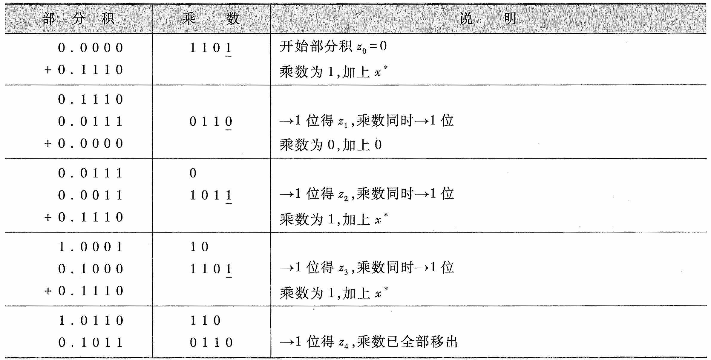

      ⚠️：这里的移位是属于**逻辑移位**，不存在符号位的概念，移位时均补0

   3. ##### 原码两位乘的运算规则

       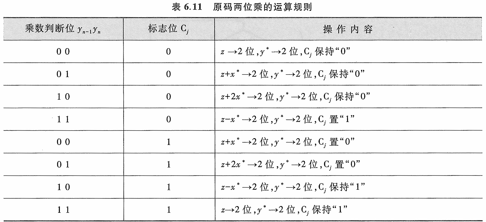

       3 倍被乘数的获得较难，因为直接移位没法直接得到3倍于原数的结果，因此我们将3视 为 4-1(11=100-001) ，可把乘以 3 分两步完成：

       1. 被乘数减去1倍乘数⚠️这个减是是加法实现的，用部分积减去
       2. 被乘数加上4倍乘数
   
       如果你不看接下来的解释，而直接看了`原码两位乘实例`，有可能会对最后$\mathrm{C_j}$的处理感到迷惑，我们将他说清楚：
   
       $\mathrm{C_j}$如果为1表示我们在之前的操作中，欠了一个4倍于被乘数的操作，在当前时刻应该把这个4倍的操作完成。那怎么完成呢？用正数举例，我们体会一下，在$\mathrm{C_j}$=1这一行需要执行的前一步是不是部分积的2位右移操作？然后由于是正数，部分积高2位是不是补了2个0？

       既然高位是0，对数的大小是不是没影响？可是不行啊，我要完成4倍的操作，怎么办呢，奇妙地，我们加上被乘数，就完成了4倍；这是怎么做到的？我们看看下面这个操作：

       ```python
       我们现在不考虑符号，假设假设被乘数是 0010 乘数 11
       ⚠️下面的乘数高位要补00
       ①部分积 0000 乘数 0011 Cj=0
       ②减1倍（等于加负补码）得 0000+1110=1110
       ③右移2位得新部分积 1111 10 乘数 00 前一节最后两位为11所以Cj=1
       ④
       1111 10
       +
       0010
       =
       0001 10
       算出来确实是6，没毛病吧
       ```
   
       从上面的例子中，我们应该得到一些启示，先右移2位，然后加上被乘数，其实是这样的
   
       ```
       0010被乘数
       1110部分积
       1111 10移位后
       0010 00位数对齐，原被乘数放大4倍，从2变成了8
       ```
   
       这次我相信应该明白了
   
       - ⚠️每一次判断乘几不仅取决于乘数的最后两位，还要加上$\mathrm{C_{j}}$，比如$y_{n-1}y_n=10$，$\mathrm{C_j}$=1那么实际要乘的是3（2+1）。

   4. ##### 原码两位乘实例

       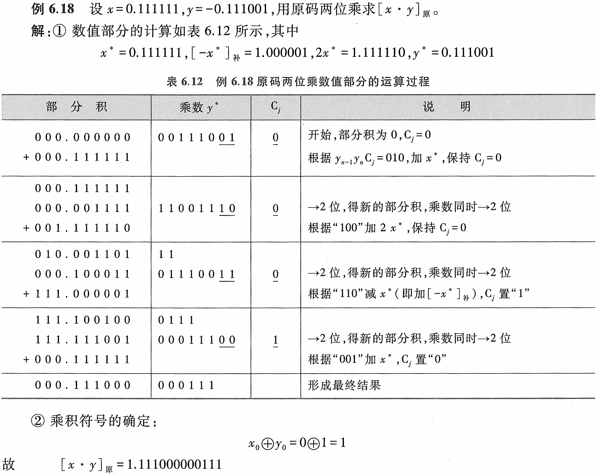

   5. ##### 补码一位乘实例（Booth算法）

       - **操作数预处理**：①**两个数操作数的补码**；②**被乘数的负补码**（$y_{n+1}-y_n$=-1时作为部分积的加法对象）；

       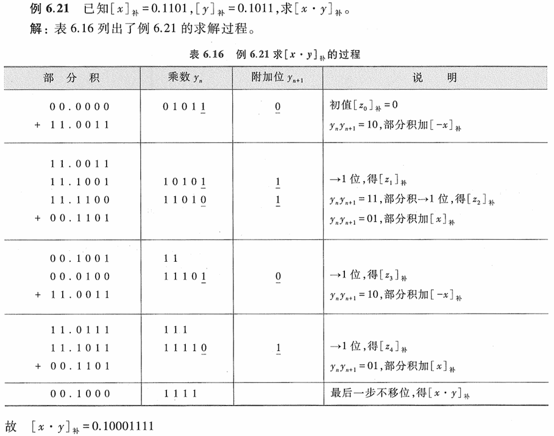

       ⚠️①**部分积使用双符号位**；②**乘数的符号位参与运算**；③**使用算术移位**；④**最后一步不移位**；

   6. ##### 补码两位乘的运算原则

       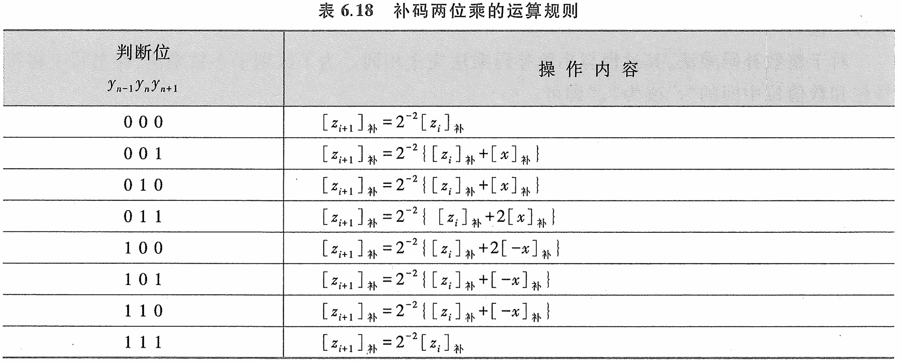

       后面的加或减多少是由【$\left(y_{n+1}-y_n\right)\text 和\left(y_n-y_{n-1}\right)$】的操作叠加决定的

   7. ##### 补码两位乘实例

       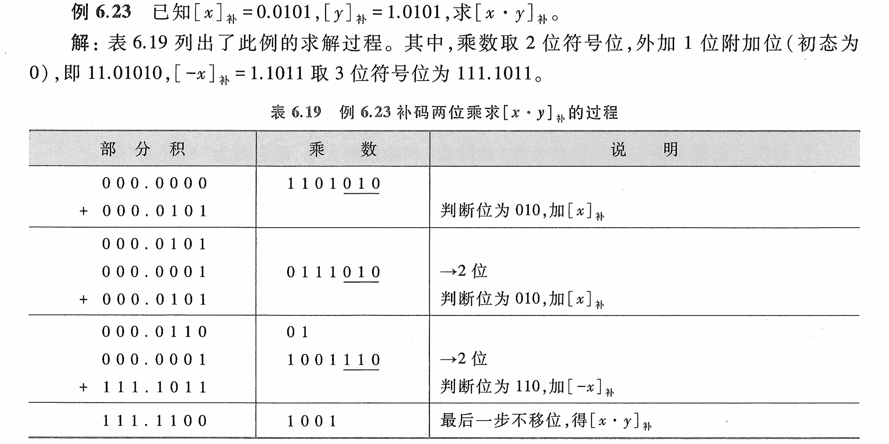

       ⚠️①部分积和被乘数取**3**位符号位，乘数取**2**位符号位，符号位参与运算；②初态乘数要在低位后加一个附加位**0**；③当乘数总位数为基数时，可在最高位前补0

#### 6.3.4 除法运算

1. ##### 对于小数除法，要求满足以下条件：

   $$
   0<|\text{被除数}|\leq|\text{除数}|
   $$

2. ##### 对于整数除法，要求满足以下条件：

   $$
   0<|\text{除数}|\leqslant|\text{被除数}|
   $$

3. ##### 原码恢复余数法除法实例

   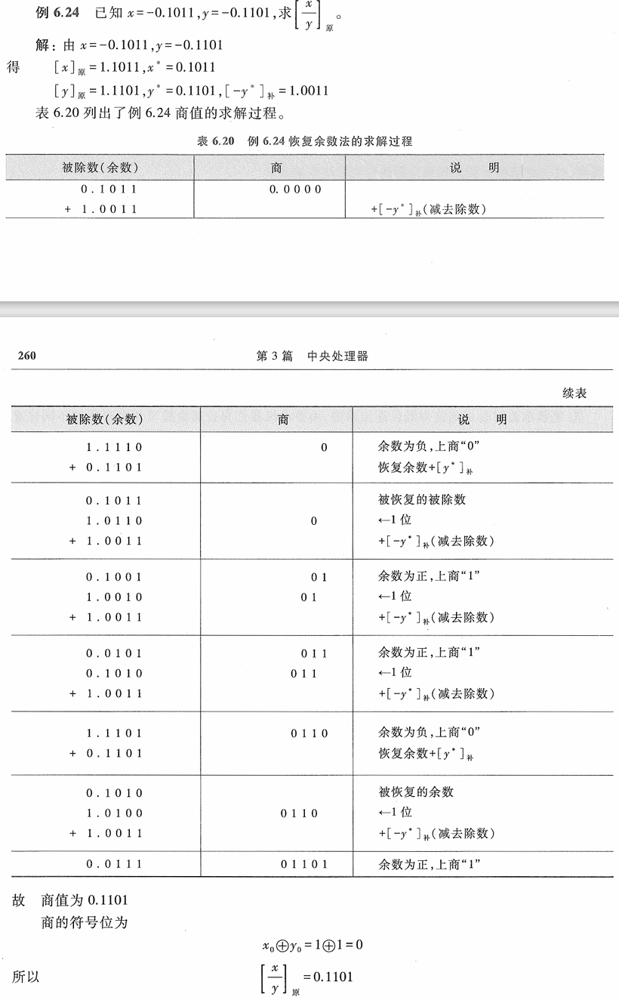

4. ##### 原码加减交替法除法实例

   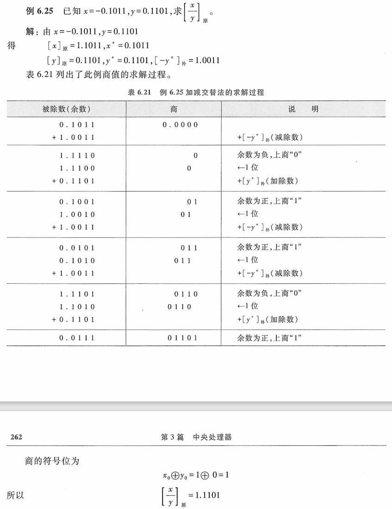

   ⚠️**小数除法**：①移位为逻辑移位；②第一次上商必为0，否则出错，需检查；③n位小数的除法共需上商n+1次

5. ##### 补码加减交替法除法实例1

   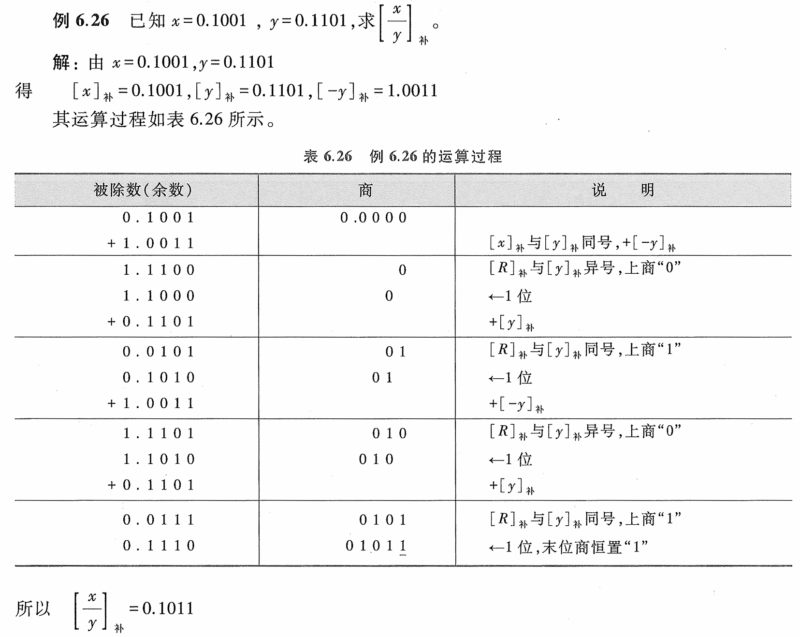

   ⚠️①余数与除数补码同号上商1，异号上商0；②第一次算余数时，两个操作数同号做减法，异号做加法。

6. ##### 补码加减交替法除法实例2

   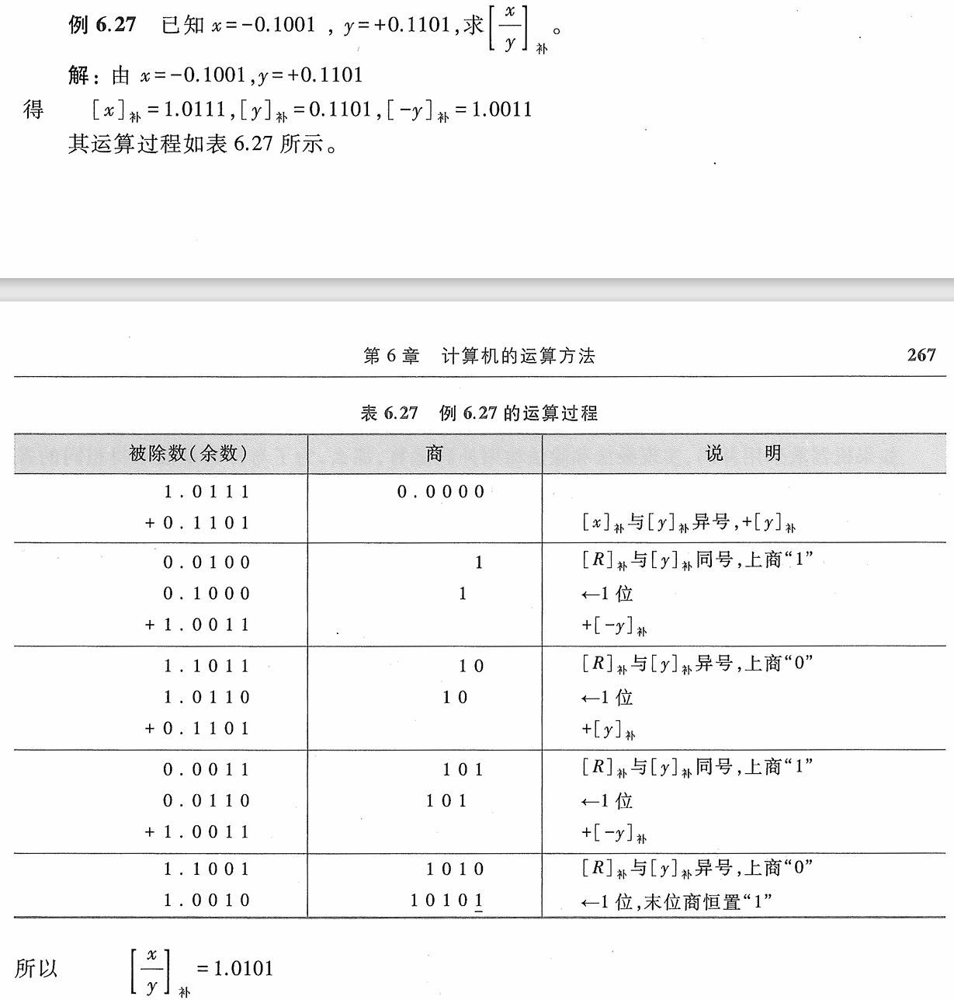


### 6.4 浮点四则运算

#### 6.4.1 浮点加减运算

##### 6.4.1.1 浮点加减法的步骤

1. **对阶**：使两数的小数点位置对齐。
2. **尾数求和**：将对阶后的两尾数按定点加减运算规则求和（差）。 
3. **规格化**：为增加有效数字的位数，提高运算精度，必须将求和（差）后的尾数规格化。 
4. **舍入**：为提高精度，要考虑尾数右移时丢失的数值位。 
5. **溢出判断**：即判断结果是否溢出。

##### 6.4.1.2 对阶

- **对阶的步骤**

  1. 求阶差
  2. 按**小阶向大阶看齐**原则，使阶小的尾数向右移位，每右移一位，阶码加 1，直到两数的阶码相等为止；这里我们注意到**右移的次数会正好等于阶差**。

- **对阶实例**

  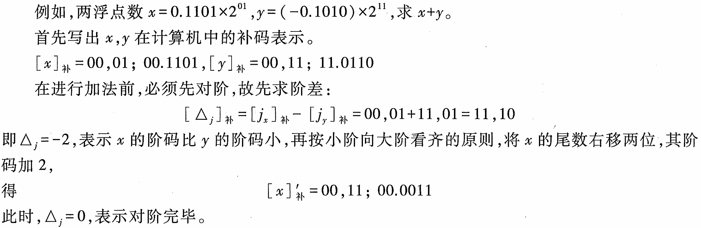

##### 6.4.1.3 尾数求和

- **尾数求和要点**：按照**定点加减运算规则**进行运算

- **位数求和实例**

  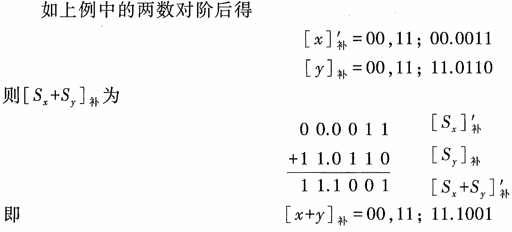

##### 6.4.1.4 规格化

- **规格化的形式**：当尾数的**最高数值位**与**符号位**不同时，即为规格化形式。如果采用**双符号位**的补码，则

  - 当 S>0 时，其补码规格化形式为
    $$
    \left[\begin{array}{c}S\end{array}\right]_\text{补}=00.1\times\times\cdots\times
    $$

  - 当 S<0 时，其补码规格化形式为
    $$
    \left[\begin{array}{c}S\end{array}\right]_\text{补}=11.0\times\times\cdots\times 
    $$

  其中，S为尾数。

- **特殊的数特殊处理**

  - 规定$-\frac{1}{2}$不是规格化的数（对于补码而言）
  - －1 视为规格化的数。

- **左规**

  - **条件与规则**：当尾数出现$00.0\times\times\cdots\times $或$11.1\times\times\cdots\times $时，需要连续执行**尾数左移一位，阶码减 1**，直到符合规格化数为止

  - **左规实例**：

    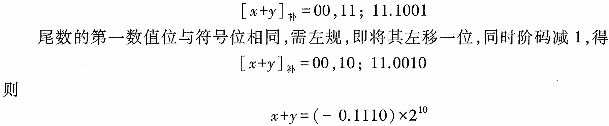

- **右规**

  - **条件与原则**：当尾数出现$01.\times\times\cdots\times $或$10.\times\times\cdots\times $时，需要连续执行**尾数右移一位，阶码加 1**，直到符合规格化数为止

  - **右规实例**：

    对于【$\left[\begin{array}{c}x+y\end{array}\right]_\text{补}=00,10;01.0010$】运算结果**两符号位不等**，表示**尾数之和绝对值大于1**，需右规，即将尾数之和向右移一位，阶 码加 1，故得
    $$
    \left[\begin{array}{c}x+y\end{array}\right]_\text{补}=00,11;00.1001
    $$
    

##### 6.4.1.5 舍入

- **“0 舍入”法**

  尾数右移时，被移去的最低数值位为0，则舍去；被移去的最高低数值位为 1，则在尾数的末位加 1。这样做可能使尾数又溢出， 此时需再做一次右规。

- **“恒置 1”法**

  尾数右移时，不论丢掉的最高数值位是“1”或“0" ，都使**右移后的尾数末位恒置”1”**

##### 6.4.1.6 溢出判断

- 阶码[【$\begin{bmatrix}j\end{bmatrix}_\text{补}=01,\times\times\cdots\times $】为上溢
- 阶码[【$\begin{bmatrix}j\end{bmatrix}_\text{补}=10,\times\times\cdots\times $】为下溢，按机器零处理

##### 6.1.4.7 浮点加减运算完整实例

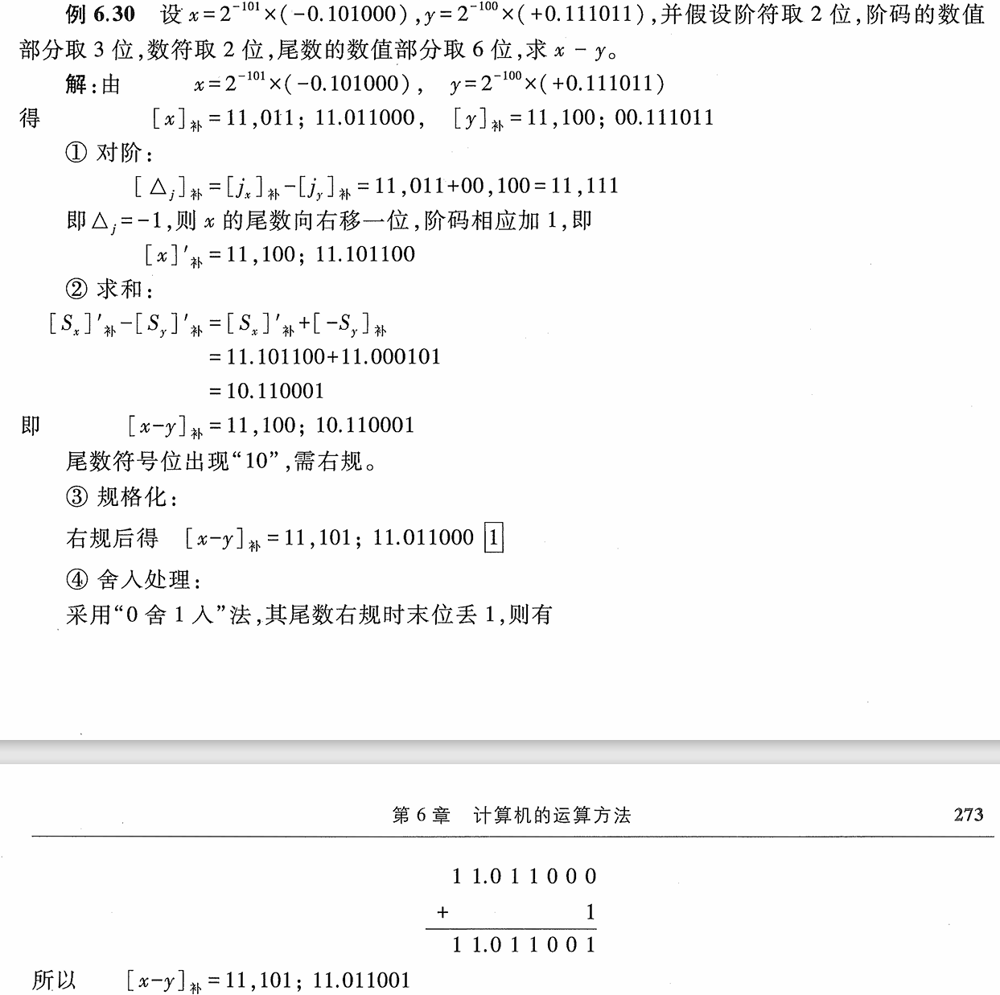

#### 6.4.2 浮点乘除法运算

##### 6.4.2.1 阶码运算

- 对于**乘法**，用第一个数的**移码**加上第二个数的**补码**即可得到**阶码和的移码形式**
  $$
  \begin{aligned}
  \left[j_{x}\right]_{\text{移}}+\left[j_{y}\right]_{\text{补}}=
  \left[\begin{matrix}{j_{x}+j_{y}}\end{matrix}\right]_{\text{移}}(\mathrm{~mod~}2^{n+1})
  \end{aligned}
  $$

- 对于**除法**，用第一个数的**移码**加上第二个数的**负数的补码**即可得到**阶码和的移码形式**
  $$
  \left[\begin{array}{c}j_x\end{array}\right]_\text{移}+\left[\begin{array}{c}-j_y\end{array}\right]_\text{补}=\left[\begin{array}{c}j_x-j_y\end{array}\right]_\text{移}
  $$

- **溢出判断**：阶码采用**2位**符号位，则可根据以下规则判断溢出

  - 运算结果移码的**最高符号位为1**：
    - 此时若低位符号位为0，表示上溢；
    - 低位符号位为 1，表示下溢。
  - 运算结果移码的**最高符号位为0**，表明没有溢出：
    - 即此时若低位符号位为 1，表明结果为正；
    - 低位符号位为 0 ，表示结果为负。

- **溢出判断实例**

  

##### 6.4.2.2 浮点乘法尾数运算

- **基本运算步骤**

  1. 检测两个尾数中是否有一个为0，若有一个为 0，乘积必为 0，不再做其他操作；如果两尾数均不为0，则可进行乘法运算。

  2. 两个浮点数的尾数相乘可以采用定点小数的任何一种乘法运算来完成。

     相乘结果可能要进行左规，左规时调整阶码后如果发生**阶下溢，则作机器零处理**；如果发生**阶上溢，则作溢出处理**。

     此外，尾数相乘会得到一个双倍字长的结果，限定只取 1 倍字长，则乘积的若干低位将会丢失。

- **如何处理丢失的各位值，通常有两种方法。**

  1. 无条件地丢掉正常尾数最低位之后的全部数值，这种方法称为截断处理，处理简单，但 影响精度。

  2. 按两种舍入原则进行舍入处理。

     - 对于原码，采用 0舍 1 入法。
     - 对负数的补码可采用如下规则进行舍入处理。
       - 当丢失的各位均为0时，不必舍入。
       - 当丢失的各位数中的**最高位为0时，且以下各位不全为0**，或丢失的各位数中的**最高位为 1，且以下各位均为 0** 时，则**舍去**被丢失的各位。
       - 当丢失的各位数中的**最高位为 1，且以下各位又不全为0** 时，则在保留尾数的**最末位加 1修正**。

  3. 原码舍入实例

     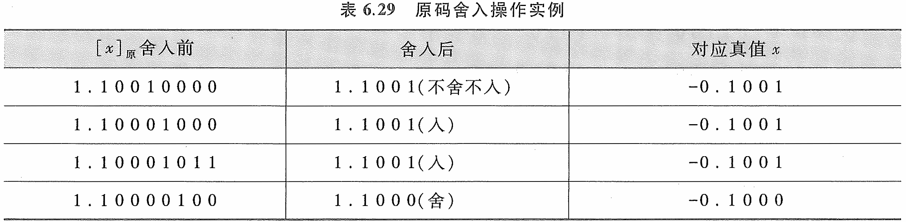

  4. 补码舍入实例

     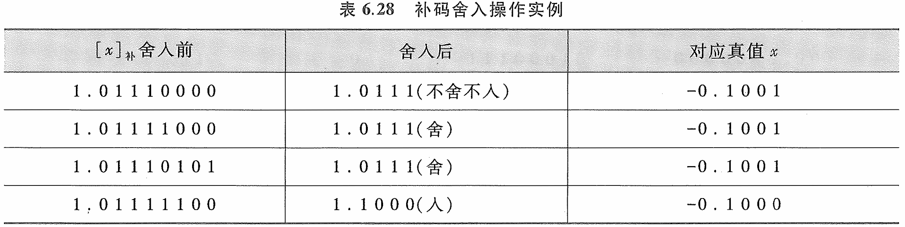

##### 6.4.2.3 浮点乘法运算全过程实例

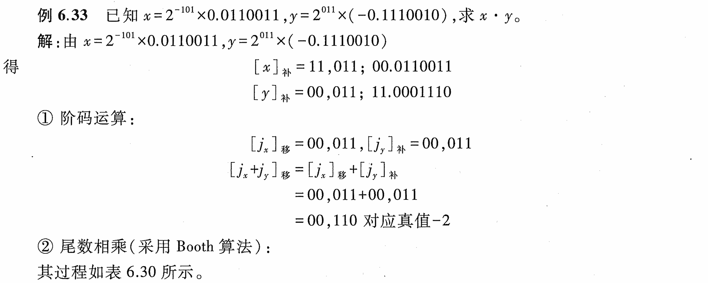

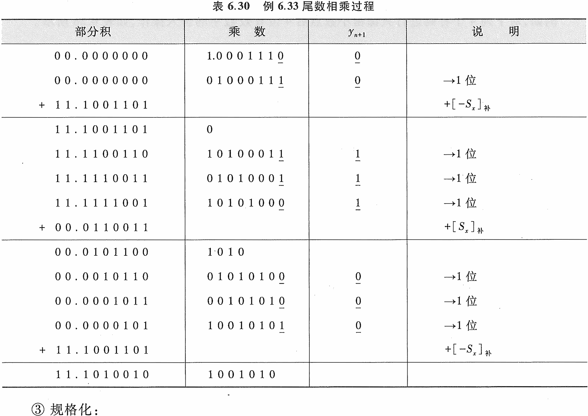

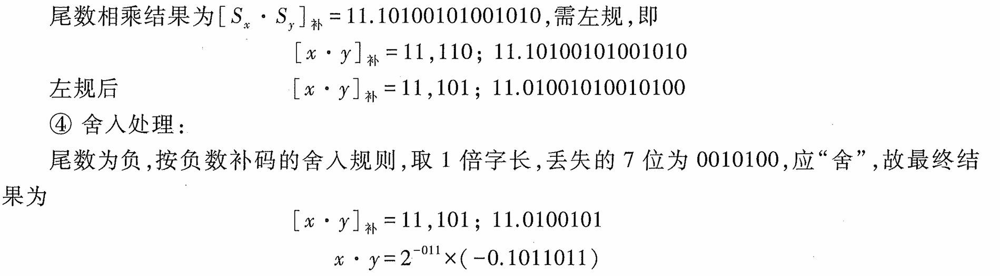


##### 6.4.2.4 浮点除法尾数运算

- **基本运算步骤**

  1. 检测被除数是否为0，若为0，则商为0；再检测除数是否为0，若为 0，则商为无穷大，另作 处理。若两数均不为0，则可进行除法运算。
  2. 两浮点数尾数相除同样可采取定点小数的任何一种除法运算来完成。对已规格化的尾 数，为了防止除法结果溢出，可**先比较被除数和除数的绝对值**，如果**被除数的绝对值大于除数的绝对值，则先将被除数右移一位，其阶码加 1**，再作尾数相除。此时**所得结果必然是规格化的定点小数**。

- **浮点除法运算全过程实例**

  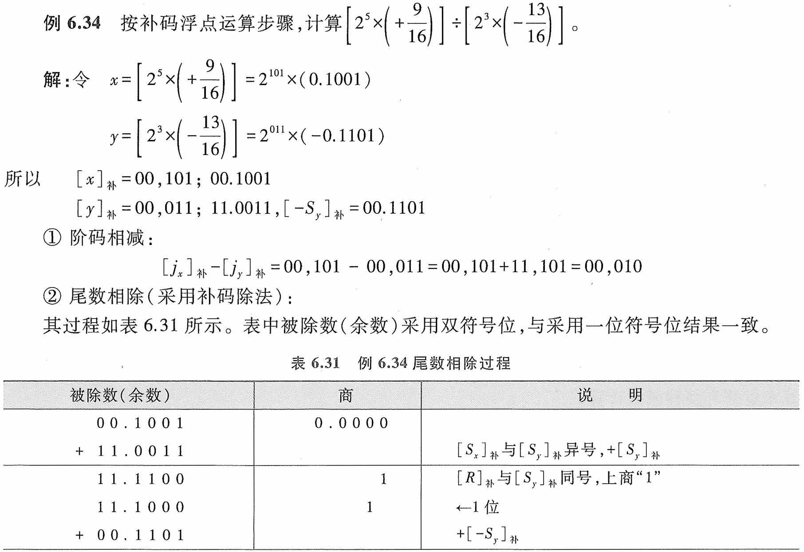

  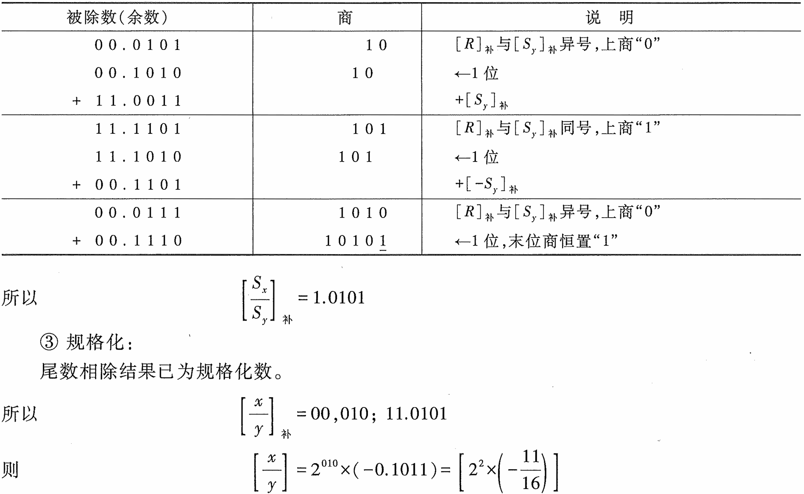

#### 6.4.3 快速进位链

##### 6.4.3.1 单重分组跳跃进位

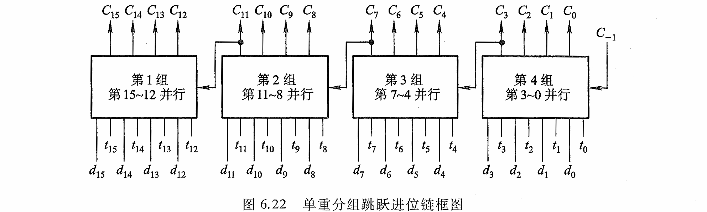

##### 6.4.3.2 双重分组跳跃进位

- **32 位并行加法器双重分组跳跃进位链框图**

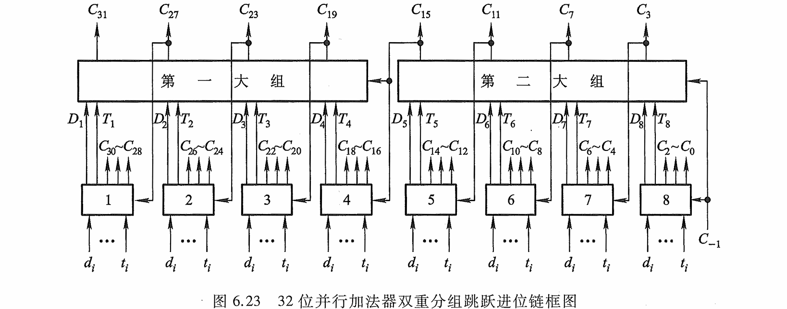

- **双重分组跳跃进位链的大组进位线路**

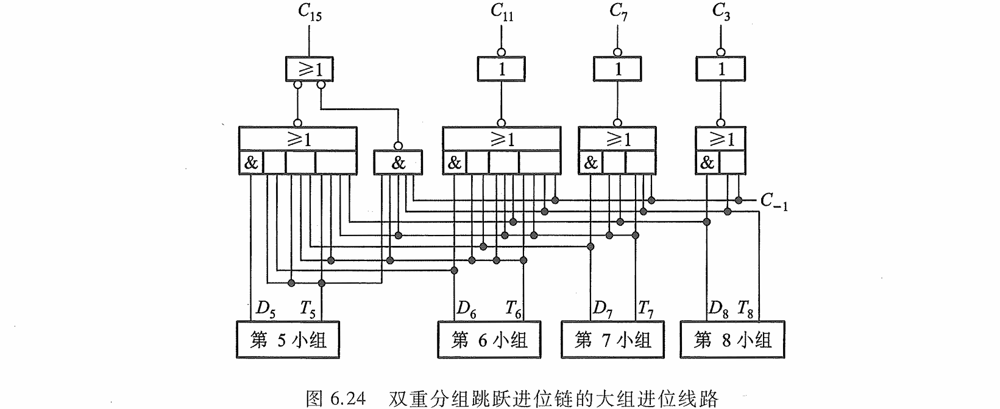

- **双重分组跳跃进位链的小 组进位线路**

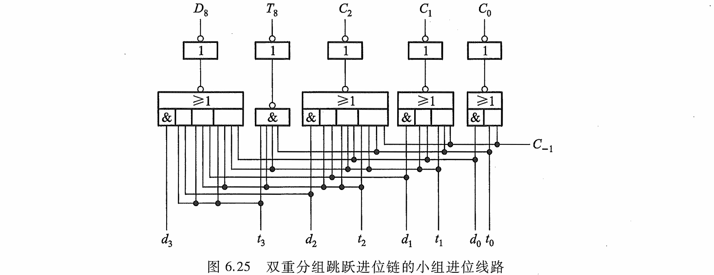

-  **16 位并行加法器的双重分组跳跃进位链框图**

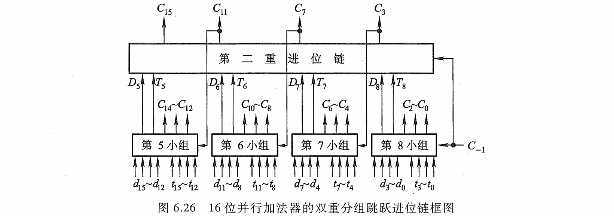