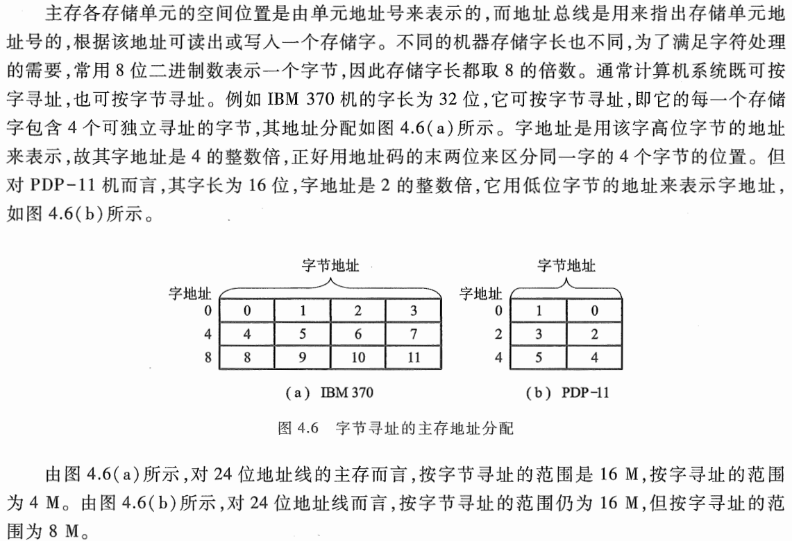

<h1>主存中存储单元地址的分配</h1>

1. 为什么写这篇文章?

   因为我看书中这部分时，看到下面的计算一下子没反应过来：

   

2. 知识回顾（第1章）

   - 计算机系统中，字节是最小的可寻址的存储单位，通常由8个比特（bit）组成

3. 理清文中参数

   - IBM：①32位字长
   - PDP-11：①16位字长
   - 地址线宽度：24位

4. 文中的计算

   - 对于图4.6（a）,即IBM 370机器

     - 因为一根地址线可以表示0，1两种状态，我们易得24位地址线可以访问$2^{24}$个存储单元，而每一个存储单元默认是用1字节表示，因此24位地址总线按字节算可寻址范围为【$2^{24}Byte=2^4\cdot2^{20}Byte=2^4Byte\cdot1\text{M}=16\text{M}$】

     - 其二说按字寻址，其实按字寻址就是按字长寻址；该机器字长为32位，那么按字寻址的可寻址范围为【$\frac{16\text{M}\times8}{32}=4\text{M}$】

   - 对于图4.6（b）,即PDP-11机器

     - 其一同IBM 370机器，因为按字节寻址不涉及到字长
     - 其二，该机器字长为16位，因此那么按字寻址的可寻址范围为【$\frac{16\text{M}\times8}{16}=8\text{M}$】