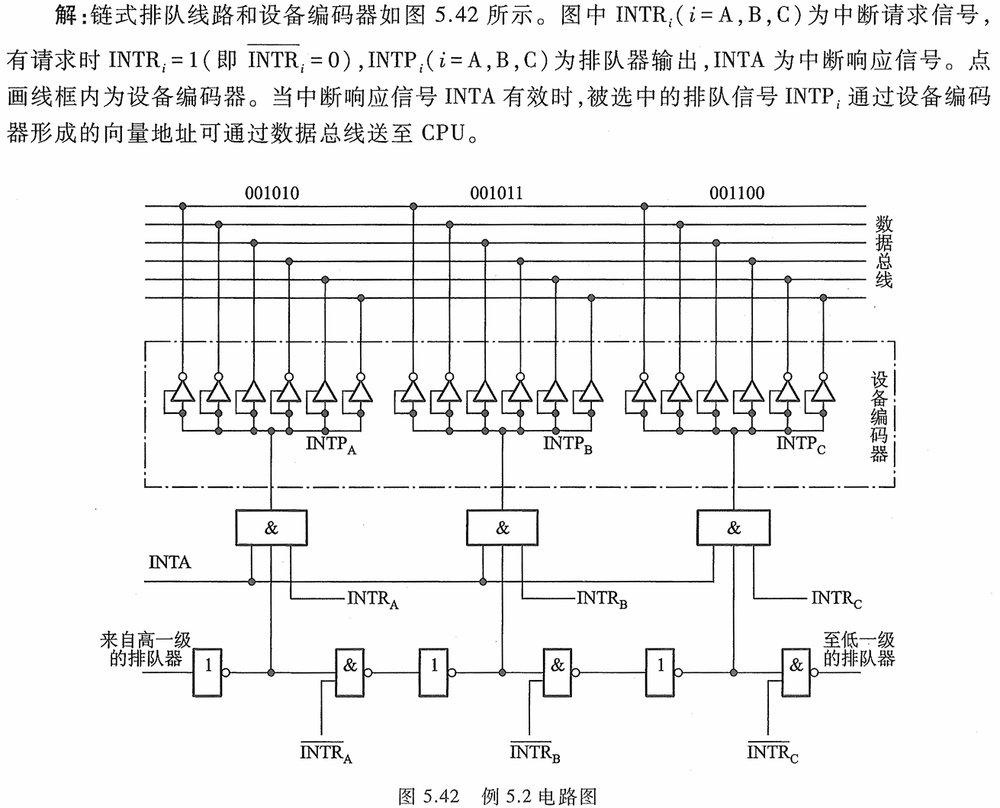

<h1>第5章 输入输出系统</h1>

### 5.1 概述

#### 5.1.1 输入输出系统的发展状况

1. ##### 早期

   

   > 在早期的I/O系统中，CPU和I/O设备是**串行**工作的。这意味着程序执行过程中，CPU会按照顺序逐个查询I/O设备，而不是同时处理多个设备的输入输出请求。这样做带来的处理机的资源浪费，效率降低。

2. ##### 接口模块和DMA阶段

   

   > 该阶段使用总线连接使CPU和I/O设备能够**并行**工作。
   >
   > 这种并行工作的方式通常利用**中断**和**DMA（直接内存访问）**方式：
   >
   > - 中断允许I/O设备在完成任务后通知CPU
   > - DMA则允许设备直接与内存进行数据传输，减少了CPU的干预，提高了数据传输效率。

3. ##### 具有通道结构的阶段

   

   > 通道结构阶段的关键是引入通道，它承担管理I/O设备和主存交换信息的任务，这样CPU在这个过程中的参与减少了，因此CPU的资源利用率得到了提高。

4. 具有I/O处理机的阶段

   > 引入I/O处理机后它可以在一定程度上独立于主机工作。这意味着它能够完成I/O通道的控制任务，同时执行一系列的数据处理操作，而无需频繁地依赖主机。
   >
   > 这样的设计提高了整个输入输出系统的并行性，有效地减轻了主机的负担，提高了系统的效率和性能。

#### 5.1.2 输入输出系统的组成

1. ##### I/O软件

   - **I/O指令**：属于**CPU指令**的一部分，由**操作码**、**命令码**、**设备码**组成。
   - **通道指令**：通道指令又称为**通道控制字(Channel Control Word，CCW)**属于**通道自身**指令，它指出了要传送的数据组的首地址、传送字数、操作命令等

2. ##### I/O硬件

   一个通道可以和**一个以上**的设备控制器相连，一个设备控制器有可以控制**若干**台**同一类型**的设备

#### 5.1.3 I/O设备与主机的联系方式

1. ##### I/0 设备编址方式

   - **统一编址**：统一编址就是将I/0地址看作存储器地址的一部分，占用了存储空间，减少了主存容量，但无须专用 的 I/0 指令。
   - **不统一编址**：不统一编址就是指 I/0 地址和存储器地址是分开的，不占用主存空间，故不影响主存容量，但需设I/0 专用指令。

2. **设备寻址**：通过**设备码**直接寻址

3. **传送方式**：**并行**传送与**串行**传送

4.  **联络方式**

   - **立即响应方式**
   - **异步工作采用应答信号联络**
   - **同步工作采用同步时标联络**：需要设备和CPU的工作速度完全同步，这几乎不可实现

5. ##### I/0 设备与主机的连接方式：

   - ##### 辐射式

     

   - ##### 总线式
   
     

#### 5.1.4 I/O设备与主机信息传送的控制方式

> I/0 设备与主机交换信息时，共有 5 种控制方式：**程序查询方式**、**程序中断方式**、**直接存储器 存取方式(DMA)** 、**I/0 通道方式**、**I/0 处理机方式**

1. ##### 程序查询方式

   

   该查询方式由于需要**不断查询**，而在这个时间内CPU又不能去干其他的事情，因此很浪费资源；其次，当IO设备准备好传输数据时，CPU要一个字一个字地从设备读出，此时CPU和设备处于**串行**工作状态，工作效率低下。

2. ##### 程序中断方式

   

   程序中断方式使得**CPU可以在启动设备后去做其他的事情**，当设备数据传输准备就绪时，设备向CPU发送**中断请求**，此时CPU通过**执行中断服务程序**的方式从IO设备读取输出。

   这样的方式显然大大**提高了系统资源的利用率**

3. ##### 直接存储器存取方式(DMA)

   > 在DMA 方式中，主存与 I/0 设备之间有一条数据通路，主存与 I/0 设备交换信息时，无须调用中断服务程序。

   - **若出现 DMA 和 CPU 同时访问主存，CPU 总是将总线占有权让给 DMA**, 通常把 DMA 的这种占有称为**窃取**或挪用。
   - 窃取的时间一般为**一个**存取周期，故又把 DMA 占用的存取周期窃取周期或挪用周期。

### 5.3 I/O接口

#### 5.3.1 I/O接口的功能

- 实现【**设备的选择**】
- 实现【**数据缓冲**】，达到速度匹配
- 实现数据【**串—并**】格式转换
- 实现【**电平转换**】
- 传送【**控制命令**】
- 反映设备的状态（"**错误**"、“**忙**”、“**就绪**”、“**中断请求**”）

#### 5.3.2 总线连接方式的I/O接口电路

我们要注意到上图的一些细节：

- 【数据线】是**双向**的，因为数据当然是双向传输的
- 【设备选择线】是**单向**的，因为在这里其扮演了地址线的角色
- 【命令线和状态线】是**单向**的，因为他们俩组合在一块扮演了控制线的作用

#### 5.3.3 接口的功能和组成

1. **选址功能**：如图5.29所示，设备选择线与所有I/O接口相联，具体选择哪台由设备选择线上的【**设备码**】来确定。同时我们要注意到一个细节，【**每个I/O接口只能挂载一台I/O设备**】。

2. **传送命令功能**：当 CPU 向 I/0 设备发出命令时，要求 I/0 设备能做出响应，故通常在I/0 接口中设有存放命令的【**命令寄存器**】以【**及命令译码器**】

   

   

3. **传送数据的功能**：接口中通常设有【**数据缓冲寄存器(Data Buffer Register, DBR)** 】，它用来暂 存I/O设备与主机准备交换的信息，与 I/O 总线中的数据线是相连的。

4. ⭐⭐⭐**反映 1/0 设备工作状态的功能**：用【**完成触发器D**】 和【**工作触发器B**】来标志设备所处的状态。

   - 当 【**D=0,B=0**】 时，表示I/O设备处千**暂停**状态
   - 当 【**D=1,B=0**】 时，表示I/O设备**已经准备就绪**
   - 当 【**D=0,B=1**】 时，表示I/O设备**正处于准备**状态

   接口电路中一般还设有【**中断请求触发器 INTR**】 ，当其为`1` 时，表示该I/O设备向 CPU 发出中断请求。

   接口内还有【**屏蔽触发器 MASK**】，它 与中断请求触发器配合使用，完成设备的屏蔽功能

#### 5.3.4 接口类型

1. 按【数据传送方式】分类，有**并行接口**和**串行接口**两类
2. 按【功能选择的灵活性】分类，有**可编程接口**和**不可编程接口**两种
   - **可编程接口**：用户可以通过软件或者特定的配置方式，定义接口的行为、功能和工作模式。这种接口通常具有更高的灵活性和通用性，因为可以根据需求进行定制化的设置。
   - **不可编程接口**：这类接口的功能通常是固化在硬件中的，用户无法修改。虽然这种接口可能在特定场景下有着很好的性能和稳定性，但是缺乏了灵活性，无法满足一些特殊需求。
3. 按【通用性】分类有**通用接口**和**专用接口**
4. 按【数据传送的控制方式】分类，有**程序型接口**和 **DMA** 型接口

#### 5.3.5 I/O接口的基本组成

观察上图，为什么I/O接口与I/O设备之间没有设备选择线？因为【**一个I/O接口只能挂载一台I/O设备**】，所以不必多此一举。

### 5.4 程序查询方式

#### 5.4.1 程序查询流程图

#### 5.4.2 程序查询方式的接口电路及查询步骤

1. 当CPU 通过I/O指令启动输入设备时，指令的设备码字段通过【**地址线**】送至【设备选择电路】。

2. 若该接口的设备码与地址线上的代码吻合，其输出 SEL有效。

3. I/O指令的【**启动命令**】经过【**与非门**】将完成触发器D置`0`，工作触发器B置`1`。

   > 完成触发器D和工作触发器D具有相同的特性，【**触发器左边接口为置位位（有效则使触发器为1），右侧接口为复位位（有效则使触发器为0）**】，因此有了上面的结论

4. 由【**B触发器**】启动设备工作。

5. 输入设备将数据送至【**数据缓冲寄存器**】。

6. 由设备发【**设备工作结束**】信号，将D置`1`,B 置`0` ，表示外设准备就绪。

7. D 触发器以【**准备就绪**】状态通知 CPU，表示【**数据缓冲满**】。

8. CPU 执行输入指令，将数据缓冲寄存器中的数据送至 CPU 的通用寄存器，再存入主存相关单元。

#### 5.4.3 程序查询的效率计算例题

### 5.5 程序中断方式

#### 5.5.3 程序中断方式的接口电路

1. ##### 中断请求触发器和中断屏蔽触发器

   - 每台外部设备都必须配置一个**中断请求触发器INTR**，当其为“1”时，表示该设备向 CPU 提 出中断请求。
   - 凡是能向 CPU 提出中断请求的各种因素统称为**中断源**。
   - 多个中断源向 CPU提出中断请求时，CPU必须坚持一个原则，即 在**任何瞬间只能接受一个中断源的请求**。
   - I/0 接口中需设置一个**屏蔽触发器MASK**，当其为“1”时，表示被屏蔽，即封锁其中断源的请求。

   

   上图中，当Mask=1时，输出=0，左侧与非门输出1，再经过一个非门，输出0，此时D=0，中断被封锁；

   反之，当mask=0时，输出1，若完成触发器D=1，则与非门输出0，经过非门输出1，即D=1，此时如果CPU中断查询信号（心跳信号）到来，即可响应中断。

2. ##### 排队器

   

   - 不论是哪个中断源（一个或多个）提出中断请求，排队器输出端$\mathrm{INTP}_i$只有一个高电平,。
   - 当各中断源均无中断请求时，各个$\overline{\text{INTR}_i}$为高电平，其$\text{INTP }_1^{\prime}\text{ 、INTP }_2^{\prime}\text{ 、INTP }_3^{\prime}\cdots $均为高电平。

3. ##### 中断向量地址形成部件（设备编码器）

   中断向量地址形成部件的输入是来自**排队器的输出**$\text{INTP }_1^{\prime}\text{ 、INTP }_2^{\prime}\text{ 、INTP }_3^{\prime}\cdots $，长度与可以处理**中断源的个数**有关。可见，该部件实质上是一个编码器，在 I/0 接口中的编码器又称为**设备编码器**。

   **硬件向量法**：所谓硬件向量法，就是通过向量地址来寻找设备的**中断服务程序入口地址**，而且向量地址是由硬件电路产生的。

   

4. ##### 程序中断方式接口电路的基本组成

   

5. ##### 硬件向量的形成电路图举例

   

   

#### 5.5.4 I/O中断处理过程

> 下面的处理过程严格依据上面图5.41讲解

1. 由 CPU 发启动I/O设备命令，将接口中的【D 置`0`，B 置`1`】。
2. 接口启动输入设备开始工作。
3. 输入设备将数据送入【**数据缓冲寄存器DBR**】。
4. 输入设备向接口发出【**设备工作结束**】信号，将【D 置`1`，B 置`0`】，标志设备准备就绪。
5. 当设备准备就绪(D= 1) ，且本设备未被屏蔽(MASK=0) 时，在指令执行阶段的结束时刻，由 CPU 发出中断查询信号。
6. 设备中断请求触发器【**INTR被置`1`** 】，标志设备向 CPU 提出中断请求。与此同时，INTR 送至排队器，进行中断判优。
7. 若 CPU 允许中断(**EINT= 1**) ，设备又被排队选中，即进入中断响应阶段，由**中断响应信号 INTA** 将排队器输出送至编码器形成**向量地址**。
8. 向量地址送至**程序计数器PC**，作为下一条指令的地址。
9. 向量地址中存放的是一条无条件转移指令，这条指令执行结束后， 无条件转至该设备的**服务程序入口地址**，开始执行**中断服务程序**，进入中断服务阶段，通过输 入指令将【**数据缓冲寄存器DBR**】的输入数据送至CPU 的**通用寄存器**，再存入主存相关单元。
10. 中断服务程序的最后一条指令是**中断返回**指令，当其执行结束时，即中断返回至原程序的断点处。至此，一个完整的程序中断处理过程即告结束。

#### 5.5.5 中断服务程序的流程

- **多重中断**：计算机在处理中断的过程中，有可能出现新的中断请求，此时如果 CPU 暂停现行的中断服务程序，转去处理新的中断请求，这种现象称为中断嵌套，或多重中断。

- **单重中断**：若 CPU在执行中断服 务程序时，对新的中断请求不予理睬，这种中断称为单重中断。

- **中断服务流程**

  1. **保护现场**

     保护现场其一是保存**程序的断点**；其二是保存**通用寄存器**和**状态寄存器**的内容。前者由**中断隐指令**完成，后者由**中断服务程序**完成。

  2. **中断服务**（设备服务）

  3. **恢复现场**

  4. **中断返回**

### 5.6 DMA方式

#### 5.6.1 DMA方式的特点

1. ##### DMA 和程序中断两种方式的数据通路

   

   - 由图中可见，由于**主存**和 **DMA 接口**之间有一条数据通路，因此主存和设备交换信息时，不通过 CPU，也不需要 CPU 暂停现行程序为设备服务，省去了**保护现场**和**恢复现场**，因此工作速度 比程序中断方式的工作速度高。这一特点特别适合于**高速I/0或辅存**与**主存**之间的信息交换。
   - 若出现**高速 I/0（通过 DMA 接口）**和 **CPU** 同时访问主存，CPU 必须将总线占有权让给 **DMA 接口**使用，因为I/O是**易失**的，因此它的优先级更高

2. ##### DMA 与主存交换数据的三种方式

   1.  ##### 停止 CPU 访问主存

      

      从图上看，该方式使得DMA接口和CPU不论在宏观还是微观上都不可能出现并行工作。

      该方式控制简单，但CPU 常处于不工作状态或保持（挂起）状态，未充分发挥 CPU 对主存的利用率。

   2.  ##### 周期挪用（或周期窃取）

      

      - CPU不访存：无可非议，DMA控制并使用主存
      - CPU正在访存：等待CPU访存完毕
      - CPU与DMA**同时**访存：CPU将总线控制权让给DMA

   3. ##### DMA 与 CPU 交替访问

      

      这种方法适合于**CPU 的工作周期比主存存取周期长**的情况，此时每一个 CPU 工作周期划分一段时间专供 DMA 访存，一段时间专供 CPU 访存，不需要申请建立和归还总线的使用权，但是不够灵活效率低，且硬件逻辑复杂。

#### 5.6.2 DMA接口的功能和组成

- ##### DMA接口的功能

  - 向 CPU 申请 DMA 传送
  - 处理总线 控制权的转交
  - 管理 系统总线、 控制 数据传送
  - 确定 数据传送的 首地址和长度，修正 传送过程中的数据 地址 和 长度
  - DMA 传送结束时， 给出操作完成信号

- ##### DMA接口的组成

  

  - **主存地址寄存器(AR)**：AR 用千存放主存中**需要交换数据的地址**
  - **字计数器(WC)**： WC 用于记录传送数据的总字数，通常以交换字数的补码值预置
  - **数据缓冲寄存器(BR)**： BR 用于暂存每次传送的数据
  - **DMA 控制逻辑**：DMA 控制逻辑负责管理DMA 的传送过程，由控制电路、时序电路及命令状态控制寄存器等 组成
  - **中断机构**：当字计数器溢出（全“0”)时，表示一批数据交换完毕，由＂溢出信号“通过中断机构向 CPU 提出中断请求，请求 CPU 作 DMA操作的后处理。
  - **设备地址寄存器(DAR)**：DAR 存放 1/0 设备的设备码或表示设备信息存储区的寻址信息，如磁盘数据所在的区号、 盘面号和柱面号。

- ##### DMA 传送过程

  

  **预处理**

  - 通过几条输入输出指令预置如下信息
  - 通知 DMA 控制逻辑传送方向（入/ 出）
  - 设备地址 DMA 的 DAR
  - 主存地址 DMA 的 AR
  - 传送字数 DMA 的 WC

  **数据传送过程（输入为例）**

  

  1. 当设备准备好一个字时，发出选通信号，将该字读到 DMA 的【**数据缓冲寄存器(BR)**】中
  2. 设备向 DMA 接口发请求(**DREQ** DMA Request)
  3. DMA 接口向 CPU 申请总线控制权(**HRQ** Hold Request) 
  4. CPU 发回 (**HLDA** Hold Acknowledge)信号，表示允许将**总线控制权**交给 DMA接口。
  5. DMA 【**主存地址寄存器(AR)**】中的**主存地址**送**地址总线**，并命令存储器**写**。
  6. 通知设备已被授予一个DMA周期(DACK) ，并为交换下一个字做准备。
  7. 将DMA【**数据缓冲寄存器(BR)**】的内容送**数据总线**。
  8. 主存将数据总线上的信息写至地址总线指定的存储单元中。
  9. 修改【**主存地址寄存器(AR)**】和【**字计数器(WC)**】的值。
  10. 判断数据块是否传送结束，若未结束，则继续传送；若已结束，（字计数器溢出），则**向 CPU 申请程序中断**，标志数据块传送结束。

  **数据传送过程（输出为例）**

  

  1. 设备向 DMA接口发请求(**DREQ** DMA Request)
  2. DMA 接口向 CPU 申请总线控制权(**HRQ** Hold Request) 
  3. CPU 发回 (**HLDA** Hold Acknowledge)信号，表示允许将总线控制权交给 DMA接口使用。
  4. 将DMA 【**主存地址寄存器(AR)**】中的**主存地址**送**地址总线**，并命令存储器**读**。
  5. 通知设备已被授予一个DMA周期(DACK) ，并为交换下一个字做准备。
  6. 主存将相应地址单元的内容通过数据总线读入DMA 的【**数据缓冲寄存器(BR)**】中。
  7. 将DMA数据缓冲寄存器的内容送到输出设备，若为字符设备，则需将其拆成字符输出。
  8. 修改【**主存地址寄存器(AR)**】和【**字计数器(WC)**】的值。
  9. 判断数据块是否已传送完毕，若未完毕，继续传送；若已传送完毕，则向 CPU 申请程序 中断。

  **后处理**：由中断服务程序完成，校验送入主存的数是否正确，是否继续用 DMA，测试传送过程是否正确，错则转诊断程序。

- ##### DMA接口与系统的连接方式

  - ##### 具有公共请求线的 DMA 请求，可以类比总线的链式查询

    

  - ##### 独立的 DMA 请求，可以类比总线的独立请求

    

- ##### 搞两道题检测一下学习成果╰(*°▽°*)╯？

  -  一个 DMA接口可采用周期窃取方式把字符传送到存储器，它支持的最大批量为 400 个字节。若存取周期为 100 ns，每处理一次中断需 5 µs，现有的字符设备的传输率为 9600 bps。假设字符之间的传输是无间隙的，若忽略预处理所需的时间，试问采用 DMA 方式每 秒因数据传输需占用处理器多少时间？如果完全采用中断方式，又需占用处理器多少时间？
  - 假设磁盘采用 DMA方式与主机交换信息，其传输速率为2 MBps，而且 DMA 的预处 理需 1 000 个时钟周期，DMA 完成传送后处理中断需 500个时钟周期。如果平均传输的数据长 度为4 KB，试问在硬盘工作时，50 MHz 的处理器需用多少时间比率进行 DMA 辅助操作（预处理 和后处理）？

#### 5.6.3 DMA接口的类型

- **选择型**：在物理上连接多个设备但是在逻辑上只允许连接 一个设备，选择型 DMA接口特别适用千**数据传输率很高**的设备。

  

- **多路型**：在物理上连接多个设备且逻辑上允许连接多个设备同时工作（仅准备数据时，可以并行，传输还是不行）；这类接口特别适合于同时为**多 个数据传输率不十分高**的设备服务。

  

  

