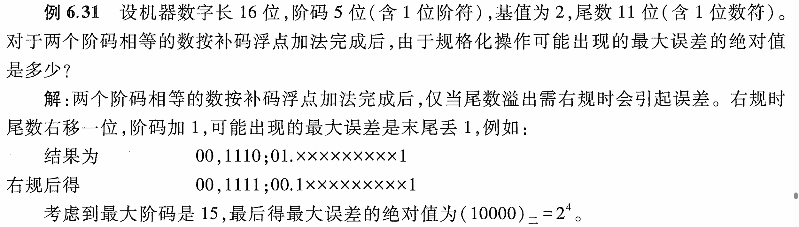

<h3>浮点加减运算的一道非计算例题</h3>

### 一、题目

- 文字描述

  > 例6.31设机器数字长16位，阶码5位（含1位阶符），基值为2，尾数11位（含1位数符）。 对千两个阶码相等的数按补码浮点加法完成后，由于规格化操作可能出现的最大误差的绝对值 是多少？

- 题目原图

  

  

### 二、个人疑问以及理解

- **疑问**

  最开始看这道例题，我看不懂为什么答案（带绝对值的）是$2^4$。

- **解答**

  题目给定尾数有11位，其中含1位符号位，那么数值位为10位。假设有以下数：
  $$
  \text{00, 1110 ; 01.XXXX XXXX X1 }
  $$
  很明显，我们处理的中间值（完成**对阶**和**尾数加减**后）两位符号位为**01**，意味着需要**右规**。

  很不巧，我们的尾数数值部分最后1位为1，右规后将被丢弃，如下所示：
  $$
  \text{00, }\underbrace{\text{1111}}_{\text{15}}\text{ ; 00.}\underbrace{\text{1XXX XXXX XX}}_{10\text{位数值位}}\underbrace{1}_{\text{丢弃}}
  $$
  我们可以观察到，右规后，尾数低位丢弃了1，这个1就是导致误差存在的原因，那么它会导致多大的误差呢？

  这里我们做个假设好吧，我们**假设这个1没有被丢弃**，并且此时我要**把这个浮点数还原为原码表示**：**阶码为15**（已经是能表示的最大值了），我们把**尾数往左移15位**，然后**阶码变为0**，得到如下值：
  $$
  \text{1X XXXX XXX1 0000.0}
  $$
  我们仔细审视这串二进制码，你会发现原来被丢弃的1，在我们假设不丢弃然后左移**阶码**（15）位后还原成了它的真实应该表示的值（16，即1 0000）。

  而实际上我们右规要把它**丢弃**，丢弃了那就变成了：
  $$
  \text{1X XXXX XXX0 0000.0}
  $$
  很明显，两者差距就是$2^4=16$，因此误差的绝对值就是$2^4$，或者是$(1\space 0000)_2$

有时候真感觉自己傻傻的，别人想一会就能搞定的东西，自己得想好久；可喜的是，还能理解。

### 三、心灵的救赎

如果想征服生命中的焦虑，活在当下，活在每一个呼吸里。——马特·海格

