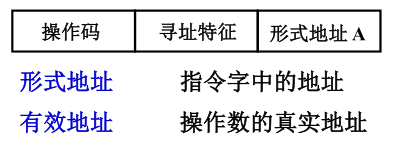
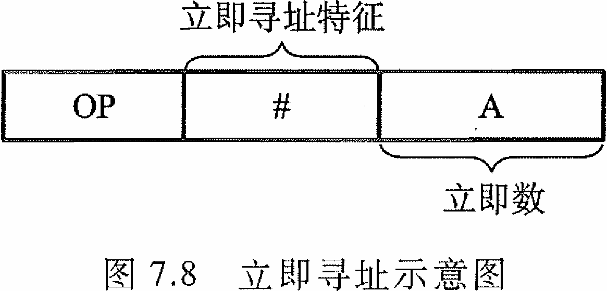
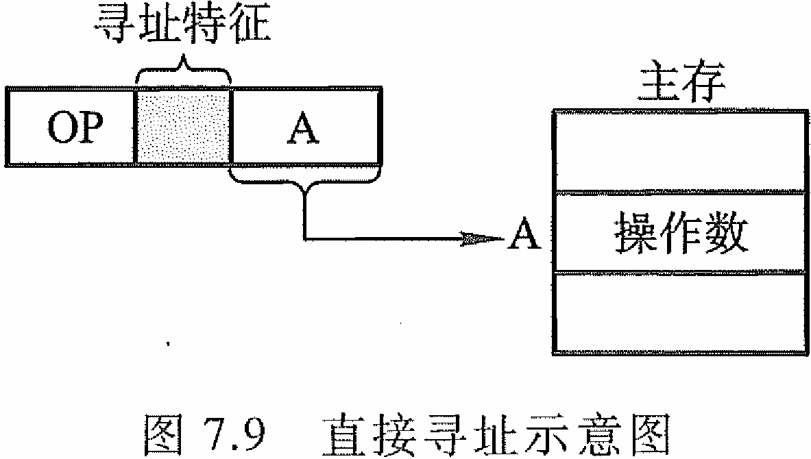
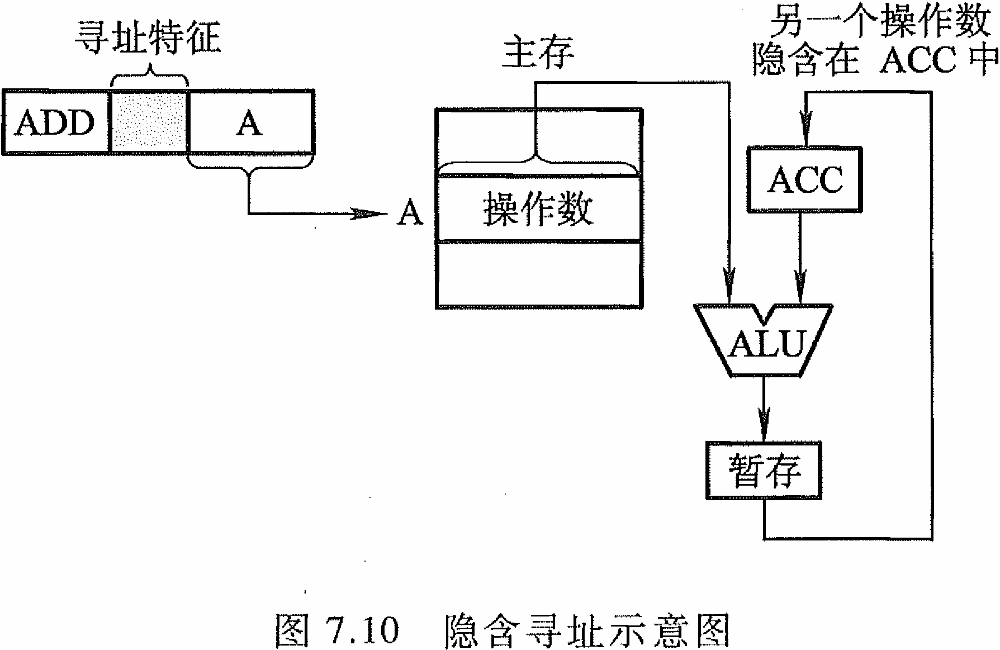
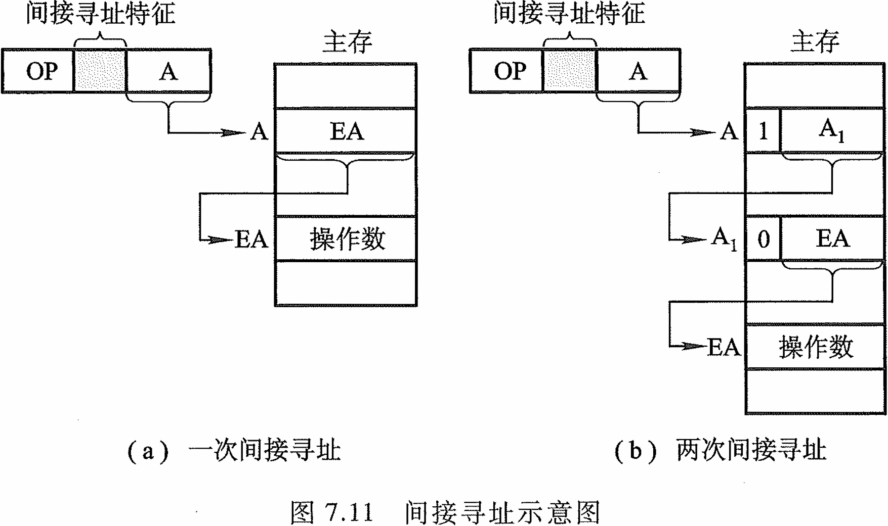
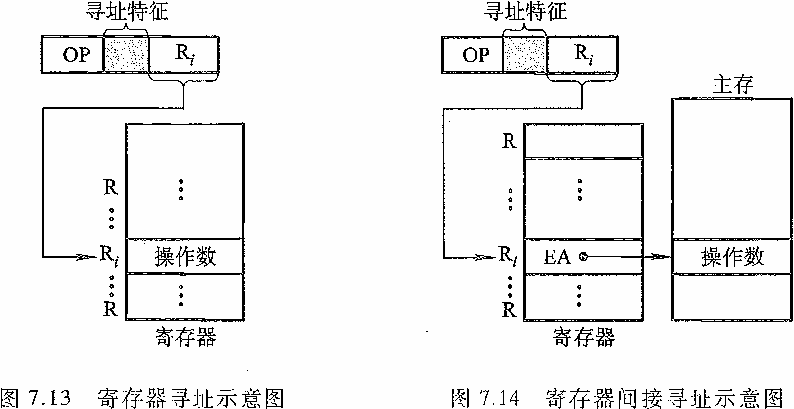
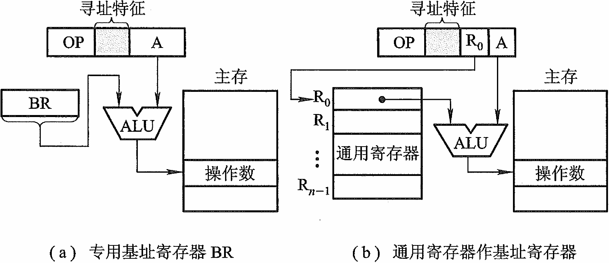
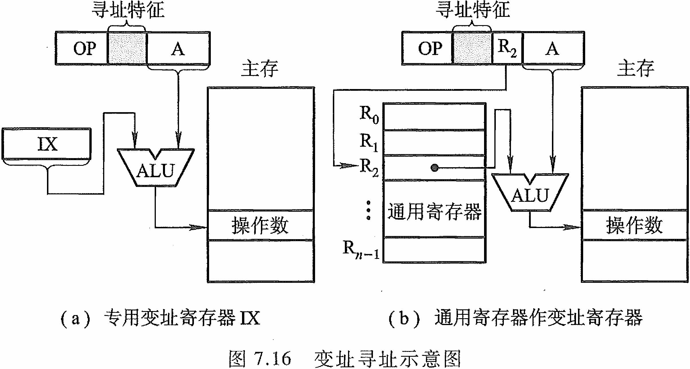
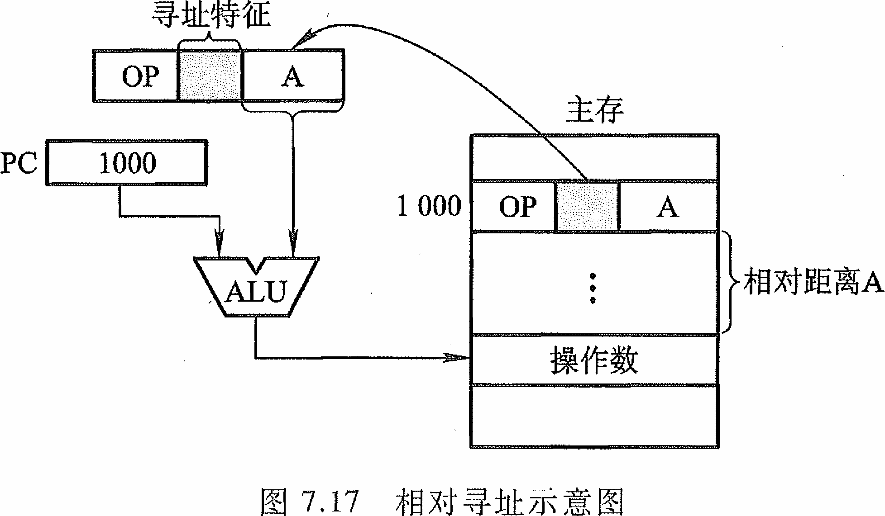

<h1>第7章 指令系统</h1>

###  7.1 操作码

- 扩展操作码技术：操作码的位数随地址数的减少而增加，短操作码不能是长操作码的前缀，否则不能区分。高频指令用短操作码，低频指令用长操作码

### 7.2 操作数

- 数据在存储器中的存放方式

  - **从任意位置开始存储**

    - 优点：不浪费存储资源
    - 缺点：除了访问一个字节之外，访问其它任何类型的数据，都可能花费两个存储周期的时间。读写控制比较复杂。

  - **从一个存储字的起始位置开始访问**：

    - 优点：无论访问何种类型的数据，在一个周期内
      均可完成，读写控制简单。
    - 缺点：浪费了宝贵的存储资源

  - **边界对准方式**

    数据存放的起始地址是数据长度的整数倍，本方案是前两个方案的折中，在一个周期内
    可以完成存储访问，空间浪费也不太严重。

### 7.3 寻址方式

- **指令寻址**:

  - **顺序**：PC寄存器自动加“1”，为下条指令地址
  - **跳跃**：由转移指令指出

- **数据寻址**：

  

  - **立即寻址**：形式地址 A 就是操作数，指令执行阶段不访存，A 的位数限制了立即数的范围

    

  - **直接寻址**：有效地址由形式地址直接给出，执行阶段访问一次存储器，A 的位数决定了该指令操作数的寻址范围，操作数的地址不易修改（必须修改A ）

    

  - **隐含寻址**：某些指令的一个操作数存放在哪个寄存器中已经规定好了，**指令字中少了一个地址字段，可缩短指令字长**

    

  - **间接寻址**：有效地址由形式地址间接提供，执行指令阶段 2 次访存或多次访存

    

  - **寄存器寻址**：有效地址即为寄存器编号，执行阶段不访存，只访问寄存器，执行速度快

  - **寄存器间接寻址**：有效地址在寄存器中， 操作数在存储器中，执行阶段访存

    

  - **基址寻址**：将CPU中基址寄存器的内容，加上指令格式中的形式地址而形成操作数的有效地址。基址寄存器可以是专用的基址寄存器或者采用给出的某一个通用寄存器作基址寄存器。形式地址 A 可变，基址寄存器内容不变，一般由操作系统确定。

    

  - **变址寻址**：和基址寻址很类似。但是形式地址A不变，变址寄存器的内容可变。便于处理数组问题

    

  - **相对寻址**：程序计数器PC的当前值为基地址，指令中的形式地址A（可正可负，补码表示）作为偏移量， A 的位数决定操作数的寻址范围，广泛用于转移指令

    

  - **堆栈寻址**：执行push和pop指令后SP寄存器的 SP 的修改与主存编址方法有关，按字编址直接+1/-1就行，按字节编址的话和机器字长有关，机器字长为32时，+4/-4，机器字长为 64 时，+8/-8。

### 7.4 CISC 和 RISC

- **CISC 的主要特征**：
  - 系统指令 复杂庞大，各种指令使用频度相差大
  - 指令 长度不固定、指令格式种类多、寻址方式多
  - 访存 指令 不受限制
  - CPU 中设有 专用寄存器
  - 大多数指令需要 多个时钟周期 执行完毕
  - 采用 微程序 控制器
- **二八定律**：典型程序中 80% 的语句仅仅使，用处理机中 20% 的简单指令。执行频度高的简单指令，因复杂指令的存在，执行速度无法提高
- **RISC 的主要特征**
  - 选用使用频度较高的一些 简单指令，复杂指令的功能由简单指令来组合
  - 指令 长度固定、指令格式种类少、寻址方式少
  - 只有 LOAD / STORE 指令访存
  - CPU 中有 多个 个 通用 寄存器
  - 采用 流水技术 一个时钟周期 内完成一条指令
  - 采用 组合逻辑 实现控制器
- **RISC 和CISC 的比较**
  1. RISC 更能 充分利用 VLSI 芯片 的面积
  2. RISC 更能 提高计算机运算速度，指令数、指令格式、寻址方式少，，通用 寄存器多 ，采用 组合逻辑 ，便于实现 指令流水
  3. RISC 便于设计 ，可 降低成本 ，提高 可靠性
  4. RISC 不易 实现 指令系统兼容
- 现代处理器的发展趋势是 RISC 与CISC相结合